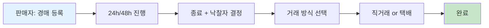

# 프로젝트 개요

-   :material-gavel:{ .lg .middle } __호구 없는 경매__

    ---

    깎이는 중고거래가 아니라 **올라가는** 경매 거래.
    판매자는 시작가만 올리면 구매자들이 경쟁해서 가격을 결정.

-   :material-clock-fast:{ .lg .middle } __실시간 입찰__

    ---

    Redis Lua + WebSocket으로 **4.5ms** 응답시간.
    종료 5분 전 입찰 시 자동 5분 연장.

-   :material-shield-check:{ .lg .middle } __안전 거래__

    ---

    1순위/2순위 자동 승계, 노쇼 페널티(경고 3회 차단),
    직거래/택배 양방향 지원.

-   :material-cube-outline:{ .lg .middle } __9개 Bounded Context__

    ---

    Hexagonal Architecture, Domain은 순수 POJO,
    Redis가 가격의 Source of Truth.

## 사용자 흐름

## Bounded Context

-   :material-account-key: __Identity__ — `auth/`, `user/`

    OAuth(카카오/네이버/구글) + JWT, 온보딩, 프로필

-   :material-hammer-screwdriver: __Auction__ — `auction/`

    경매 등록/조회, 종료 처리, 연장 정책

-   :material-arrow-up-bold: __Bid__ — `bid/`

    실시간 입찰, Redis Stream 비동기 처리

-   :material-trophy: __Winning__ — `winning/`

    1순위/2순위 낙찰 관리, 노쇼/승계

-   :material-handshake: __Trade__ — `trade/`

    거래 방식, 직거래(시간 제안), 택배(입금/송장)

-   :material-bell-ring: __Notification__ — `notification/`

    15종 알림 (FCM Push + 인앱)

-   :material-shield-account: __Admin__ — `admin/`

    통계, 유저/경매 관리

-   :material-robot: __AI__ — `ai/`

    시작가 추천 + 설명 생성 (Claude/Gemini/OpenAI)

## 핵심 기술 결정

!!! danger "이거 모르면 코드 읽다 막힘"
    아래 5가지는 프로젝트의 핵심 결정. 필수 숙지.

!!! tip "1) Redis가 입찰 가격의 Source of Truth"
    DB의 `auction.current_price`에 직접 UPDATE **금지**. RDB는 비동기 동기화.
    이유: 동시성 + DB 장애 격리.
    → [블로그: DB 영속화 전략 변경](https://tkgkd159.tistory.com/entry/DB-%EC%98%81%EC%86%8D%ED%99%94-%EC%A0%84%EB%9E%B5%EC%9D%84-%EC%84%B8-%EB%B2%88-%EB%B0%94%EA%BE%B8%EB%A9%B0-%EB%B0%B0%EC%9A%B4-%EA%B2%83-%E2%80%94-%EB%8F%99%EA%B8%B0-Async-Redis-Stream)

!!! tip "2) Hexagonal Architecture"
    Domain은 **순수 POJO** (JPA 어노테이션 금지).
    Controller → UseCase → Service → Domain. → [03-architecture.md](03-architecture.md)

!!! tip "3) Lua 스크립트 원자적 입찰"
    검증 + 가격 갱신 + 1/2순위 갱신 + 연장 판정 한 번에.
    → [블로그: 응답시간 3,600ms → 4.5ms](https://tkgkd159.tistory.com/entry/%EC%9E%85%EC%B0%B0-%EB%B2%88%ED%8A%BC-%EB%88%84%EB%A5%B4%EA%B3%A0-98%EC%B4%88-%E2%80%94-%EC%9D%91%EB%8B%B5%EC%8B%9C%EA%B0%84-3600ms%EC%97%90%EC%84%9C-45ms%EA%B9%8C%EC%A7%80-%EB%B3%91%EB%AA%A9%EC%9D%84-%EC%B6%94%EC%A0%81%ED%95%9C-%EA%B3%BC%EC%A0%95)

!!! tip "4) 서버 역할 분리 (api/ws/all)"
    REST API와 WebSocket을 독립 스케일.
    `SERVER_ROLE` 환경변수로 빈 활성화 분기.

!!! tip "5) Redis HA"
    Master + 2 Slave + 3 Sentinel. quorum 2/3 자동 failover.
    → [블로그: Redis HA Sentinel](https://tkgkd159.tistory.com/entry/FairBid-Redis%EB%A5%BC-%EB%A9%94%EC%9D%B8-DB%EB%A1%9C-%EC%93%B0%EB%A9%B4%EC%84%9C-%EC%9E%A5%EC%95%A0%EC%97%90-%EB%8C%80%EB%B9%84%ED%95%9C-%EA%B3%BC%EC%A0%95)

## 다음 읽을 거

[:material-book-open: 도메인 용어집](GLOSSARY.md){ .md-button }
[:material-rocket-launch: 환경 셋업](01-setup.md){ .md-button }
[:material-sitemap: 아키텍처](03-architecture.md){ .md-button .md-button--primary }
