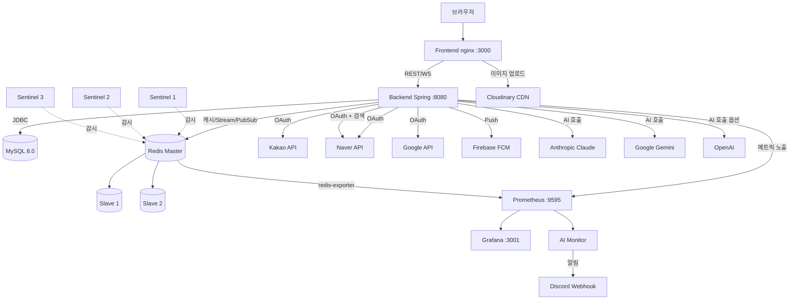

# 02. Infra — 외부 의존성 토폴로지

## 토폴로지

## 컴포넌트 표

| 컴포넌트 | 이미지/버전 | 포트(Host) | 역할 |
|---------|------------|-----------|------|
| backend | spring-boot 3.5 | 8080 | REST + WebSocket |
| frontend | react+vite (nginx) | 3000 | SPA |
| mysql | mysql:8.0 | 3308→3306 | RDB (이력/스냅샷) |
| redis (master) | redis:7 | 6379 | 캐시 + Stream + Pub/Sub (가격 SoT) |
| redis-slave-1 | redis:7 | 6380 | 복제본 |
| redis-slave-2 | redis:7 | 6381 | 복제본 |
| sentinel-1/2/3 | redis:7 | 26379~26381 | 자동 failover (quorum 2/3) |
| prometheus | v2.47.0 | 9595→9090 | 메트릭 수집 |
| grafana | 10.1.0 | 3001→3000 | 대시보드 |
| redis-exporter | v1.62.0 | 9121 | Redis 서버 메트릭 |
| ai-monitor | 자체 빌드 | - | Prometheus 폴링 → Claude → Discord |

## Redis 사용 패턴 (이게 핵심)

| 용도 | 자료구조 | 비고 |
|------|---------|------|
| 경매 가격 SoT | Hash | 현재가/최고입찰자/2순위/연장 횟수 |
| 입찰 처리 | Lua 스크립트 | 검증+갱신+연장 원자 처리 |
| RDB 동기화 | Stream | Consumer Group으로 멱등 처리 |
| 실시간 가격 브로드캐스트 | Pub/Sub | WebSocket 인스턴스로 fan-out |
| 분산 스케줄러 락 | ShedLock (JDBC) | 주간 리포트 중복 방지 |

`min-replicas-to-write 1` 설정으로 Slave 0개면 쓰기 거부 (split brain 방지).

## 외부 API 의존성

| 서비스 | 용도 | 키 환경변수 | 미설정 시 동작 |
|--------|------|------------|---------------|
| Kakao OAuth | 로그인 | `KAKAO_CLIENT_ID/SECRET` | 카카오 로그인 비활성 |
| Naver OAuth | 로그인 | `NAVER_CLIENT_ID/SECRET` | 네이버 로그인 비활성 |
| Naver 검색 API | AI 시세 데이터 (v2) | 위와 동일 키 재사용 | 시세 조회 실패 |
| Google OAuth | 로그인 | `GOOGLE_CLIENT_ID/SECRET` | 구글 로그인 비활성 |
| Anthropic Claude | AI 가격 추천 | `ANTHROPIC_API_KEY` | `/ai/auction-assist` 503 |
| Google Gemini | AI 설명 생성 | `GEMINI_API_KEY` | 설명 생성 실패 |
| OpenAI | AI 옵션 (provider 스위치) | `OPENAI_API_KEY` | `AI_PROVIDER=openai` 시 503 |
| Firebase FCM | 모바일 푸시 | `FIREBASE_CONFIG` (서비스 계정 키) | 푸시 미발송 (인앱 알림은 정상) |
| Cloudinary | 이미지 업로드 | `VITE_CLOUDINARY_*` (프론트) | 업로드 실패 |
| Discord Webhook | AI 모니터링 알림 | `DISCORD_AI_ASSIST_SOFT_WEBHOOK_URL` | 리포트 미발송 (no-op) |

## 서버 역할 분리 (스케일아웃 시)

| `SERVER_ROLE` | 활성 빈 |
|---------------|--------|
| `all` (기본) | 전체 (단일 인스턴스 개발) |
| `api` | REST Controller + Pub/Sub Publisher |
| `ws` | WebSocket + Pub/Sub Subscriber |

`@EnabledOnRole({"api", "all"})` 같은 어노테이션으로 빈 활성화 분기.

## HikariCP 풀 설정

- max 50, min idle 20
- connection timeout 3초 (장애 빠른 전파용)
- socket timeout 3초 (DB 응답 불가 시 무한 대기 방지)

자세한 설계 맥락: [03-architecture.md](03-architecture.md), [05-conventions.md](05-conventions.md)
