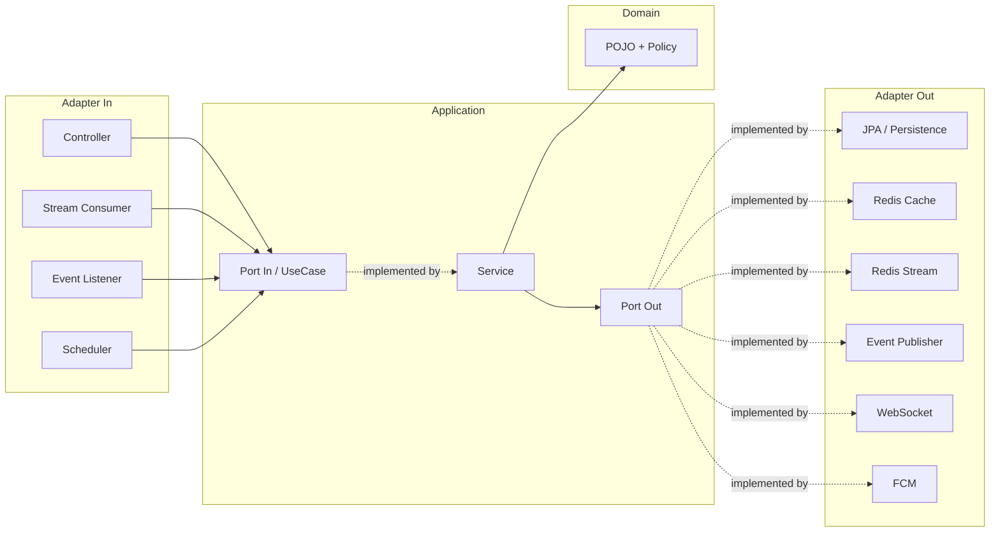
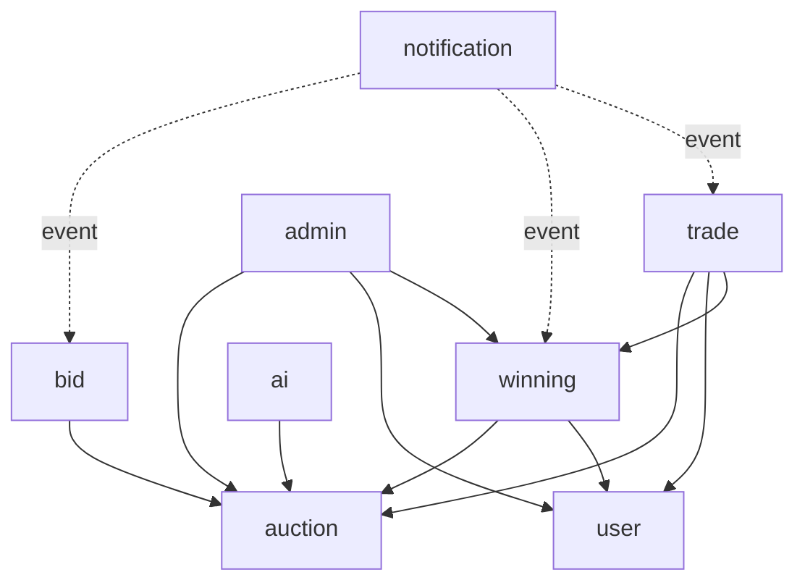

# 03. Architecture — 코드 구조

## Hexagonal (Port & Adapter)



## 레이어 책임

| 레이어 | 위치 | 의존 가능 | 의존 금지 |
|--------|------|----------|-----------|
| Domain | `{ctx}/domain/` | 없음 (순수 POJO) | 모든 외부 기술 |
| Port In (UseCase) | `{ctx}/application/port/in/` | Domain | Adapter, Entity |
| Port Out | `{ctx}/application/port/out/` | Domain | Adapter, Entity |
| Service | `{ctx}/application/service/` | Domain, Port Out | Adapter, Entity, Controller |
| Controller | `{ctx}/adapter/in/controller/` | UseCase, DTO | Service 직접, Domain, Entity |
| Adapter Out | `{ctx}/adapter/out/...` | Port Out, Entity, Mapper | Domain 직접 변환 |
| Entity | `{ctx}/adapter/out/persistence/entity/` | JPA만 | Domain |

## 패키지 구조 (BC 1개 기준)

```
com.cos.fairbid.{ctx}/
├── adapter/
│   ├── in/
│   │   ├── controller/   ← REST Controller
│   │   ├── dto/          ← Request/Response DTO (record)
│   │   ├── event/        ← @EventListener
│   │   ├── scheduler/    ← @Scheduled
│   │   └── stream/       ← Redis Stream Consumer
│   └── out/
│       ├── persistence/  ← Entity, JpaRepository, PersistenceAdapter, Mapper
│       ├── cache/        ← Redis Cache Adapter
│       ├── stream/       ← Redis Stream Producer
│       ├── pubsub/       ← Redis Pub/Sub
│       ├── event/        ← ApplicationEventPublisher 어댑터
│       ├── websocket/    ← WebSocket Push
│       └── fcm/          ← Firebase Push
├── application/
│   ├── port/
│   │   ├── in/           ← UseCase 인터페이스
│   │   └── out/          ← Repository/외부 서비스 인터페이스
│   ├── service/          ← UseCase 구현체
│   └── dto/              ← 내부 전달용 DTO (Command/Result)
└── domain/
    ├── {Entity}.java     ← 도메인 모델 (POJO + 비즈니스 로직)
    ├── {Enum}.java
    ├── policy/           ← 도메인 정책 (계산 로직)
    ├── event/            ← 도메인 이벤트 (Spring ApplicationEvent)
    └── exception/        ← 도메인 예외 (DomainException 상속)
```

## BC 의존 그래프



- 일방향, 순환 의존 없음
- 점선(`-.event.-`)은 Spring `ApplicationEvent` 기반 (인프로세스, 같은 JVM)

## 도메인 간 통신 두 가지 방식

### 1) Port Out 직접 참조 (주류)
```
winning/Service → auction/AuctionRepositoryPort (직접 주입)
```
강한 결합이지만 명시적. 대부분의 케이스.

### 2) Spring ApplicationEvent (느슨한 결합)
```
입찰 발생 → BidPlacedEvent → BidEventListener → 알림 전송
경매 종료 → AuctionClosedEvent → AuctionClosedEventListener → 낙찰 처리
```
주로 알림/후속 처리 같은 비핵심 흐름.

> ⚠️ 인프로세스 이벤트임 (Kafka 아님). 서비스 분리 시 메시지 브로커로 마이그 필요.

## 서버 역할 분리 (Split Scaling)

```
SERVER_ROLE=api  → REST + Pub/Sub Publisher만 부팅
SERVER_ROLE=ws   → WebSocket + Pub/Sub Subscriber만 부팅
SERVER_ROLE=all  → 전체 (로컬 dev 기본값)
```

빈에 `@EnabledOnRole({"api", "all"})` 같은 어노테이션을 붙여 분기. Redis Pub/Sub이 인스턴스 간 가격 fan-out 담당.

## 핵심 비동기 흐름 (입찰)

```
HTTP POST /bids
  → BidController
  → BidService.placeBid()       ← 트랜잭션 없음 (의도적)
    → Redis Lua (원자적 입찰)   ← 동기, 4.5ms
    → WebSocket fan-out          ← 동기
    → Redis Stream XADD          ← O(1)
  → Response (201 Created)

[비동기]
BidStreamConsumer
  → BidEntity 저장 (RDB)
  → 멱등성 보장 (stream_record_id UNIQUE)
```

자세히: [features/입찰.md](features/입찰.md), [블로그 글](https://tkgkd159.tistory.com/entry/DB-%EC%98%81%EC%86%8D%ED%99%94-%EC%A0%84%EB%9E%B5%EC%9D%84-%EC%84%B8-%EB%B2%88-%EB%B0%94%EA%BE%B8%EB%A9%B0-%EB%B0%B0%EC%9A%B4-%EA%B2%83-%E2%80%94-%EB%8F%99%EA%B8%B0-Async-Redis-Stream)

## 가드레일

- **ArchUnit** 테스트로 레이어 위반 컴파일/CI에서 자동 차단
- **Checkstyle** (네이버 컨벤션 + 커스텀)
- **SpotBugs** (null 참조, 리소스 누수)
- 자세히: [05-conventions.md](05-conventions.md)
