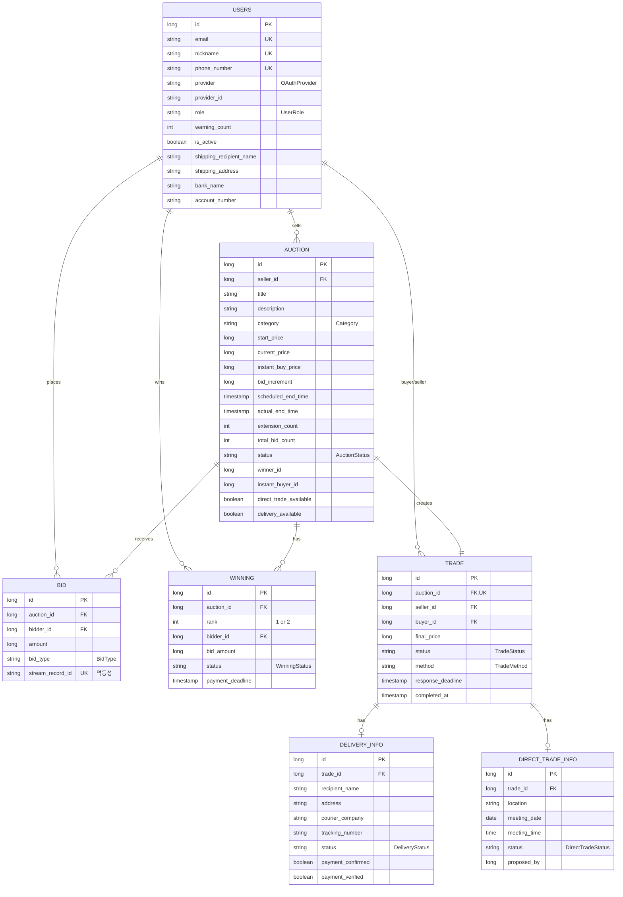

# 04. Data Model — Entity & ERD

> 헥사고날 컨벤션상 Entity는 JPA 전용. Domain 객체와 완전 분리되며 Mapper로 변환.
> 따라서 이 문서의 Entity 구조는 **DB 스키마에 가까운** 표현이고, 비즈니스 의미는 [GLOSSARY.md](GLOSSARY.md)와 [03-architecture.md](03-architecture.md)에 따로 있음.

## ERD

## 테이블별 메모

### `users`
- OAuth provider + provider_id 조합으로 identity (provider_id UNIQUE 제약)
- `warning_count >= 3`이면 `User.isBlocked() == true` (입찰/거래 차단)
- 배송지/계좌는 nullable — 거래 진행 직전에 채움

### `auction`
- `current_price`, `extension_count`, `total_bid_count`는 RDB와 Redis가 동시 보유 — **읽기 시 Redis 우선**
- `image_urls`는 ElementCollection (`auction_image` 별도 테이블, OSIV로 Lazy 로딩)
- `status` 전이: `BIDDING` → `INSTANT_BUY_PENDING`(즉시구매 발생) → `ENDED` (또는 `FAILED`/`CANCELLED`)

### `bid`
- `auction_id`, `bidder_id`는 외래키 제약 없음 (성능/Stream 비동기 보존 위해)
- `stream_record_id` UNIQUE — Redis Stream 메시지 ID. **멱등성 핵심**: Consumer 재시도 시 중복 저장 방지

### `winning`
- 한 경매에 최대 2 row (1순위 + 2순위)
- `rank=1` 노쇼 → `rank=2` 자동 승계 (단, 2순위 금액 ≥ 1순위 × 90%)

### `trade`
- `auction_id` UNIQUE — 한 경매당 거래 1개
- `method`는 nullable (구매자 선택 전엔 null)
- `response_deadline`까지 거래 방식 미선택 시 만료

### `delivery_info` / `direct_trade_info`
- `trade_id` 1:1
- 거래 방식에 따라 둘 중 하나만 생성

## 주요 Enum

상세는 [GLOSSARY.md](GLOSSARY.md) 참고.

| Enum | 위치 |
|------|------|
| `AuctionStatus` | `auction/domain/AuctionStatus.java` |
| `BidType` | `bid/domain/BidType.java` |
| `WinningStatus` | `winning/domain/WinningStatus.java` |
| `TradeStatus`, `TradeMethod` | `trade/domain/...` |
| `DeliveryStatus` | `trade/domain/...` |
| `OAuthProvider`, `UserRole` | `user/domain/...` |
| `Category` | `auction/domain/Category.java` |

## DDL 관리

`spring.jpa.hibernate.ddl-auto: update` — 마이그레이션 도구 없음.
운영 환경 변경 시 인덱스 누락 위험 있어, 추후 Flyway/Liquibase 도입 검토 필요.
