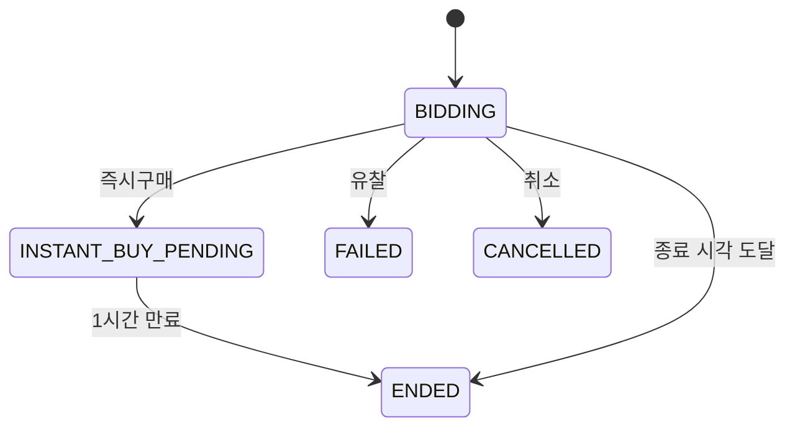
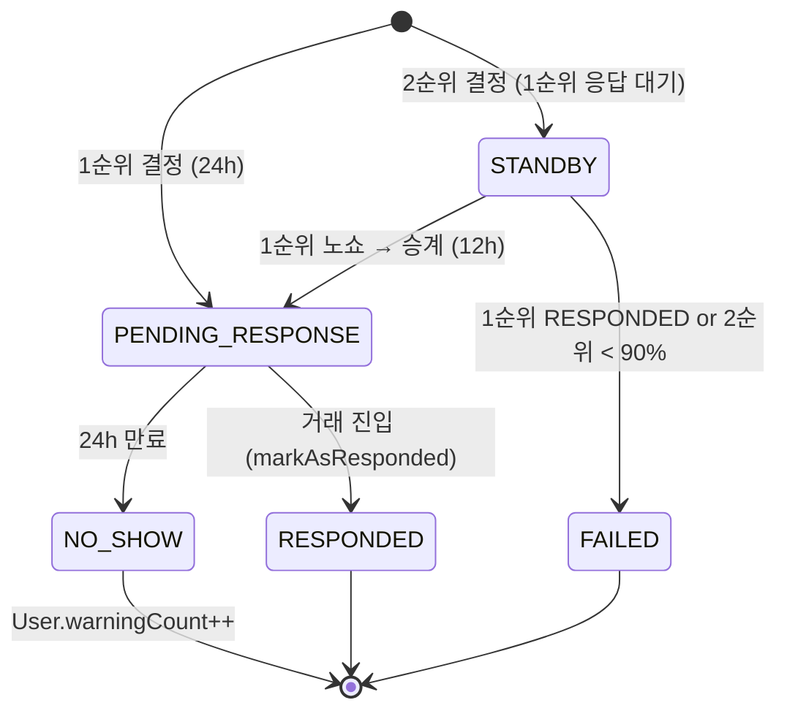

# GLOSSARY — 도메인 용어집

> 처음 코드를 보는 사람이 용어 때문에 막히지 않도록.
> 각 용어 옆 file:line은 정의/구현 위치.

## 입찰 관련

### 원터치 입찰 (One-touch Bid)
1클릭으로 **현재가 + 입찰단위** 자동 입찰. 사용자가 금액 입력 안 해도 됨.
- `BidType.ONE_TOUCH` — `bid/domain/BidType.java:16`
- `amount` 필드는 무시되고 자동 계산

### 직접 입찰 (Direct Bid)
사용자가 금액을 직접 입력해서 입찰. 현재가 + 입찰단위 이상이어야 함.
- `BidType.DIRECT` — `bid/domain/BidType.java:26`

### 즉시 구매 (Instant Buy)
판매자가 설정한 즉시구매가로 바로 구매. 경매가 즉시 종료되지 않고 **1시간의 최종 입찰 기회** 부여.
- `BidType.INSTANT_BUY` — `bid/domain/BidType.java:40`
- 활성 조건: 현재가 < 즉시구매가 × 90% (`Auction.isInstantBuyEnabled` — `auction/domain/Auction.java:164`)
- 즉시구매 발생 시 `AuctionStatus`가 `BIDDING` → `INSTANT_BUY_PENDING`으로 전이

### 1순위 입찰자 / 2순위 입찰자
경매 종료 시점의 최고가/2위 입찰자.
- 1순위: `Winning.createFirstRank` — `winning/domain/Winning.java:48`
- 2순위: `Winning.createSecondRank` — `winning/domain/Winning.java:80`
- Auction에 캐시된 필드: `topBidderId`, `secondBidderId` — `auction/domain/Auction.java:54-57`
- **2순위가 왜 필요?** → 1순위 노쇼 시 자동 승계용

### 입찰 단위 (Bid Increment)
다음 입찰 시 더해야 하는 최소 금액. 가격 구간별 차등.
- 정의: `auction/domain/policy/PriceBracket.java`
- 계산: `BidIncrementPolicy` — `auction/domain/policy/BidIncrementPolicy.java:54`

| 가격 구간 | 입찰 단위 |
|----------|-----------|
| 1만 원 미만 | 500원 |
| 1만 ~ 5만 | 1,000원 |
| 5만 ~ 10만 | 3,000원 |
| 10만 ~ 50만 | 5,000원 |
| 50만 ~ 100만 | 10,000원 |
| 100만 이상 | 30,000원 |

### 경매 연장 (Extension)
종료 5분 전 입찰이 들어오면 종료 시간을 5분 추가. 막판 입찰 폭주 방지.
- 트리거: `AuctionExtensionPolicy.isInExtensionPeriod` — `auction/domain/policy/AuctionExtensionPolicy.java:33`
- 적용: `Auction.extend` — `auction/domain/Auction.java`
- 누적 가능 (한 경매에 여러 번 연장 가능)

### 입찰 단위 할증
연장 3회마다 입찰 단위에 50% 추가. 막판 흐름 가속.
- 공식: `final = base × (1 + ⌊extensionCount / 3⌋ × 0.5)`
- `BidIncrementPolicy.calculateAdjustedIncrement` — `auction/domain/policy/BidIncrementPolicy.java:41`

## 낙찰/거래 관련

### 낙찰 (Winning)
경매 종료 시점에 최고가 입찰자가 구매 확정. `Winning` 도메인 객체로 표현.
- `WinningStatus.PENDING_RESPONSE`로 시작 (응답 대기)

### 낙찰 승계 (Auto Transfer)
1순위 노쇼 시 2순위로 자동 이전. 단, **2순위 금액 ≥ 1순위 × 90%** 조건.
- `Winning.transferToSecondRank` — `winning/domain/Winning.java:157`
- 임계값: `AUTO_TRANSFER_THRESHOLD = 0.9` — `winning/domain/Winning.java`
- 미달 시 `WinningStatus.FAILED` (유찰)

### 응답 기한 (Response Deadline)
낙찰자가 거래 진행 의사를 표하는 마감 시간.
- 1순위: 24시간 (`RESPONSE_DEADLINE_HOURS = 24`)
- 2순위 승계: 12시간 (`SECOND_RANK_DEADLINE_HOURS = 12`)
- 만료 시 `Winning.isResponseExpired = true` → 노쇼 처리

### 노쇼 (No-show)
낙찰자가 응답 기한 내 행동 안 함. → `WinningStatus.NO_SHOW` + `User.warningCount++`.
- 판정: `Winning.isResponseExpired` — `winning/domain/Winning.java:173`
- 페널티: `User.NO_SHOW_PENALTY = 1` (경고 1회)

### 경고 / 차단
경고 3회 누적 시 계정 차단. 입찰/거래 불가.
- `User.addWarning` — `user/domain/User.java:134`
- `User.isBlocked` — `user/domain/User.java:85` (`warningCount >= 3`)

### 거래 방식 (Trade Method)
구매자가 선택. 판매자가 등록 시 가능한 옵션을 정해둠 (`directTradeAvailable`, `deliveryAvailable`).
- `TradeMethod.DIRECT` (직거래) | `DELIVERY` (택배)

### 직거래
판매자/구매자가 시간/장소 정해서 직접 만남.
- 시간 제안 → 수락/역제안 흐름 (`DirectTradeStatus`)
- `Trade.isDirectTrade` — `trade/domain/Trade.java:191`

### 택배 거래
배송지 입력 → 입금 → 입금 확인 → 발송 → 수령 확인. 단계별 상태 전이.
- `DeliveryStatus`: `AWAITING_ADDRESS` → `AWAITING_PAYMENT` → `SHIPPED` → `DELIVERED`
- 입금 확인은 판매자가 수동 (`payment_verified` 플래그)

## 인증/사용자 관련

### OAuth Provider
`KAKAO`, `NAVER`, `GOOGLE` 3종 지원. provider + provider_id 조합으로 사용자 식별.
- `OAuthProvider` enum — `user/domain/`

### 온보딩 (Onboarding)
회원 가입 후 **닉네임 등록** 단계. 미완료 시 입찰/거래 불가 (`@RequireOnboarding` 가드).
- `User.completeOnboarding` — `user/domain/User.java`
- `CompleteOnboardingUseCase` — 온보딩 후 JWT 재발급 (role 갱신)

### 닉네임 중복 확인
닉네임 등록 전 사전 검증 API.
- `GET /api/v1/users/check-nickname` (비인증)

### 배송지 / 계좌
거래 진행 직전에 입력 가능. nullable.
- `User`에 shippingAddress, bankName, accountNumber 등 필드

## 경매 상태 (AuctionStatus)

| 값 | 의미 |
|----|------|
| `BIDDING` | 입찰 진행 중 (기본) |
| `INSTANT_BUY_PENDING` | 즉시구매 발생 → 1시간 최종 입찰 기간 |
| `ENDED` | 종료, 낙찰자 결정됨 |
| `FAILED` | 유찰 (입찰 없음 또는 2순위 < 90%) |
| `CANCELLED` | 판매자가 취소 |

## 낙찰 상태 (WinningStatus)

## 알림 (Notification)

15종의 도메인 이벤트 알림. FCM Push + 인앱 이중 구조.
- `NotificationType` enum — `notification/domain/NotificationType.java:7`
- 예: `BID_PLACED`, `OUTBID`(역전됨), `AUCTION_WON`(낙찰됨), `PAYMENT_CONFIRMED`, ...

## 핵심 정책 클래스 위치

| 정책 | 클래스 |
|------|--------|
| 가격 구간별 입찰 단위 | `auction/domain/policy/PriceBracket.java` |
| 입찰 단위 + 연장 할증 | `auction/domain/policy/BidIncrementPolicy.java` |
| 종료 5분 전 연장 | `auction/domain/policy/AuctionExtensionPolicy.java` |
