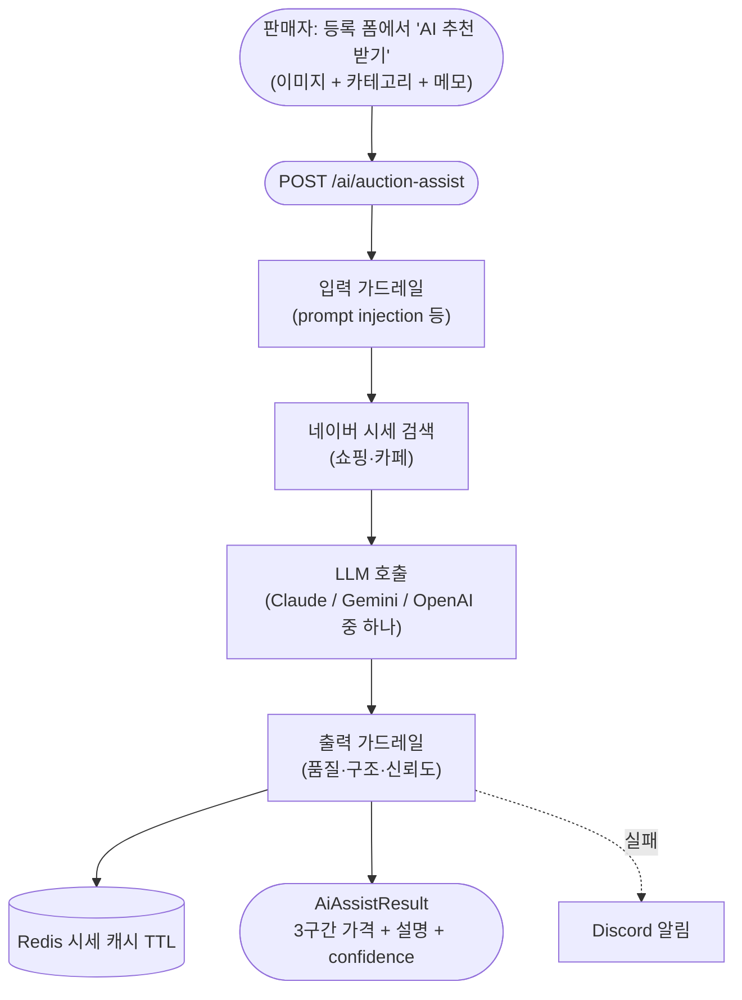
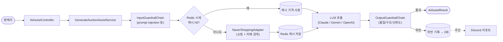
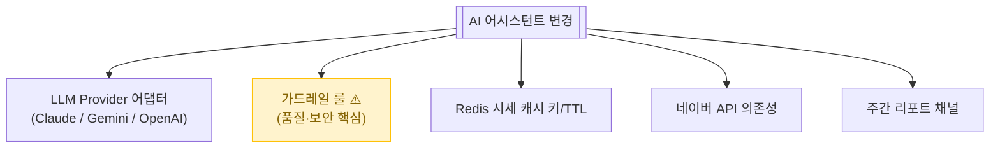

# AI 경매 어시스턴트

> 판매자가 등록 폼에서 "AI 추천 받기" 누르면 → **시작가 3구간(보수/적정/공격) + 마케팅 설명**을 자동 생성. 외부 LLM (Claude/Gemini) + 시세 검색 (네이버) 조합.

📁 코드 위치: `backend/.../ai/` · 👥 주체: 판매자 · 🔐 인증: 로그인 + 온보딩

---

## 1. 한눈에



**스토리**: 판매자가 가격 책정 어려울 때 도움. **외부 시세 검색 + LLM 조합** → 시작가 3구간 + 마케팅 톤 설명. 들어오는/나가는 데이터에 가드레일 걸어 품질·보안 관리.

---

## 2. 왜 이게 있나

!!! abstract "비즈니스 의도"
    - **가격 책정 진입장벽 해소** — 시세 모르는 판매자도 적정가로 시작 가능
    - **3구간 추천** — 보수/적정/공격으로 판매자 선택권
    - **시세 검증** — LLM 단독 추론 X, 네이버 쇼핑·카페 가격 RAG로 신뢰도 확보
    - **신뢰도 표시** — high/low로 사용자에게 "이건 확실치 않아요" 표시
    - **가드레일** — prompt injection 차단 + 출력 품질 보증 (홍보 톤, 길이, 가격 구조)
    - **운영 관측** — 가드레일 위반 누적 → Discord 알림 (주간 리포트)

---

## 3. 시나리오 — `POST /ai/auction-assist`



<div class="grid cards" markdown>

-   :material-shield-check: **0. 입력 가드레일**

    `InputGuardrailChain` — 여러 룰 순차 검사. 대표 룰: `PromptInjectionRule` (사용자 메모에 LLM 조작 시도 차단).
    위반 시 즉시 예외 + DB 기록.

-   :material-numeric-1-circle: **시세 검색 (RAG)**

    네이버 쇼핑 + 카페 API → 동일/유사 상품 가격 raw 데이터.
    Redis 캐시로 같은 키워드 반복 호출 방지.

-   :material-numeric-2-circle: **LLM 호출 (멀티 프로바이더)**

    Claude / Gemini / OpenAI 중 하나 (설정으로 선택).
    이미지 + 카테고리 + 메모 + **시세 raw 데이터를 prompt에 주입** = RAG 패턴.
    [SPEC §19](https://github.com/ahn-h-j/Fairbid/blob/main/docs/spec/ai-monitoring-spec.md) 참고 — Port 분리로 어떤 프로바이더든 끼울 수 있음.

-   :material-numeric-3-circle: **출력 가드레일 (8종 룰)**

    | 룰 | 검사 |
    |----|------|
    | `DescriptionLengthRule` | 설명 길이 범위 |
    | `DescriptionQualityRule` | 마케팅 톤 / 일반성 |
    | `HookRule` | 도입부 매력도 |
    | `PersonaRule` | 1인칭 표현 등 페르소나 |
    | `PriceStructureRule` | 3구간 가격 일관성 (저 < 적정 < 고) |
    | `ConfidenceTrackingRule` | confidence 필드 존재 |
    | `ReformatRule` | 마크다운 포맷 |
    | `PromptInjectionRule` | (출력에도 적용) |

-   :material-numeric-4-circle: **위반 시 DB 기록 + 주간 Discord 리포트**

    `GuardrailFailurePersistenceAdapter`로 RDB 저장.
    `GuardrailReportScheduler`가 주기적으로 집계 → `DiscordReportAdapter`로 알림.

-   :material-numeric-5-circle: **응답: 3구간 가격 + 설명 + confidence**

    `confidence="high"` (검색 기반) / `"low"` (LLM 학습 지식만).
    low면 사용자에게 "이건 확실치 않음" 표시.

</div>

---

## 4. 진입점

| Method | Path | 핸들러 | 권한 |
|--------|------|--------|------|
| `🟡 POST` | `/api/v1/ai/auction-assist` | [`generateAuctionAssist`](https://github.com/ahn-h-j/Fairbid/blob/main/backend/src/main/java/com/cos/fairbid/ai/adapter/in/controller/AiAssistController.java#L39) | 로그인 + 온보딩 |

스케줄러 (사용자 호출 X):
| 종류 | 이름 | 트리거 |
|------|------|--------|
| Scheduler | [`GuardrailReportScheduler`](https://github.com/ahn-h-j/Fairbid/blob/main/backend/src/main/java/com/cos/fairbid/ai/adapter/in/scheduler/GuardrailReportScheduler.java) | 주기 호출 (주간) |

---

## 5. 요청 / 응답

??? example "AiAssistRequest"
    ```json
    {
      "category": "FASHION",
      "memo": "상품 정보: 나이키 에어맥스 270 / 구매 시기: 2024년 / 상태: 거의 새것",
      "imageUrls": ["https://..."]
    }
    ```
    `category`는 **nullable** (AI가 이미지+메모로 추론).

??? example "AiAssistResponse"
    ```json
    {
      "suggestedPrices": {
        "conservative": 80000,
        "moderate": 100000,
        "aggressive": 130000
      },
      "generatedDescription": "## ...마케팅 톤 설명...",
      "confidence": "high" | "low",
      "confidenceReason": "(low일 때만) 시세 검색 결과 부족"
    }
    ```

---

## 6. 에러 케이스

| 예외 | 발생 조건 | HTTP |
|------|-----------|------|
| [`PromptInjectionDetectedException`](https://github.com/ahn-h-j/Fairbid/blob/main/backend/src/main/java/com/cos/fairbid/ai/domain/exception/PromptInjectionDetectedException.java) | 메모에 LLM 조작 시도 | 400 |
| [`InvalidImageException`](https://github.com/ahn-h-j/Fairbid/blob/main/backend/src/main/java/com/cos/fairbid/ai/domain/exception/InvalidImageException.java) | 이미지 URL 형식/크기/MIME 위반 | 400 |
| [`AiServiceUnavailableException`](https://github.com/ahn-h-j/Fairbid/blob/main/backend/src/main/java/com/cos/fairbid/ai/domain/exception/AiServiceUnavailableException.java) | LLM API 다운/타임아웃 | 503 |
| [`AiGenerationFailedException`](https://github.com/ahn-h-j/Fairbid/blob/main/backend/src/main/java/com/cos/fairbid/ai/domain/exception/AiGenerationFailedException.java) | 출력 가드레일 누적 실패 | 500 |

---

## 7. 변경 시 영향



> 가드레일 약화 = 품질 저하 + 프롬프트 인젝션 위험.

---

## 8. 설계 결정

!!! tip "왜 이렇게 했나"

    **Port 분리로 멀티 프로바이더 지원**
    `LlmGeneratorPort` 같은 추상 (확인 필요). Claude / Gemini / OpenAI 모두 같은 Port. 비용·품질 비교하며 교체 가능.

    **RAG 패턴 (네이버 시세 + LLM)**
    LLM 단독 추론은 hallucination 위험. 실제 시세를 prompt에 박아 신뢰도 확보. confidence가 그 결과.

    **가드레일을 입력/출력 양쪽에**
    입력: prompt injection 차단. 출력: 품질·구조·신뢰도 검증. 둘 다 Chain of Responsibility 패턴.

    **시세 캐시**
    같은 키워드 반복 호출 시 네이버 API 부담 + 비용. Redis TTL로 절감.

    **주간 Discord 리포트**
    가드레일 위반은 즉시 알림보다 **누적 패턴 파악**이 중요. 주간 리포트로 운영 인사이트.

    **`category` nullable**
    사용자가 카테고리 안 골랐어도 AI가 이미지+메모로 추론. UX 마찰 줄임.

---

## 9. 🔧 기술 메모

!!! info "트랜잭션"
    - 메인 흐름은 `@Transactional` 없음 (외부 API + Redis만).
    - 가드레일 위반 기록은 `@Transactional` (write) — `GuardrailFailurePersistenceAdapter`.

!!! info "외부 API — 멀티 LLM + 검색 + Discord"
    - LLM: Anthropic / Google / OpenAI HTTP. 타임아웃·재시도는 어댑터 내부.
    - 네이버: 쇼핑 + 카페. `NaverShoppingAdapter`.
    - Discord: webhook. `DiscordReportAdapter`.
    - **외부 장애 시 사용자에게 503 노출** (LLM 폴백 정책 확인 필요).

!!! info "캐시 — Redis 시세"
    - `RedisPriceCacheAdapter`. 키워드별 캐시. TTL 설정 확인.

!!! info "가드레일 — Chain of Responsibility"
    - `InputGuardrailChain` / `OutputGuardrailChain` — 여러 `Rule` 순차 적용.
    - 각 룰은 `validate(...)` 반환값으로 통과/위반.

!!! info "스케줄러 — 주간 리포트"
    - `GuardrailReportScheduler@Scheduled`.
    - DB 집계 → Discord 알림.

!!! info "이벤트 / 락 / 비동기 처리 — 안 씀"
    동기 외부 호출. 한 요청이 한 LLM 호출 + 한 검색.

---

## 10. 운영

- 가드레일 위반 누적 → Discord 채널
- LLM API 응답 시간 / 실패율은 어댑터 내부 로그
- 비용 모니터링은 Anthropic/OpenAI 콘솔 별도

**관련 페이지**
- [경매 등록](경매-등록.md) — AI 추천 결과로 시작가 채우는 흐름
- 추가 명세: [`docs/spec/ai-monitoring-spec.md`](https://github.com/ahn-h-j/Fairbid/blob/main/docs/spec/ai-monitoring-spec.md)
