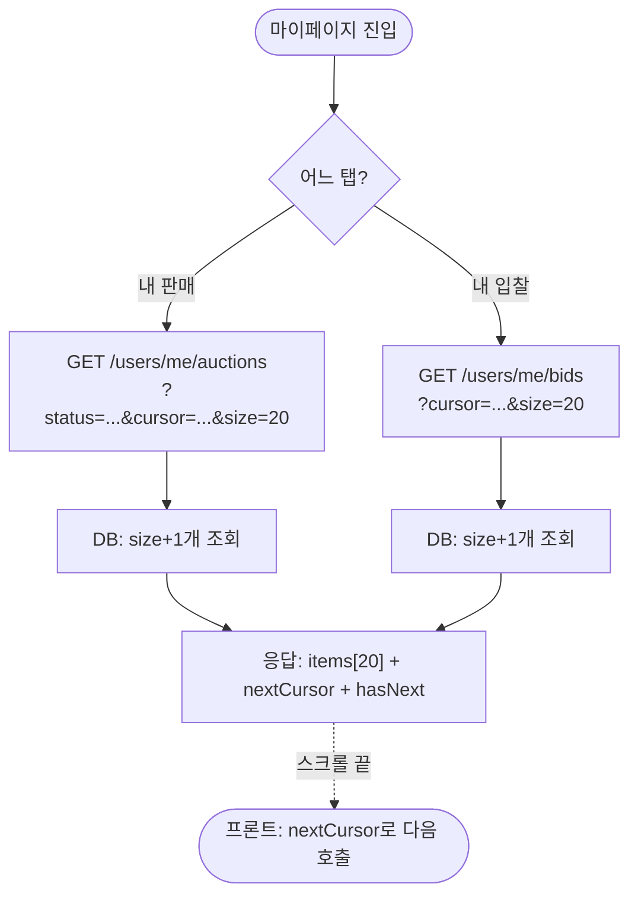
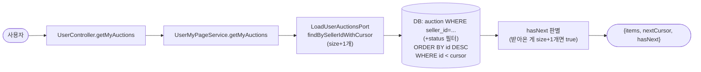
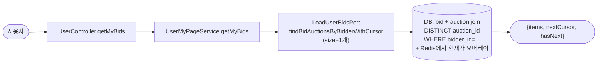
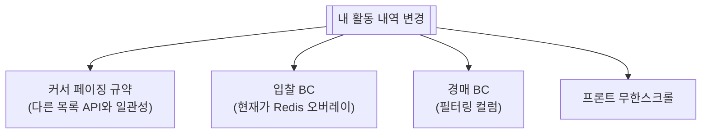

# 내 활동 내역 (판매 / 입찰 목록)

> 마이페이지의 두 탭 — **내가 등록한 경매**, **내가 입찰한 경매**. 무한스크롤로 쭉 내려가는 목록.

📁 코드 위치: `backend/.../user/` · 👥 주체: 본인 · 🔐 인증: 로그인 + 온보딩 완료 (`@RequireOnboarding`)

---

## 1. 한눈에



**스토리**: 두 탭 모두 똑같이 **커서 기반 페이징**. `size+1`개 가져와서 hasNext 판단, 마지막 항목의 ID를 다음 커서로. 오프셋 페이징(LIMIT/OFFSET)이 아닌 이유는 [설계 결정](#8) 참고.

---

## 2. 왜 이게 있나

!!! abstract "비즈니스 의도"
    - **판매자 시점** — 내가 올린 경매가 어떻게 진행 중인지. 진행/종료/낙찰 여부 한 화면에
    - **구매자 시점** — 내가 입찰한 경매들. 1등 여부 + 현재가 추적
    - **상태 필터** (판매만) — 진행 중만 / 낙찰만 / 유찰만 분리해서 보기
    - **무한스크롤 UX** — 모바일/데스크톱 통합. 페이지 번호 없음

---

## 3. 시나리오

### 3-1. 내 판매 경매 목록 — `GET /users/me/auctions`

> **상황**: 마이페이지 "내 판매" 탭 진입. 또는 스크롤이 바닥에 닿아 다음 페이지 요청.



<div class="grid cards" markdown>

-   :material-numeric-1-circle: **size+1 트릭으로 hasNext 판단**

    `size=20`이면 21개 조회. 21개 오면 hasNext=true, items는 20개 (마지막 1개 잘라냄).
    20개 이하면 끝. **count(*) 쿼리 안 돔** = 비용 절약.

-   :material-numeric-2-circle: **status 필터 (선택)**

    `?status=ACTIVE` / `ENDED` 등으로 진행 중 / 종료만 보기.
    안 주면 전체.

-   :material-numeric-3-circle: **커서 = 마지막 경매 ID**

    `cursor=null`이면 처음부터, `cursor=123`이면 `id<123` 뽑기.
    응답의 `nextCursor`를 다음 호출에 그대로 전달.

</div>

---

### 3-2. 내 입찰 경매 목록 — `GET /users/me/bids`

> **상황**: 마이페이지 "내 입찰" 탭. 내가 입찰한 경매들 (1등 여부 포함).



<div class="grid cards" markdown>

-   :material-numeric-1-circle: **DISTINCT auction**

    한 경매에 여러 번 입찰해도 1줄로. 같은 경매 중복 노출 방지.

-   :material-numeric-2-circle: **현재가는 Redis에서 오버레이**

    경매 가격은 [입찰 BC](입찰.md)에서 Redis가 정답. RDB의 `current_price`는 백업/통계용.
    **목록 표시 시 Redis로 덮어씌움** → 실시간 현재가 정확.

-   :material-numeric-3-circle: **응답 항목**

    경매 정보 + 내 마지막 입찰가 + 현재가 + 1등 여부.

</div>

---

## 4. 진입점

| Method | Path | 핸들러 | 권한 |
|--------|------|--------|------|
| `🟢 GET` | `/api/v1/users/me/auctions?status=&cursor=&size=` | [`getMyAuctions`](https://github.com/ahn-h-j/Fairbid/blob/main/backend/src/main/java/com/cos/fairbid/user/adapter/in/controller/UserController.java#L198) | 로그인 + 온보딩 |
| `🟢 GET` | `/api/v1/users/me/bids?cursor=&size=` | [`getMyBids`](https://github.com/ahn-h-j/Fairbid/blob/main/backend/src/main/java/com/cos/fairbid/user/adapter/in/controller/UserController.java#L220) | 로그인 + 온보딩 |

---

## 5. 요청 / 응답

??? example "공통 쿼리 파라미터"
    - `cursor` (Long, optional) — 마지막으로 받은 항목의 ID. 없으면 처음부터
    - `size` (1~100, default 20) — 페이지 크기

??? example "CursorPageResponse 형태"
    ```json
    {
      "items": [...],
      "nextCursor": 123,
      "hasNext": true
    }
    ```
    `nextCursor`를 다음 요청의 `cursor`에 그대로 전달.

??? example "MyAuctionResponse 항목"
    경매 기본 + 내가 정한 시작가/즉시구매가, 현재가, 입찰 수, 종료 시각, 상태 등

??? example "MyBidResponse 항목"
    경매 정보 + 내 마지막 입찰가 + 현재가 (Redis) + 1등 여부

---

## 6. 에러 케이스

| 예외 | 발생 조건 | HTTP |
|------|-----------|------|
| 유효성 (`@Min`/`@Max`) | size 범위 위반 | 400 |
| `@RequireOnboarding` | 온보딩 미완료 | 403 |

---

## 7. 변경 시 영향



> 페이지 응답 포맷(`CursorPage`)은 `common/pagination/`에 공유 모델. 다른 목록 API([경매 조회](경매-목록-상세.md))와 일관성 유지.

---

## 8. 설계 결정

!!! tip "왜 이렇게 했나"

    **오프셋(LIMIT/OFFSET)이 아닌 커서 페이징**
    데이터가 많아지면 OFFSET이 큰 값일수록 느려짐 (DB가 앞부분 다 스킵). **커서는 인덱스 활용으로 일정 시간**.

    **size+1 트릭**
    count 쿼리 없이 hasNext 판단. count(*)이 큰 테이블에서 비싸기 때문. 1개 더 받는 비용으로 끝.

    **현재가는 Redis가 답**
    경매 RDB의 `current_price`는 항상 정합성 보장 안 됨 (입찰 비동기). 마이페이지처럼 정확해야 하는 곳은 Redis 오버레이.

    **DISTINCT auction (입찰 목록)**
    같은 경매에 여러 번 입찰한 사용자가 흔함. 경매 단위로 묶음.

---

## 9. 🔧 기술 메모

!!! info "트랜잭션"
    - `UserMyPageService` — 클래스 `@Transactional(readOnly=true)`. 조회만이라 가벼움.

!!! info "DB 인덱스 — 페이징 성능 의존"
    - **판매 목록**: `auction(seller_id, id)` 또는 `auction(seller_id, status, id)` 복합 인덱스 필수.
    - **입찰 목록**: `bid(bidder_id, auction_id)` 인덱스 + DISTINCT 처리 효율 위해 `auction(id)` PK.
    - 인덱스 빠지면 `WHERE seller_id=... AND id<cursor` 쿼리가 풀스캔.

!!! info "Redis 오버레이 (입찰 목록 현재가)"
    - 목록 N개 가져온 후 각 경매의 현재가를 Redis에서 조회 → 응답에 박음.
    - **N+1 위험**: 목록 size만큼 Redis 호출. mget(다중 키 조회)로 1회 호출이 이상적이지만 현재 구현은 어댑터 내부 확인 필요.

!!! info "이벤트 / 락 / 비동기 — 안 씀"
    조회만. 동기.

---

## 10. 운영

별도 메트릭 없음.

**관련 페이지**
- [경매 조회](경매-목록-상세.md) — 같은 커서 페이징 패턴
- [입찰](입찰.md) — 현재가 Redis 출처
- [프로필](user-profile.md)
