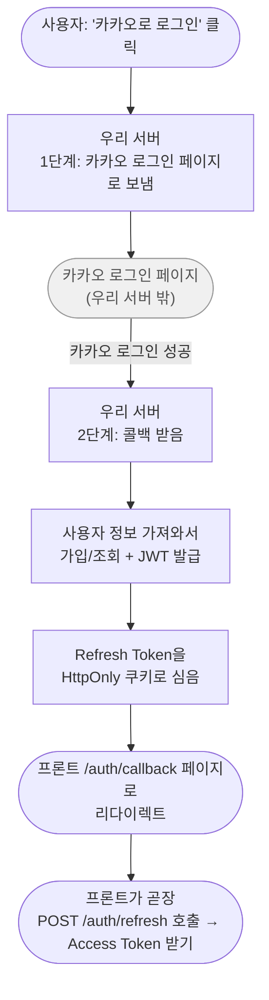
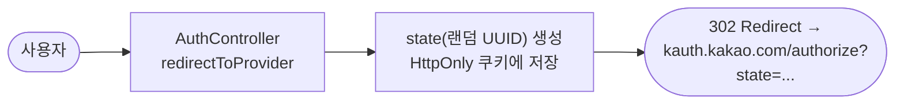
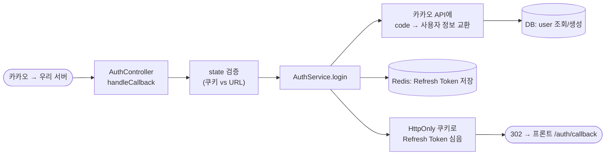
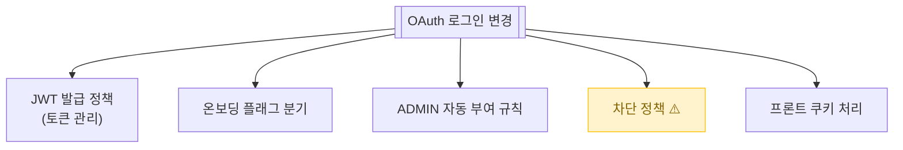

# OAuth 로그인

> 카카오/네이버/구글 계정으로 한 번에 로그인. 비밀번호 안 만들고도 회원가입 + 로그인이 동시에 됨.

📁 코드 위치: `backend/.../auth/` · 👥 주체: 모든 사용자 (비로그인) · 🔐 인증: 없음 (로그인 자체)

---

## 1. 한눈에

**스토리**: "카카오로 로그인" 버튼 누르면 카카오 페이지로 잠깐 갔다가 → 다시 우리 서버로 돌아옴 → 그 사이 우리는 카카오한테 사용자 정보 받아와서 회원이면 로그인, 아니면 가입 → JWT 발급 → 프론트로 보냄. 흔한 OAuth 2.0 Authorization Code 흐름.

---

## 2. 왜 이게 있나

!!! abstract "비즈니스 의도"
    - **가입 진입장벽 제거** — 이메일/비밀번호 없이 1번 클릭으로 시작
    - **3사 통합** — 카카오, 네이버, 구글 모두 같은 흐름 (provider만 분기)
    - **CSRF 방지** — `state` 파라미터를 쿠키에 박아 콜백이 우리가 시작한 흐름인지 검증
    - **단일 세션 정책** — 같은 계정으로 다른 기기 로그인 시 이전 세션 무효화 ([토큰 관리](token-management.md))
    - **ADMIN 자동 부여** — 환경변수 `ADMIN_EMAILS`에 들어있는 이메일로 첫 로그인 시 ADMIN 권한

---

## 3. 시나리오

### 3-1. Provider 로그인 페이지로 보내기 — `GET /auth/oauth2/{provider}`

> **상황**: 사용자가 우리 사이트의 "카카오로 로그인" 버튼을 누름.

-   :material-numeric-1-circle: **provider 파싱**

    URL의 `kakao` / `naver` / `google` 문자열을 `OAuthProvider` enum으로.
    그 외 값이면 400.

-   :material-numeric-2-circle: **CSRF 방지 state 발급**

    랜덤 UUID 생성 → 5분짜리 HttpOnly 쿠키(`oauth_state`)에 저장.
    같은 값을 인증 URL의 `state` 파라미터로 카카오에 보냄.

    > 콜백 받을 때 쿠키와 URL state가 일치하는지 봐서 **다른 사이트가 우리 콜백을 도용하는 공격을 막음**.

-   :material-numeric-3-circle: **인증 URL 만들어서 302 리다이렉트**

    카카오/네이버/구글마다 URL/scope 다름 (카카오: `account_email`, 구글: `email profile`).
    `buildAuthorizationUrl`에서 switch 분기.

---

### 3-2. Provider 콜백 처리 — `GET /auth/oauth2/callback/{provider}`

> **상황**: 사용자가 카카오 로그인을 마치고, 카카오가 우리 서버로 다시 보냄.

-   :material-shield-check: **0. state 검증 (CSRF 방어)**

    쿠키의 state와 URL의 state가 다르면 → `/auth/error?reason=invalid_state`로 보냄.
    검증 후 state 쿠키 즉시 제거 (일회용).

-   :material-numeric-1-circle: **카카오에서 사용자 정보 받기**

    `OAuthClientPort.getUserInfo(provider, code)` — `code`를 카카오 API에 던져 액세스 토큰 → 그걸로 사용자 정보(`email`, `providerId`) 조회.

-   :material-numeric-2-circle: **DB에서 회원 조회 / 신규 가입**

    `provider + providerId`로 검색.
    있으면 기존 사용자, 없으면 `User.create`로 신규.
    이메일이 ADMIN_EMAILS에 있으면 `UserRole.ADMIN` 부여.

-   :material-numeric-3-circle: **차단 사용자 거부**

    `user.isBlocked()` 체크. 비활성/경고 누적 차단 계정이면 즉시 예외.
    노쇼 3회 누적 시 자동 차단 ([경매 종료](경매-종료.md) 참고).

-   :material-numeric-4-circle: **JWT Access + Refresh 발급**

    Access Token: 짧은 수명, **응답으로 직접 안 줌 (다음 단계에서)**.
    Refresh Token: 긴 수명, HttpOnly + Secure + SameSite=Lax 쿠키로.

-   :material-numeric-5-circle: **Refresh Token Redis 저장**

    `userId → token` 매핑 단일 키. **다른 기기 로그인 시 이전 토큰 덮어씀** = 단일 세션 정책.

-   :material-numeric-6-circle: **프론트 콜백 페이지로 리다이렉트**

    `${frontendUrl}/auth/callback` 302. 프론트가 도착 즉시 `POST /auth/refresh` 호출 → Access Token 받음 ([토큰 관리](token-management.md)).

---

## 4. 진입점

| Method | Path | 핸들러 | 권한 |
|--------|------|--------|------|
| `🟢 GET` | `/api/v1/auth/oauth2/{provider}` | [`redirectToProvider`](https://github.com/ahn-h-j/Fairbid/blob/main/backend/src/main/java/com/cos/fairbid/auth/adapter/in/controller/AuthController.java#L87) | 비로그인 |
| `🟢 GET` | `/api/v1/auth/oauth2/callback/{provider}` | [`handleCallback`](https://github.com/ahn-h-j/Fairbid/blob/main/backend/src/main/java/com/cos/fairbid/auth/adapter/in/controller/AuthController.java#L110) | 비로그인 |

---

## 5. 요청 / 응답

??? example "redirectToProvider"
    파라미터: `provider` (path) — `kakao` / `naver` / `google`
    응답: 302 Redirect → Provider 인증 URL

??? example "handleCallback"
    파라미터: `provider` (path), `code` (query), `state` (query)
    응답: 302 Redirect → `${FRONTEND}/auth/callback`
    쿠키: `Set-Cookie: refresh_token=...; HttpOnly; SameSite=Lax`

---

## 6. 에러 케이스

| 상황 | 처리 |
|------|------|
| 지원 안 하는 provider | `IllegalArgumentException` → 400 |
| state 불일치 | 302 → `/auth/error?reason=invalid_state` |
| 카카오 API 실패 | OAuth 어댑터 예외 전파 → 500 |
| 차단 계정 | [`UserBlockedException`](https://github.com/ahn-h-j/Fairbid/blob/main/backend/src/main/java/com/cos/fairbid/user/domain/exception/UserBlockedException.java) — `byDeactivation` / `byWarningCount` |

---

## 7. 변경 시 영향

> 차단 검증을 빼면 노쇼 누적 사용자가 다시 활동하게 되는 보안 누수. 유지 필수.

---

## 8. 설계 결정

!!! tip "왜 이렇게 했나"

    **state를 쿠키에 박은 이유**
    세션 저장소(Redis 등) 안 쓰고 쿠키로. 짧은 TTL + HttpOnly + SameSite=Lax. 서버 상태 안 늘리고 가벼움.

    **콜백에서 Access Token을 직접 안 주는 이유**
    리다이렉트 응답에 토큰 박으면 URL/리퍼러로 새어나갈 위험. **Refresh Token만 쿠키로** 심고, 프론트가 `/auth/refresh`를 다시 쳐서 Access Token을 본문으로 받음.

    **provider + providerId로 사용자 식별**
    이메일은 Provider마다 다르거나 변경 가능. 카카오 자체 사용자번호 + provider 조합이 가장 안정 키.

    **ADMIN을 코드 아닌 환경변수로**
    `ADMIN_EMAILS`에 콤마 나열. 배포 환경마다 다른 관리자 운용, 코드 안 건드리고 권한 변경.

    **단일 세션 정책 (`refreshTokenPort.save`가 덮어쓰기)**
    한 userId당 Redis 키 1개. 다른 기기 로그인하면 이전 기기 로그아웃. 토큰 탈취 영향 최소화.

---

## 9. 🔧 기술 메모

!!! info "트랜잭션"
    - `AuthService` 클래스 기본 `@Transactional(readOnly=true)`, `login()`만 `@Transactional` (write).
    - 신규 가입 시 `User.save` + Redis 저장이 한 메서드 안. **Redis는 트랜잭션 밖**. DB 저장 실패 시 롤백되지만 그 시점엔 Redis 저장 전이라 정합성 OK.

!!! info "외부 API 호출"
    - 카카오/네이버/구글 OAuth 어댑터(`OAuthClientPort` 구현체)가 외부 HTTP 호출.
    - **타임아웃/재시도는 어댑터 내부**. 외부 장애 시 로그인 자체 실패하는 SPOF.

!!! info "쿠키 보안"
    - `oauth_state`: HttpOnly + SameSite=Lax + Path=`/api/v1/auth/oauth2`. Secure는 `app.cookie.secure`로 제어 (운영 true, 로컬 false).
    - `refresh_token`: HttpOnly + Secure + SameSite=Lax. JWT 자체 만료에 맞춤.

!!! info "이벤트 / 캐시 / 락 / 비동기 — 안 씀"
    동기 호출 + RDB + Redis 직접. 큐/이벤트 없음.

---

## 10. 운영

별도 메트릭 없음. 차단/실패는 `WARN` 레벨 로그 (`OAuth state 불일치`, `Refresh Token 재사용 감지` 등).

**관련 페이지**
- [토큰 관리](token-management.md)
- [온보딩](user-onboarding.md)
- [경매 종료 / 노쇼 / 차단](경매-종료.md)
