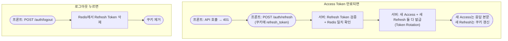
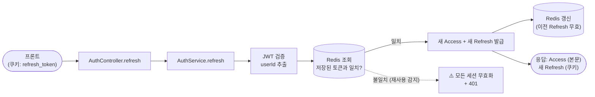
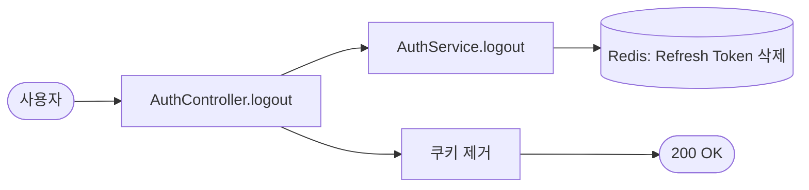
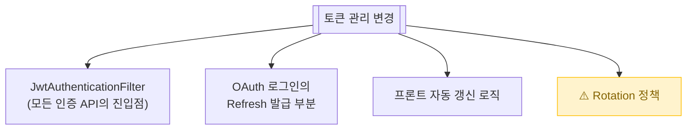

# 토큰 관리 (Refresh / Logout)

> Access Token이 짧은 수명이라 만료되면 새로 받아야 함. **Refresh Token을 던져서 새 Access를 받는 흐름**과 로그아웃 처리.

📁 코드 위치: `backend/.../auth/` · 👥 주체: 로그인 사용자 · 🔐 인증: Refresh Token (쿠키)

---

## 1. 한눈에

**스토리**: Access는 짧게(보통 30분~1시간), Refresh는 길게(2주). 짧은 Access를 자주 갱신해서 **혹시 새어나가도 빨리 무효화**되게 함. 그리고 Refresh도 갱신할 때마다 새 거로 바꿔주는데(**Token Rotation**), 이전 Refresh를 누가 또 쓰면 → 탈취 의심으로 모든 세션 무효화.

---

## 2. 왜 이게 있나

!!! abstract "비즈니스 의도"
    - **Access는 짧게, 자주 갱신** — 새어나가도 피해 최소화
    - **Token Rotation** — Refresh 쓸 때마다 새 Refresh 발급. 이전 건 무효
    - **재사용 감지** — 이전 Refresh를 누가 또 쓰면 탈취 의심 → **모든 세션 무효화**
    - **단일 세션** — 같은 userId당 Redis 키 1개. 다른 기기 로그인 시 이전 기기 자동 로그아웃

---

## 3. 시나리오

### 3-1. Access Token 갱신 — `POST /auth/refresh`

> **상황**: 프론트가 API 호출했는데 401 받음. Access 만료된 것 같음. 자동으로 `/auth/refresh` 때림.

-   :material-numeric-1-circle: **쿠키에서 Refresh Token 꺼내기**

    `@CookieValue` 어노테이션으로 자동 추출.
    없거나 빈 문자열이면 즉시 401 (로그인 안 된 상태).

-   :material-numeric-2-circle: **JWT 검증 + userId 추출**

    `tokenProviderPort.getUserIdFromRefreshToken` — 서명 검증, 만료 체크, claim 파싱.
    한 번에 다 함. 여기서 실패하면 토큰 자체가 망가짐.

-   :material-numeric-3-circle: **Redis 일치 확인 (재사용 감지)**

    `refreshTokenPort.matches(userId, token)` — Redis에 저장된 가장 최신 토큰과 비교.
    **불일치면 토큰 탈취로 간주** → `refreshTokenPort.delete(userId)`로 그 사용자의 모든 세션 무효화 + `RefreshTokenReusedException`.

    > 왜 이러냐: Token Rotation은 매 갱신마다 새 토큰을 줌. 이전 토큰은 즉시 무효. 누군가 이전 토큰을 또 쓰면 = "정품 사용자가 갱신했지만 누군가 옛날 걸 들고 있다" = 탈취 가능성.

-   :material-numeric-4-circle: **사용자 조회 + 차단 검증**

    `loadUserPort.findById` — 사이에 탈퇴/차단 됐을 수 있음.
    없으면 `UserNotFoundException`.

-   :material-numeric-5-circle: **새 Access + 새 Refresh 발급**

    Access는 응답 본문(`TokenResponse`), 새 Refresh는 쿠키 갱신.
    `onboarded` 플래그도 같이 응답 — 프론트가 온보딩 페이지로 보낼지 결정.

-   :material-numeric-6-circle: **Redis 갱신 (Rotation)**

    같은 키에 새 토큰 덮어쓰기. **이전 토큰은 그 즉시 무효**.

!!! warning "갱신 실패 시 쿠키 제거"
    어떤 이유로든 갱신 실패하면 catch에서 `clearRefreshTokenCookie` 호출 → 다음 요청에서도 401이 나도 무한 루프 안 빠짐.

---

### 3-2. 로그아웃 — `POST /auth/logout`

> **상황**: 사용자가 로그아웃 버튼 누름.

-   :material-numeric-1-circle: **Redis Refresh Token 삭제**

    `refreshTokenPort.delete(userId)`. 이게 빠지면 Refresh가 살아있어서 무한 갱신 가능.

-   :material-numeric-2-circle: **쿠키 제거**

    `Set-Cookie: refresh_token=; Max-Age=0`. 브라우저가 자동 삭제.

-   :material-numeric-3-circle: **Access는 만료까지 계속 쓸 수 있음**

    Access는 stateless라 서버가 무효화 못 함. **짧은 수명에 의존**.
    "방금 로그아웃했는데 잠깐 동안 API 됨" 시나리오는 여기서 발생.

---

## 4. 진입점

| Method | Path | 핸들러 | 권한 |
|--------|------|--------|------|
| `🟡 POST` | `/api/v1/auth/refresh` | [`refresh`](https://github.com/ahn-h-j/Fairbid/blob/main/backend/src/main/java/com/cos/fairbid/auth/adapter/in/controller/AuthController.java#L147) | Refresh 쿠키 보유자 |
| `🟡 POST` | `/api/v1/auth/logout` | [`logout`](https://github.com/ahn-h-j/Fairbid/blob/main/backend/src/main/java/com/cos/fairbid/auth/adapter/in/controller/AuthController.java#L175) | 로그인 사용자 |

---

## 5. 요청 / 응답

??? example "refresh"
    Body 없음. 쿠키로 `refresh_token` 자동 전달.
    응답: `TokenResponse { accessToken, onboarded }` + 새 `refresh_token` 쿠키.

??? example "logout"
    Body 없음. 응답 200 + `refresh_token` 쿠키 제거.

---

## 6. 에러 케이스

| 예외 | 발생 조건 | HTTP |
|------|-----------|------|
| (없음, 401 직접 반환) | Refresh 쿠키 부재 | 401 |
| [`TokenInvalidException`](https://github.com/ahn-h-j/Fairbid/blob/main/backend/src/main/java/com/cos/fairbid/auth/domain/exception/TokenInvalidException.java) | 서명/형식 깨짐 | 401 |
| [`TokenExpiredException`](https://github.com/ahn-h-j/Fairbid/blob/main/backend/src/main/java/com/cos/fairbid/auth/domain/exception/TokenExpiredException.java) | Refresh 만료 | 401 |
| [`RefreshTokenReusedException`](https://github.com/ahn-h-j/Fairbid/blob/main/backend/src/main/java/com/cos/fairbid/auth/domain/exception/RefreshTokenReusedException.java) | **재사용 감지 — 전 세션 강제 종료** | 401 |
| [`UserNotFoundException`](https://github.com/ahn-h-j/Fairbid/blob/main/backend/src/main/java/com/cos/fairbid/user/domain/exception/UserNotFoundException.java) | 사이에 사용자 삭제됨 | 404 |

---

## 7. 변경 시 영향

> Rotation 룰을 깨뜨리면 (예: 이전 Refresh도 유효하게 두면) **재사용 감지 의미 없어짐 = 토큰 탈취 무방어**.

---

## 8. 설계 결정

!!! tip "왜 이렇게 했나"

    **Token Rotation**
    Refresh 쓸 때마다 새 Refresh 발급. **이전 Refresh를 누가 또 쓰면 = 탈취** → 그 사용자의 모든 세션 즉시 무효화.

    **Refresh를 Redis에 두는 이유**
    JWT는 stateless라 서버가 무효화 못 함. Redis에 별도 저장하고 비교해야 "이전 토큰 무효" 가능.

    **단일 세션 (userId당 키 1개)**
    여러 기기 동시 로그인 안 됨. 새로 로그인하면 이전 기기 토큰 덮어써짐 = 자동 로그아웃. 토큰 탈취 영향 최소화.

    **Access는 무효화 안 함**
    Stateless 그대로 둠. 짧은 수명(JWT 만료)에 의존. 즉시 무효화 필요하면 Redis blacklist를 추가해야 하는데 현재 안 함.

    **갱신 실패 시 쿠키 제거**
    catch 블록에서 무조건 `clearRefreshTokenCookie`. 안 그러면 망가진 토큰을 들고 무한 401 루프.

---

## 9. 🔧 기술 메모

!!! info "트랜잭션"
    - `AuthService.refresh` / `logout`은 메서드 레벨 `@Transactional` 없음 → 클래스 기본인 `@Transactional(readOnly=true)`.
    - DB는 `loadUserPort.findById`만 호출. 나머지는 Redis. **JPA 트랜잭션이 Redis에 영향 안 줌.**

!!! info "캐시 / 세션 저장소"
    - `RefreshTokenRedisAdapter` — `userId → refreshToken` 단순 키-밸류. TTL은 JWT 만료와 동일.
    - **TTL 안 맞추면**: TTL이 짧으면 정상 사용자가 갑자기 401, 길면 만료 후에도 일치 검사가 통과 (실제론 JWT 검증에서 막힘).

!!! info "Redis 단일 세션 정책"
    - 키 패턴: `refresh_token:{userId}`. SET 시 자동 덮어쓰기 (이전 값 무효).
    - 다중 기기 지원하려면 → 키에 deviceId 붙이는 식으로 확장 필요. **현재는 단일 세션 고정**.

!!! info "JWT 처리"
    - `JwtTokenProvider` — HS256 + secret key. Access/Refresh 다른 secret 사용.
    - 검증 시 만료/서명/형식 체크 한 번에. 실패 케이스에 따라 `TokenExpired` / `TokenInvalid` 분기.

!!! info "이벤트 / 락 / 비동기 — 안 씀"
    동기 호출 + Redis. 락 없음 (Token Rotation은 순차 호출 가정).

---

## 10. 운영

`Refresh Token 재사용 감지! userId={}` 로그가 `WARN` 레벨로 남으면 **탈취 의심**. 잦으면 보안 점검.

**관련 페이지**
- [OAuth 로그인](oauth-login.md)
- [온보딩](user-onboarding.md)
