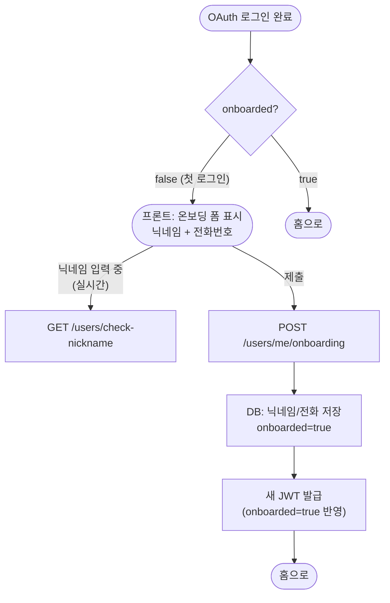
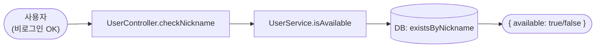
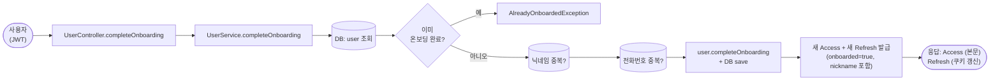
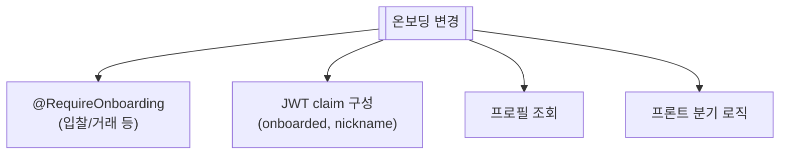

# 온보딩 (닉네임 + 전화번호 등록)

> OAuth로 로그인하면 우리한텐 이메일/카카오ID밖에 없음. **닉네임이랑 전화번호 받아야 사이트 활동 가능**.

📁 코드 위치: `backend/.../user/` · 👥 주체: 첫 로그인 사용자 · 🔐 인증: 로그인 (JWT)

---

## 1. 한눈에

**스토리**: OAuth 로그인 직후엔 `onboarded=false`. 프론트는 응답의 이 플래그 보고 온보딩 폼 띄움. 닉네임은 입력 중에 중복 체크 호출(실시간), 폼 제출하면 저장 + 새 JWT 발급. 새 JWT에는 `onboarded=true`가 박혀있어서 다음부턴 바로 홈.

---

## 2. 왜 이게 있나

!!! abstract "비즈니스 의도"
    - **OAuth는 식별만, 사이트 정보는 따로** — 카카오 이메일이 본명일 필요 없음. 사이트에서 쓸 닉네임 별도로
    - **전화번호는 거래 필수** — 직거래/택배 양쪽 다 연락처 필요
    - **온보딩 미완료자는 활동 차단** — `@RequireOnboarding` 어노테이션으로 입찰/거래 등 차단
    - **JWT에 onboarded 박는 이유** — 매 요청마다 DB 안 보고 토큰 안의 플래그로 빠르게 분기

---

## 3. 시나리오

### 3-1. 닉네임 중복 확인 (실시간) — `GET /users/check-nickname`

> **상황**: 사용자가 닉네임 입력 중. 프론트가 디바운스해서 호출.

-   :material-numeric-1-circle: **비로그인도 호출 가능**

    SecurityConfig에서 permitAll. 가입 전에도 닉네임 미리 골라볼 수 있게.

-   :material-numeric-2-circle: **유효성: 2~20자**

    `@NotBlank @Size(min=2, max=20)` — 길이 안 맞으면 400.

-   :material-numeric-3-circle: **단순 exists 쿼리**

    DB에 이미 있는지만. 다른 검증(욕설 필터 등) 없음.

---

### 3-2. 온보딩 완료 — `POST /users/me/onboarding`

> **상황**: 닉네임/전화번호 입력 후 제출.

-   :material-numeric-1-circle: **사용자 조회 + 이미 온보딩 체크**

    이미 `onboarded=true`면 → `AlreadyOnboardedException`. 두 번 호출 막음.

-   :material-numeric-2-circle: **닉네임 + 전화번호 중복 검사**

    각각 `existsByNickname` / `existsByPhoneNumber`.
    **둘 다 unique 제약** — 동시성 상황에선 DB 제약이 최후 방어선.

-   :material-numeric-3-circle: **도메인 메서드로 변경**

    `user.completeOnboarding(nickname, phoneNumber)` — `nickname`/`phoneNumber` 세팅 + `onboarded=true`.
    POJO 도메인이 자기 상태 변경 책임.

-   :material-numeric-4-circle: **새 JWT 재발급**

    Access Token claim에 `onboarded`/`nickname`이 박혀있는데 **둘 다 바뀜** → 토큰 무효화 후 새 거 발급.
    Refresh도 같이 Rotation([토큰 관리](token-management.md) 참고).

-   :material-numeric-5-circle: **응답: 새 Access (본문) + 새 Refresh (쿠키)**

    프론트는 새 Access를 받아서 `onboarded=true` 상태로 다음 요청 시작.

---

## 4. 진입점

| Method | Path | 핸들러 | 권한 |
|--------|------|--------|------|
| `🟢 GET` | `/api/v1/users/check-nickname?nickname=...` | [`checkNickname`](https://github.com/ahn-h-j/Fairbid/blob/main/backend/src/main/java/com/cos/fairbid/user/adapter/in/controller/UserController.java#L119) | 비로그인 OK |
| `🟡 POST` | `/api/v1/users/me/onboarding` | [`completeOnboarding`](https://github.com/ahn-h-j/Fairbid/blob/main/backend/src/main/java/com/cos/fairbid/user/adapter/in/controller/UserController.java#L97) | 로그인 |

---

## 5. 요청 / 응답

??? example "checkNickname"
    Query: `nickname=닉네임`
    응답: `{ "available": true }`

??? example "completeOnboarding"
    Body: `{ "nickname": "...", "phoneNumber": "010..." }`
    응답: `{ "accessToken": "..." }` + `Set-Cookie: refresh_token=...`

---

## 6. 에러 케이스

| 예외 | 발생 조건 | HTTP |
|------|-----------|------|
| 유효성 (Bean Validation) | 닉네임 길이/형식 위반 | 400 |
| [`AlreadyOnboardedException`](https://github.com/ahn-h-j/Fairbid/blob/main/backend/src/main/java/com/cos/fairbid/user/domain/exception/AlreadyOnboardedException.java) | 이미 온보딩 완료 | 409 |
| [`NicknameDuplicateException`](https://github.com/ahn-h-j/Fairbid/blob/main/backend/src/main/java/com/cos/fairbid/user/domain/exception/NicknameDuplicateException.java) | 닉네임 중복 | 409 |
| [`PhoneNumberDuplicateException`](https://github.com/ahn-h-j/Fairbid/blob/main/backend/src/main/java/com/cos/fairbid/user/domain/exception/PhoneNumberDuplicateException.java) | 전화번호 중복 | 409 |
| [`UserNotFoundException`](https://github.com/ahn-h-j/Fairbid/blob/main/backend/src/main/java/com/cos/fairbid/user/domain/exception/UserNotFoundException.java) | 토큰의 userId가 DB에 없음 | 404 |

---

## 7. 변경 시 영향

> 온보딩 필수 필드 추가 시 → `@RequireOnboarding` 가드와 도메인 `User.isOnboarded()` 판정 같이 갱신 필요.

---

## 8. 설계 결정

!!! tip "왜 이렇게 했나"

    **닉네임 + 전화번호 동시 등록**
    분리하면 단계별 미완료 상태 관리 복잡. 한 번에 받고 한 번에 활성.

    **온보딩 후 JWT 재발급**
    `onboarded`/`nickname`이 토큰 claim에 있으니 변경되면 새로 발급. 다음 요청부터 즉시 반영.

    **닉네임 실시간 검증 + 최종 저장 시 재검증**
    실시간은 UX(사용자가 입력 중 알림), 저장 시는 동시성(다른 사람이 같은 닉네임 차지). **둘 다 필요**.

    **`@RequireOnboarding` 어노테이션으로 후속 차단**
    온보딩 안 한 사용자가 입찰/거래 못 하게. 컨트롤러 메서드에 어노테이션 1개로 통제.

---

## 9. 🔧 기술 메모

!!! info "트랜잭션"
    - `UserService` 클래스 기본 `@Transactional(readOnly=true)`.
    - `completeOnboarding`만 `@Transactional` (write).
    - DB save + Redis 토큰 저장이 한 메서드. **Redis는 트랜잭션 밖** — DB 실패 시 토큰 발급 전이라 정합성 OK.

!!! info "JWT 재발급 = 단일 세션과 충돌 없음"
    - 새 Refresh가 Redis에 덮어써지므로 이전 Refresh 자동 무효.
    - 사용자가 다른 기기에 로그인 중이었으면 **온보딩 시점에 그 기기 자동 로그아웃**.

!!! info "유니크 제약 (DB 레벨)"
    - `nickname`, `phone_number` 컬럼에 unique 인덱스. 동시성 상황에서 어플 검사를 통과해도 DB가 막음.
    - 운영 시 unique 제약 위반은 race로 처리해서 사용자에게 "다시 시도" 메시지 권장.

!!! info "이벤트 / 캐시 / 락 / 비동기 — 안 씀"
    동기 + RDB + Redis 직접.

---

## 10. 운영

별도 메트릭 없음. 신규 가입은 OAuth 로그인 시 `INFO` 로그(`신규 사용자 가입`).

**관련 페이지**
- [OAuth 로그인](oauth-login.md)
- [토큰 관리](token-management.md)
- [프로필](user-profile.md)
