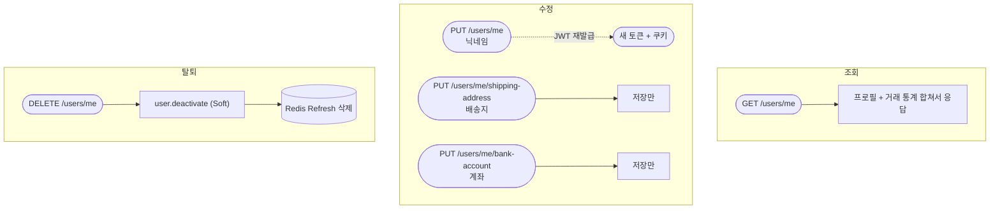
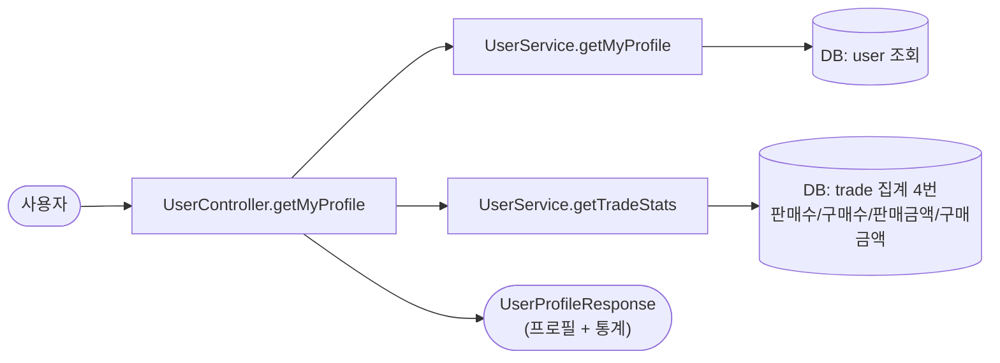
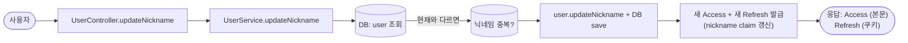
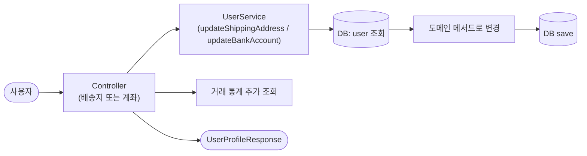
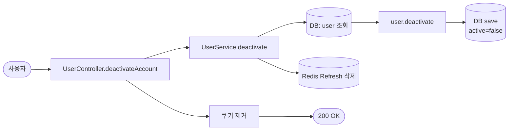
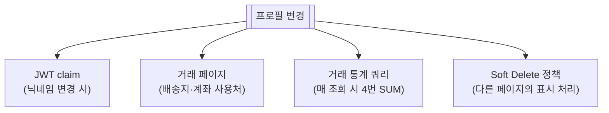

# 프로필 (조회 / 수정 / 탈퇴)

> 마이페이지에서 보고/수정하는 내 정보. 닉네임, 배송지, 계좌, 거래 통계 등. 회원 탈퇴도 여기.

📁 코드 위치: `backend/.../user/` · 👥 주체: 본인 · 🔐 인증: 로그인 (JWT) + 일부는 `@RequireOnboarding`

---

## 1. 한눈에

**스토리**: 프로필 5가지 동작 — 조회 / 닉네임 수정 / 배송지 수정 / 계좌 수정 / 탈퇴. **닉네임만 JWT 재발급** (토큰에 들어있는 값이라). 나머지는 단순 저장. 탈퇴는 Soft Delete (DB 안 지우고 비활성화).

---

## 2. 왜 이게 있나

!!! abstract "비즈니스 의도"
    - **닉네임은 토큰 claim** — 변경 시 토큰 재발급 필요 (다른 화면에 표시되는 닉네임 일관성)
    - **배송지/계좌는 거래 시 사용** — 택배는 배송지 필수, 판매자는 계좌 필요 ([택배](택배.md))
    - **계좌는 입금 대기 시에만 노출** — 다른 사람한테 안 보임 (개인정보)
    - **탈퇴 = Soft Delete** — 거래 이력 보존, 로그인만 차단
    - **거래 통계 (판매/구매 횟수, 금액)** — 마이페이지에서 한눈에

---

## 3. 시나리오

### 3-1. 내 프로필 조회 — `GET /users/me`

> **상황**: 마이페이지 로드.

-   :material-numeric-1-circle: **컨트롤러가 두 UseCase 호출**

    프로필 조회 + 거래 통계 따로 호출해서 컨트롤러에서 합침.
    UseCase가 다른 도메인(`trade`) 데이터를 쓰지만 직접 의존 안 하고 자기 UseCase 통해서 가져옴.

-   :material-numeric-2-circle: **거래 통계는 4번 쿼리**

    판매 완료 수, 구매 완료 수, 총 판매액, 총 구매액 — 각각 따로 SUM.
    페이지 로드 시마다 DB 4번 — **캐시 없음**.

---

### 3-2. 닉네임 수정 — `PUT /users/me`

> **상황**: 마이페이지에서 닉네임 변경.

-   :material-numeric-1-circle: **현재 닉네임이면 중복 검사 스킵**

    같은 값으로 다시 저장해도 동작하게.

-   :material-numeric-2-circle: **닉네임 변경 → JWT 재발급 필수**

    토큰 claim에 nickname이 들어있어서 다른 화면(채팅, 알림 등)에서 옛 값 표시 방지.
    Refresh도 Rotation.

-   :material-shield-alert: **`@RequireOnboarding` 가드**

    온보딩 안 한 사용자는 호출 자체 차단.

---

### 3-3. 배송지 / 계좌 수정 — `PUT /users/me/shipping-address`, `PUT /users/me/bank-account`

-   :material-numeric-1-circle: **단순 저장 — JWT 재발급 없음**

    토큰 claim에 안 들어있는 정보라 토큰 안 건드림.

-   :material-numeric-2-circle: **응답에 거래 통계도 함께**

    프론트가 수정 직후 마이페이지 화면을 그대로 그릴 수 있도록.
    → DB가 같은 요청에서 4번 더 SUM 돔.

-   :material-bank-outline: **계좌는 판매자 정산용**

    `bankName`, `accountNumber`, `accountHolder` 3개. 택배 거래에서 구매자가 입금할 때만 노출.

---

### 3-4. 회원 탈퇴 (Soft Delete) — `DELETE /users/me`

-   :material-numeric-1-circle: **Soft Delete (`active=false`)**

    DB에서 안 지움. 거래 이력, 입찰 기록 모두 보존 (다른 사용자한텐 "탈퇴한 사용자"로 표시).

-   :material-numeric-2-circle: **Refresh Token 즉시 삭제**

    Redis에서 제거 = 갱신 불가. Access는 만료까지 살지만 짧은 수명에 의존.

-   :material-numeric-3-circle: **재가입 시 새 사용자 취급**

    같은 카카오 계정이라도 신규 가입 흐름. 이전 데이터 복구 안 함.

---

## 4. 진입점

| Method | Path | 핸들러 | 권한 |
|--------|------|--------|------|
| `🟢 GET` | `/api/v1/users/me` | [`getMyProfile`](https://github.com/ahn-h-j/Fairbid/blob/main/backend/src/main/java/com/cos/fairbid/user/adapter/in/controller/UserController.java#L133) | 로그인 |
| `🟠 PUT` | `/api/v1/users/me` | [`updateNickname`](https://github.com/ahn-h-j/Fairbid/blob/main/backend/src/main/java/com/cos/fairbid/user/adapter/in/controller/UserController.java#L158) | 로그인 + 온보딩 완료 |
| `🟠 PUT` | `/api/v1/users/me/shipping-address` | [`updateShippingAddress`](https://github.com/ahn-h-j/Fairbid/blob/main/backend/src/main/java/com/cos/fairbid/user/adapter/in/controller/UserController.java#L240) | 로그인 + 온보딩 |
| `🟠 PUT` | `/api/v1/users/me/bank-account` | [`updateBankAccount`](https://github.com/ahn-h-j/Fairbid/blob/main/backend/src/main/java/com/cos/fairbid/user/adapter/in/controller/UserController.java#L274) | 로그인 + 온보딩 |
| `🔴 DELETE` | `/api/v1/users/me` | [`deactivateAccount`](https://github.com/ahn-h-j/Fairbid/blob/main/backend/src/main/java/com/cos/fairbid/user/adapter/in/controller/UserController.java#L179) | 로그인 |

---

## 5. 요청 / 응답

??? example "UserProfileResponse"
    프로필 기본 정보 (id, email, nickname, phoneNumber, role, onboarded, active 등)
    \+ 배송지 (있을 때) + 계좌 (있을 때)
    \+ `tradeStats { completedSales, completedPurchases, totalSalesAmount, totalPurchaseAmount }`

??? example "UpdateNicknameRequest"
    `{ "nickname": "..." }` → 응답 `{ "accessToken": "..." }` + Refresh 쿠키 갱신

??? example "UpdateShippingAddressRequest"
    `{ "recipientName", "recipientPhone", "postalCode", "address", "addressDetail" }`

??? example "UpdateBankAccountRequest"
    `{ "bankName", "accountNumber", "accountHolder" }`

---

## 6. 에러 케이스

| 예외 | 발생 조건 | HTTP |
|------|-----------|------|
| 유효성 (Bean Validation) | 입력 형식/길이 위반 | 400 |
| [`UserNotFoundException`](https://github.com/ahn-h-j/Fairbid/blob/main/backend/src/main/java/com/cos/fairbid/user/domain/exception/UserNotFoundException.java) | 토큰의 userId가 없음 | 404 |
| [`NicknameDuplicateException`](https://github.com/ahn-h-j/Fairbid/blob/main/backend/src/main/java/com/cos/fairbid/user/domain/exception/NicknameDuplicateException.java) | 닉네임 중복 | 409 |
| [`OnboardingRequiredException`](https://github.com/ahn-h-j/Fairbid/blob/main/backend/src/main/java/com/cos/fairbid/user/domain/exception/OnboardingRequiredException.java) | `@RequireOnboarding` 가드 | 403 |

---

## 7. 변경 시 영향

> 거래 통계 쿼리가 **매 프로필 조회마다 4번 SUM**. 사용자 수 늘면 캐시 도입 검토 필요.

---

## 8. 설계 결정

!!! tip "왜 이렇게 했나"

    **닉네임만 JWT 재발급, 나머지는 안 함**
    토큰 claim에 들어있는 값(`nickname`)만 동기화 필요. 배송지/계좌는 토큰에 없으니 그냥 저장만.

    **거래 통계를 매번 4번 쿼리**
    캐시 없음. 사용자 수 적은 단계라 일단 정직하게 SUM. 캐시 도입은 나중에.

    **계좌는 응답에서 조건부 노출**
    [거래 기본](거래-기본.md)의 `sellerBankAccount` — 입금 대기 단계 + 구매자 본인일 때만. 그 외에는 가림.

    **Soft Delete**
    경매/입찰/거래 이력이 다른 사용자한테 보여야 하므로 데이터 유지. 로그인만 차단(`active=false` + Refresh 삭제).

    **`@RequireOnboarding` 가드**
    수정 API는 온보딩 완료자만. 조회/탈퇴는 누구나.

---

## 9. 🔧 기술 메모

!!! info "트랜잭션"
    - `UserService` 클래스 기본 `@Transactional(readOnly=true)`.
    - 수정/탈퇴 메서드만 `@Transactional` (write).
    - 닉네임 수정/탈퇴 시 DB save + Redis 작업이 같은 메서드. **Redis는 트랜잭션 밖** — DB 실패 시 Redis 변경 전이라 정합성 OK.

!!! info "거래 통계 — 캐시 미도입"
    - `tradeRepositoryPort.countCompletedSales` 등 4번 호출. 매번 DB 집계.
    - **사용자 수 늘면 N+1 비슷한 부하**. Redis 캐시 또는 비정규화 컬럼 검토.

!!! info "유니크 제약 (DB)"
    - `nickname`, `phone_number` 컬럼 unique 인덱스. 어플 검사 우회되는 race 상황도 DB가 막음.

!!! info "이벤트 / 락 / 비동기 — 안 씀"
    동기 + RDB + Redis (닉네임 수정/탈퇴 시 토큰 처리만).

---

## 10. 운영

별도 메트릭 없음. 닉네임 수정/탈퇴는 `INFO` 로그.

**관련 페이지**
- [OAuth 로그인](oauth-login.md)
- [토큰 관리](token-management.md)
- [거래 기본](거래-기본.md) — 계좌 정보 노출 조건
- [택배](택배.md) — 배송지 사용처
