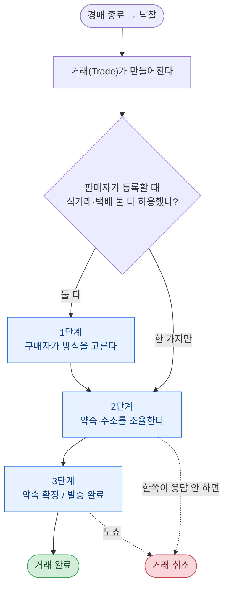
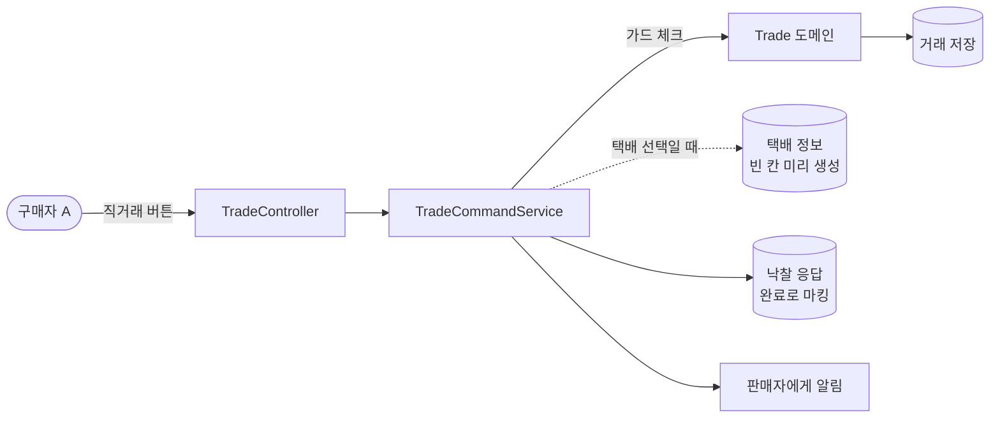
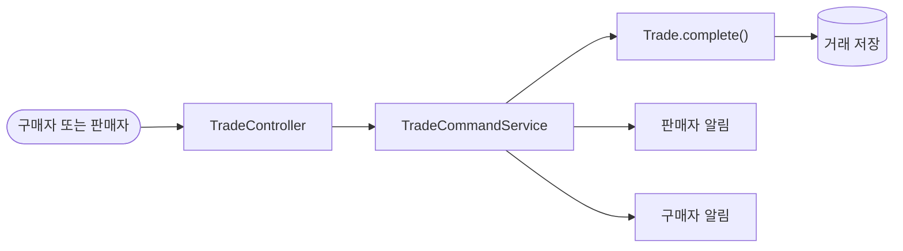
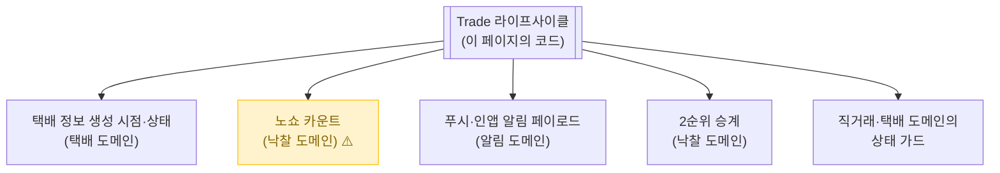

# 거래 기본

> 경매가 끝나서 낙찰자가 정해지면, 판매자와 낙찰자를 한 자리에 묶어주는 게 **거래(Trade)**. 이 페이지는 그 거래가 시작돼서 끝날 때까지의 **공통 뼈대**다.

📁 코드 위치: `backend/.../trade/` · 👥 주체: 판매자/구매자 · 🔐 인증: 로그인 사용자(API 서버)

---

## 1. 한눈에



**스토리**: 낙찰되면 `Trade` 객체가 하나 만들어진다. 판매자가 직거래/택배 둘 다 허용했으면 구매자가 한 번 골라야 하고(1단계), 한 가지만 허용했으면 그냥 다음 단계로 간다. 이후 약속 잡고(2단계) → 만남이나 발송이 끝나면(3단계) → 완료. 중간에 응답 안 하면 취소되고 [2순위 승계](경매-종료.md)로 넘어간다.

---

## 2. 왜 이게 있나

!!! abstract "이 기능이 풀어주는 문제"
    **"낙찰됐는데 어떻게 만나죠?"** — 시스템이 단계별로 가이드한다.

    - **거래 방식이 둘**(직거래/택배)이라 누군가 한 번 골라야 함 → 책임은 **구매자**
    - **응답 안 하고 잠수타는 사람** 막으려고 단계마다 응답 기한이 붙음 → 어기면 [노쇼 처리](경매-종료.md)
    - 구체적인 거래 절차는 [직거래](직거래.md) / [택배](택배.md) 페이지로 위임. 여기는 **공통 뼈대만**

---

## 3. 거래의 5가지 상태

거래가 살면서 거치는 5가지 단계. 코드에서는 `TradeStatus` enum.

<div class="grid cards" markdown>

-   :material-numeric-1-circle: **방식 선택 대기**
    `AWAITING_METHOD_SELECTION`

    "직거래로 받을지, 택배로 받을지 골라주세요" — 화면에 버튼 두 개.
    구매자가 누르기 전까지 멈춤. 응답 안 하면 노쇼 카운트.

-   :material-numeric-2-circle: **조율 중**
    `AWAITING_ARRANGEMENT`

    방식이 정해진 뒤 실제 약속을 잡는 단계.
    직거래면 판매자가 시간/장소를 제안하고, 택배면 구매자가 주소를 입력하고 입금한다.

-   :material-numeric-3-circle: **약속 완료 / 발송 완료**
    `ARRANGED`

    직거래는 만나기로 약속 확정, 택배는 발송 완료.
    이제 만나거나 받기만 하면 됨.

-   :material-numeric-4-circle: **거래 완료**
    `COMPLETED`

    물건을 주고받았다. `completedAt` 기록되고 마이페이지 거래내역에 노출.

-   :material-numeric-5-circle: **거래 취소**
    `CANCELLED`

    한쪽이 응답 안 함(노쇼) 또는 거절. → [2순위 승계](경매-종료.md) 흐름으로 다음 사람한테 넘어간다.

</div>

---

## 4. 시나리오

### 4-1. 방식을 고른다 (`POST /trades/{id}/method`)

> **상황**: 구매자 A가 낙찰받았다. 그 경매는 직거래·택배 **둘 다** 가능했다. 화면에 "직거래" / "택배" 버튼이 떠 있고, A가 "직거래"를 누른다.



<div class="grid cards" markdown>

-   :material-shield-check: **0. 권한 검사 — "이 거래의 구매자 맞아?"**

    서비스가 먼저 막고, 도메인(`Trade.selectMethod()`) 안에서도 한 번 더 막는다.
    혹시라도 누가 우회 호출해도 상태가 깨지지 않도록 **마지막 방어선은 도메인**.

-   :material-numeric-1-circle: **방식을 확정한다 — 1단계 → 2단계**

    내부적으로 거래 상태가 `AWAITING_METHOD_SELECTION`(고를 차례) → `AWAITING_ARRANGEMENT`(약속 잡을 차례)로 바뀐다.
    버튼 누른 순간 화면도 다음 단계 UI로 전환됨.

-   :material-numeric-2-circle: **응답 기한 시계 리셋**

    "이 거래에 X시간 안에 응답 안 하면 노쇼" 시계가 거래마다 붙어있다(`responseDeadline`).
    방식 선택은 끝났으니, **이제부턴 약속을 잡아야 하는 시계**로 다시 시작.

    > 왜 리셋? 방식 선택이 마감 직전에 일어나면 약속 잡을 시간이 0이 됨. 단계마다 새 시계.

-   :material-numeric-3-circle: **택배라면, 빈 택배 정보를 미리 만든다**

    이후 [택배](택배.md) 화면에서 주소 입력/입금/송장 같은 칸이 차근차근 채워짐.
    껍데기를 미리 만들어 두는 이유: 다음 화면에서 "택배 정보가 없네요" 처리할 일이 없도록.

-   :material-numeric-4-circle: **노쇼 카운트 빼주기**

    구매자가 응답을 했으니, [낙찰(`Winning`)](경매-종료.md)의 "응답함" 플래그를 켠다(`markAsResponded`).
    이게 빠지면 정상 응답한 사람이 잠수자로 카운트되는 버그가 남.

-   :material-numeric-5-circle: **판매자에게 알림 발송**

    "구매자가 직거래를 선택했어요" 푸시·인앱.
    판매자는 이제 직거래 약속을 제안할 차례임을 알게 됨.

</div>

---

### 4-2. 거래를 종료한다 (`POST /trades/{id}/complete`)

> **상황**: 직거래로 만났고, 물건을 주고받았다. 구매자가 "수령 확인" 버튼을 누른다.



<div class="grid cards" markdown>

-   :material-shield-check: **0. 권한 검사 — "이 거래 참여자 맞아?"**

    구매자든 판매자든 둘 중 하나면 OK.
    그 외 사용자가 호출하면 403.

-   :material-numeric-1-circle: **3단계 → 거래 완료**

    상태가 `ARRANGED`(약속 확정/발송 완료) → `COMPLETED`로 바뀐다.
    거기 아닌 단계에서 호출하면 도메인이 거부(`IllegalStateException`).

    > 보통 이 엔드포인트를 사용자가 직접 누르진 않는다. [직거래 `accept`](직거래.md), [택배 `confirmDelivery`](택배.md) 안에서 자동 호출됨. 명시 호출은 **상대가 응답 안 할 때 한쪽이 강제로 종결하는 백업 경로**.

-   :material-numeric-2-circle: **양쪽에 알림**

    판매자/구매자 모두에게 "거래가 완료됐어요" 푸시·인앱. 한쪽만 알려주는 게 아님.

</div>

---

### 4-3. 거래 상세를 본다 (`GET /trades/{id}`)

> **상황**: 마이페이지에서 거래 내역 클릭 → 상세 화면.

핵심은 거래 방식에 따라 **다른 부가 정보**를 끼워주는 것.

<div class="grid cards" markdown>

-   :material-card-account-details-outline: **직거래라면**

    `directTradeUseCase.findByTradeId`로 약속 시간/장소 같은 [직거래 정보](직거래.md)를 조립.

-   :material-truck-outline: **택배라면**

    `deliveryUseCase.findByTradeId`로 주소/송장/입금 같은 [택배 정보](택배.md)를 조립.

-   :material-bank-outline: **그리고 — 입금 대기 중이라면 판매자 계좌까지**

    "택배 + 보고 있는 사람이 구매자 + 입금 대기 단계" 이 세 조건이 모두 맞을 때만,
    판매자의 은행/계좌번호/예금주를 응답에 끼워준다.

    완료 후엔 가린다 → **개인정보 최소화 원칙**.

</div>

---

## 5. 진입점

| Method | Path | 핸들러 | 권한 |
|--------|------|--------|------|
| `🟢 GET` | `/api/v1/trades/{tradeId}` | [`getTrade`](https://github.com/ahn-h-j/Fairbid/blob/main/backend/src/main/java/com/cos/fairbid/trade/adapter/in/controller/TradeController.java#L63) | 거래 참여자 |
| `🟢 GET` | `/api/v1/trades/my` | [`getMyTrades`](https://github.com/ahn-h-j/Fairbid/blob/main/backend/src/main/java/com/cos/fairbid/trade/adapter/in/controller/TradeController.java#L107) | 본인 |
| `🟡 POST` | `/api/v1/trades/{tradeId}/method` | [`selectMethod`](https://github.com/ahn-h-j/Fairbid/blob/main/backend/src/main/java/com/cos/fairbid/trade/adapter/in/controller/TradeController.java#L120) | **구매자만** |
| `🟡 POST` | `/api/v1/trades/{tradeId}/complete` | [`complete`](https://github.com/ahn-h-j/Fairbid/blob/main/backend/src/main/java/com/cos/fairbid/trade/adapter/in/controller/TradeController.java#L133) | 거래 참여자 |

---

## 6. 요청 / 응답

??? example "TradeDetailResponse — 상세 조회 응답"
    | 필드 | 노출 조건 |
    |------|-----------|
    | 거래 기본 정보 (id, 가격, 상태, 방식, 응답기한 등) | 항상 |
    | `directTradeInfo` | 직거래일 때 |
    | `deliveryInfo` | 택배일 때 |
    | `sellerBankAccount` (은행/계좌/예금주) | **택배 + 구매자 + 입금 대기 단계** |

??? example "SelectMethodRequest — 방식 선택 요청"
    ```json
    { "method": "DIRECT" }
    ```
    → 응답: `TradeResponse` (Trade 기본 정보)

??? example "complete — 완료 요청"
    Body 없음. → 응답: `TradeResponse`.

---

## 7. 에러 케이스

| 예외 | 언제 나는가 | HTTP | 사용자에게 보이는 의미 |
|------|-------------|------|---------------------|
| [`TradeNotFoundException`](https://github.com/ahn-h-j/Fairbid/blob/main/backend/src/main/java/com/cos/fairbid/trade/domain/exception/TradeNotFoundException.java) | 그 거래 ID가 없음 | 404 | 거래를 찾을 수 없음 |
| [`NotTradeParticipantException.notParticipant`](https://github.com/ahn-h-j/Fairbid/blob/main/backend/src/main/java/com/cos/fairbid/trade/domain/exception/NotTradeParticipantException.java) | 참여자 아닌 사람이 조회/완료 시도 | 403 | 권한 없음 |
| [`NotTradeParticipantException.notBuyer`](https://github.com/ahn-h-j/Fairbid/blob/main/backend/src/main/java/com/cos/fairbid/trade/domain/exception/NotTradeParticipantException.java) | 구매자 아닌 사람이 방식 선택 | 403 | 구매자만 선택 가능 |
| [`InvalidTradeStatusException.cannotSelectMethod`](https://github.com/ahn-h-j/Fairbid/blob/main/backend/src/main/java/com/cos/fairbid/trade/domain/exception/InvalidTradeStatusException.java) | 이미 방식이 정해진 거래에 또 선택 시도 | 409 | 이미 방식이 정해진 거래 |
| `IllegalStateException` (도메인) | `complete`을 `ARRANGED` 아닌 단계에서 호출 | 500 | (정상 흐름이면 안 나야 함 — 호출 순서 의심) |

---

## 8. 변경 시 영향

이 기능을 손대면 줄줄이 영향받는 곳들. 굵을수록 부서지기 쉬움.



> 노란색이 가장 부서지기 쉬운 곳. `selectMethod`의 부수효과를 건드릴 때 `Winning.markAsResponded` 호출 누락하면 정상 응답자가 노쇼로 처리됨.

??? note "의존하는 Port 목록"
    | Port | 어댑터 | 무엇에 |
    |-----|--------|------|
    | `TradeRepositoryPort` | JPA | Trade CRUD |
    | `DeliveryInfoRepositoryPort` | JPA | 방식 선택 시 빈 택배 정보 생성 |
    | `WinningRepositoryPort` | JPA | 노쇼 카운트 방지 처리 |
    | `AuctionRepositoryPort` | JPA | 알림 메시지에 경매 제목 |
    | `PushNotificationPort` | FCM + 인앱 | 거래 진행 알림 |
    | `DirectTradeUseCase` / `DeliveryUseCase` | 같은 도메인 | 상세 조회 시 부가 정보 |
    | `GetMyProfileUseCase` | 사용자 도메인 | 판매자 계좌 |

---

## 9. 설계 결정

!!! tip "왜 이렇게 했나"

    **마지막 방어선은 도메인**
    서비스/컨트롤러에서 가드 체크를 해도, `Trade` 도메인 메서드(`selectMethod`, `complete`) 안에서 한 번 더 검사한다. 호출 순서가 깨져도 도메인 객체가 자기 일관성을 지키게.

    **응답 기한은 단계마다 리셋**
    선택 시점부터 다시 카운트. 안 그러면 마지막에 응답한 사람은 다음 단계 기한이 0이 됨. 정책 SoT는 `Winning.RESPONSE_DEADLINE_HOURS`(낙찰 BC).

    **판매자 계좌는 입금 대기 단계에서만 노출**
    완료 후엔 가린다. 응답에 항상 박고 null 처리하는 게 아니라 컨트롤러에서 조건 체크 후 조립 — 개인정보 최소화.

    **`complete`은 양쪽 다 호출 가능**
    UI는 보통 구매자가 수령 확인 → 자동 `complete`. 그래도 명시 엔드포인트를 둔 건 **상대가 응답 안 할 때 한쪽이 강제 종결**할 수 있게.

    **2순위 승계는 같은 Trade 객체 재활용**
    `transferToSecondRank`로 `buyerId`/`finalPrice`/상태/기한을 갈아끼움. 새 Trade 안 만드는 이유는 **하나의 낙찰 = 하나의 Trade** 1:1 불변. 이력 추적은 [Winning](경매-종료.md)에서.

---

## 10. 🔧 기술 메모

코드에 어떤 기술 선택지가 들어갔고, **건드릴 때 뭘 조심해야 하는지**.

!!! info "트랜잭션 — 어디서 시작하고 어디서 끝나는가"
    - **`TradeCommandService`**: `@Transactional` (write). `selectMethod` / `complete` 각각 한 트랜잭션.
      → Trade 변경 + 빈 택배 정보 생성 + 노쇼 카운트 마킹 + 알림 호출이 **모두 같은 트랜잭션**. 한쪽이라도 실패하면 다 롤백.
    - **`TradeQueryService`**: `@Transactional(readOnly=true)` — 읽기 전용. 더티 체크 안 함, 1차 캐시 가벼움.
    - **⚠️ 조심**: 알림 호출이 트랜잭션 안에서 **동기**로 일어남. FCM 외부 호출이 느려지면 DB 커넥션을 그만큼 오래 잡고 있음. 알림 비동기 분리는 [알림](알림.md) 참고.

!!! info "도메인이 자기 일관성 책임"
    `Trade.selectMethod()` / `complete()` 같은 메서드는 **상태 가드를 도메인 안에 둔다**.
    서비스/컨트롤러 가드는 빠른 차단용, 도메인 가드가 마지막 방어선. 누가 우회 호출해도 객체가 깨지지 않음.

!!! info "이벤트 / 캐시 / 락 / 비동기 — 안 씀"
    이 기능은 단순 RDB write + 동기 외부 호출. 이벤트 발행, Redis 캐시, 락, `@Async` 모두 사용 안 함.
    동시성 높은 영역(입찰)은 [입찰 비동기 처리](입찰-비동기처리.md), 알림 비동기는 [알림](알림.md).

---

## 11. 운영

별도 메트릭 없음. 단계별 분포가 보고 싶으면 `trade.status` 그룹 카운트.

**관련 페이지**
- [경매 종료 / 낙찰 / 노쇼](경매-종료.md)
- [직거래](직거래.md)
- [택배](택배.md)
- [알림](알림.md)
