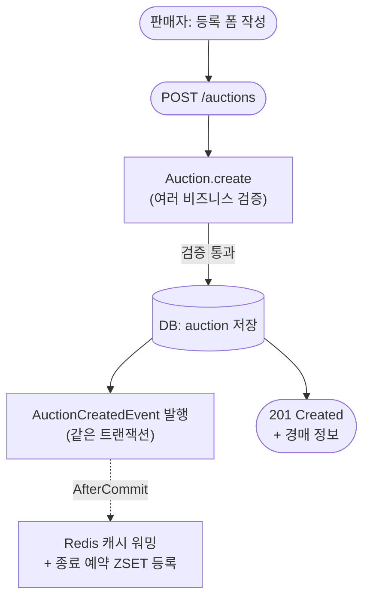
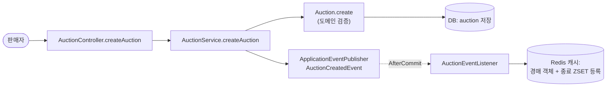
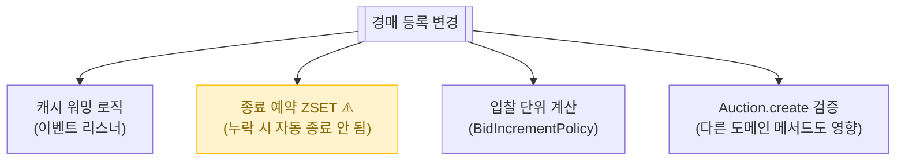

# 경매 등록

> 판매자가 물건을 올려서 경매를 시작. 시작가, 즉시구매가, 24h/48h 기간, 직거래/택배 옵션, 카테고리 등을 한 번에.

📁 코드 위치: `backend/.../auction/` · 👥 주체: 판매자 · 🔐 인증: 로그인 + 온보딩 완료

---

## 1. 한눈에



**스토리**: 폼 → 도메인이 자기 검증(시작가/즉시구매가/거래방식 등) → DB 저장 → 같은 트랜잭션에서 이벤트 발행 → **트랜잭션 커밋 후** 리스너가 Redis에 캐시 워밍 + 종료 시각 예약. 동기 응답은 사용자에게 빠르게.

---

## 2. 왜 이게 있나

!!! abstract "비즈니스 의도"
    - **거래 시작점** — 모든 입찰/낙찰/거래 흐름의 출발
    - **사기/오등록 방지** — 즉시구매가가 시작가보다 낮으면 거부, 거래 방식 미선택 거부
    - **즉시 반영** — 등록 직후부터 입찰 가능 → 캐시도 등록 시점에 워밍
    - **자동 종료** — 등록 시 종료 시각을 Redis Sorted Set에 박아 [경매 종료 스케줄러](경매-종료.md)가 시간 되면 처리

---

## 3. 시나리오

### 3-1. 경매 등록 — `POST /auctions`

> **상황**: 판매자가 폼 채우고 "경매 시작" 버튼 누름.



<div class="grid cards" markdown>

-   :material-shield-alert: **0. `@RequireOnboarding` 가드**

    온보딩 미완료자는 등록 자체 차단 (403).

-   :material-numeric-1-circle: **도메인이 비즈니스 검증**

    `Auction.create(...)` 안에서:
    - 즉시구매가가 시작가보다 낮거나 같으면 거부 (`instantBuyPriceTooLow`)
    - 직거래·택배 둘 다 false면 거부 (`noTradeMethodSelected`)
    - 직거래 선택 시 위치 비어있으면 거부 (`directTradeLocationRequired`)

    > 컨트롤러는 입력 형식만 본다. **비즈니스 룰은 도메인이 책임**.

-   :material-numeric-2-circle: **종료 시각 자동 계산**

    `now + 24h` 또는 `now + 48h` (`AuctionDuration` enum). 클라이언트가 보낸 시간 안 믿음.

-   :material-numeric-3-circle: **입찰 단위 자동 계산**

    시작가 구간에 따라 입찰 단위 결정 (`BidIncrementPolicy`). 500원 ~ 50,000원 차등.

-   :material-numeric-4-circle: **DB 저장 + 이벤트 발행**

    `auctionRepository.save` → `eventPublisher.publishEvent(AuctionCreatedEvent)`.
    이벤트는 같은 트랜잭션. 리스너는 `AfterCommit`이라 **트랜잭션 커밋된 후**에 실행됨.

-   :material-numeric-5-circle: **(이벤트) Redis 캐시 워밍 + 종료 예약**

    `AuctionEventListener`가:
    - 경매 객체를 Redis에 저장 (다음 조회 캐시 hit)
    - 종료 시각을 Sorted Set(`auction:closing`)에 등록 → [경매 종료 스케줄러](경매-종료.md)가 시간 되면 꺼냄

</div>

---

## 4. 진입점

| Method | Path | 핸들러 | 권한 |
|--------|------|--------|------|
| `🟡 POST` | `/api/v1/auctions` | [`createAuction`](https://github.com/ahn-h-j/Fairbid/blob/main/backend/src/main/java/com/cos/fairbid/auction/adapter/in/controller/AuctionController.java#L57) | 로그인 + 온보딩 |

---

## 5. 요청 / 응답

??? example "CreateAuctionRequest"
    ```json
    {
      "title": "...",
      "description": "...",
      "category": "FASHION",
      "startPrice": 10000,
      "instantBuyPrice": 50000,
      "duration": "HOURS_24",
      "imageUrls": ["..."],
      "directTradeAvailable": true,
      "deliveryAvailable": true,
      "directTradeLocation": "강남역 11번 출구"
    }
    ```

??? example "AuctionResponse (응답 201)"
    경매 기본 정보 + 자동 계산된 종료 시각, 입찰 단위 등.

---

## 6. 에러 케이스

| 예외 | 발생 조건 | HTTP |
|------|-----------|------|
| 유효성 (Bean Validation) | 필드 누락/형식 위반 | 400 |
| [`InvalidAuctionException.instantBuyPriceTooLow`](https://github.com/ahn-h-j/Fairbid/blob/main/backend/src/main/java/com/cos/fairbid/auction/domain/exception/InvalidAuctionException.java) | 즉시구매가 ≤ 시작가 | 400 |
| [`InvalidAuctionException.noTradeMethodSelected`](https://github.com/ahn-h-j/Fairbid/blob/main/backend/src/main/java/com/cos/fairbid/auction/domain/exception/InvalidAuctionException.java) | 거래 방식 미선택 | 400 |
| [`InvalidAuctionException.directTradeLocationRequired`](https://github.com/ahn-h-j/Fairbid/blob/main/backend/src/main/java/com/cos/fairbid/auction/domain/exception/InvalidAuctionException.java) | 직거래 선택 + 위치 빈값 | 400 |
| `OnboardingRequiredException` | `@RequireOnboarding` 가드 | 403 |

---

## 7. 변경 시 영향



> 종료 예약 ZSET 등록이 빠지면 → 경매가 영원히 안 끝남 (스케줄러가 못 찾음). 이벤트 리스너 누락 절대 금지.

---

## 8. 설계 결정

!!! tip "왜 이렇게 했나"

    **이벤트로 캐시 워밍을 분리**
    DB 저장만 동기 응답. 캐시 워밍은 `AfterCommit` 리스너로 분리 — 트랜잭션 롤백 시 캐시 오염 방지 + 응답 시간 단축.

    **종료 시각을 Redis Sorted Set에 박는 이유**
    스케줄러가 RDB 폴링 안 하고 Redis ZSET `score`로 시간 정렬해 한 번에 조회. **입찰 연장으로 시간이 바뀌어도 ZSET만 갱신**하면 됨.

    **즉시구매가 검증을 도메인에서**
    "즉시구매가 > 시작가" 같은 룰은 비즈니스 룰. 컨트롤러/서비스가 아니라 `Auction.create` 안에서 강제. **DTO 검증으로 표현 못 함**.

    **시작가 구간별 차등 입찰 단위**
    낮은 가격대는 작은 단위(500원), 높은 가격대는 큰 단위(50,000원). `BidIncrementPolicy`에 분리. 도메인이 정책 객체를 호출.

    **`@RequireOnboarding` 가드**
    노쇼 추적이 가능한 사용자만 경매 등록 가능 (전화번호/닉네임 필요).

---

## 9. 🔧 기술 메모

!!! info "트랜잭션"
    - `AuctionService` 클래스 기본 `@Transactional(readOnly=true)`.
    - `createAuction`만 `@Transactional` (write).
    - DB save + 이벤트 발행이 한 트랜잭션. **이벤트 리스너는 `@TransactionalEventListener(AFTER_COMMIT)`** → 커밋 후 실행. 캐시는 트랜잭션 밖.

!!! info "이벤트 — Spring ApplicationEvent (인프로세스)"
    - `AuctionCreatedEvent` — 같은 JVM 내 `@TransactionalEventListener`가 받음.
    - **메시지 브로커 아님**. 다른 인스턴스에서는 못 받음.
    - 리스너는 `AuctionEventListener`. 캐시 워밍 + 종료 ZSET 등록.

!!! info "캐시 — Redis"
    - `AuctionCachePort` → `RedisAuctionCacheAdapter`. JSON 직렬화.
    - 캐시 키: 경매 ID 단위. TTL은 종료 시각 기반 (확인 필요).
    - 캐시 워밍 실패해도 DB는 정상 저장됨 → 첫 조회 시 캐시 미스로 워밍됨 (`getAuctionDetail` 폴백).

!!! info "락 / 비동기 — 안 씀"
    동기 + 단일 트랜잭션. 등록 자체에 동시성 이슈 없음.

---

## 10. 운영

별도 메트릭 없음.

**관련 페이지**
- [경매 조회](경매-목록-상세.md)
- [경매 종료 / 노쇼 / 2순위](경매-종료.md)
- [입찰](입찰.md)
