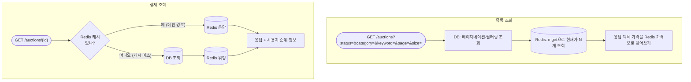
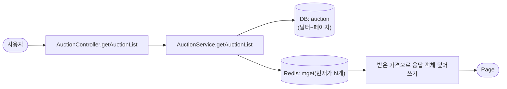
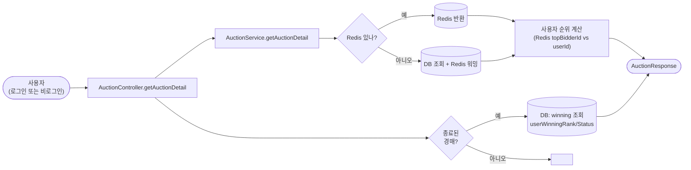
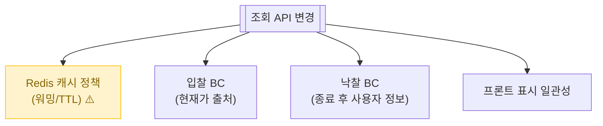

# 경매 조회 (목록 / 상세)

> 메인/검색 화면의 경매 목록과 한 경매의 상세 정보. **현재가는 항상 Redis에서**, 메타데이터는 DB에서.

📁 코드 위치: `backend/.../auction/` · 👥 주체: 모든 사용자 (비로그인 OK) · 🔐 인증: 선택

---

## 1. 한눈에

**스토리**: 두 API의 공통점 — **가격은 Redis에서**. 차이점 — 목록은 DB가 메인 + Redis 가격 오버레이, 상세는 **Redis가 메인** + 미스 시 DB 폴백.

---

## 2. 왜 이게 있나

!!! abstract "비즈니스 의도"
    - **실시간 가격** — 입찰이 비동기로 처리되어 RDB의 `current_price`가 늦게 반영됨. 화면엔 항상 Redis 값
    - **상세 조회는 캐시 메인** — 동시 접속자 많은 경매(인기)는 DB 부하 줄이려 Redis가 답
    - **사용자 컨텍스트** — 상세에서 "내가 1순위인지", "낙찰됐는지" 같은 정보 같이 응답
    - **검색/필터** — 카테고리, 상태, 키워드로 좁혀서 보기

---

## 3. 시나리오

### 3-1. 경매 목록 — `GET /auctions`

> **상황**: 메인 화면 진입 / 카테고리 클릭 / 검색.

-   :material-numeric-1-circle: **DB가 메인 (페이징/필터링)**

    `JpaAuctionRepository.findAll(status, category, keyword, pageable)` — `Specification`으로 동적 쿼리.
    정렬은 `createdAt DESC` 기본.

-   :material-numeric-2-circle: **Redis 가격으로 덮어쓰기**

    가져온 N개의 ID로 **`mget`(다중 키 조회)** 한 번에. 1+1 쿼리 (DB 1회 + Redis 1회).
    Redis에 없는 경매는 DB의 `current_price` 그대로.

    > **왜 덮어쓰나**: 입찰은 비동기 처리되어 DB current_price가 항상 최신 아님 ([입찰 비동기 처리](입찰-비동기처리.md)).

-   :material-numeric-3-circle: **도메인 메서드로 갱신**

    `auction.updateCurrentPriceFromCache(redisPrice)` — 도메인이 자기 필드 변경 책임.
    DTO 만들기 전에 도메인 객체 먼저 갱신.

---

### 3-2. 경매 상세 — `GET /auctions/{id}`

> **상황**: 목록에서 클릭, 또는 외부 링크로 직접.

-   :material-numeric-1-circle: **Redis가 메인 DB (캐시 미스 시 RDB 폴백)**

    `auctionCachePort.findById` → 있으면 그대로 반환.
    없으면 RDB 조회 → 캐시 워밍 → 반환. **다음 요청부터는 캐시 hit**.

    > 인기 경매(동시 접속 많음)에서 DB 부하를 압도적으로 줄임.

-   :material-numeric-2-circle: **현재 사용자의 입찰 순위 계산**

    Redis의 `topBidderId`와 `currentUserId` 비교. 같으면 1순위, 아니면 null.
    비로그인이면 null. 진행 중인 경매에서만 (종료 후엔 낙찰 정보 사용).

-   :material-numeric-3-circle: **종료된 경매면 낙찰 정보 추가**

    DB의 `winning` 테이블에서 사용자 본인의 낙찰 정보 조회 (rank, status).
    없으면 null (낙찰자 아님).

---

## 4. 진입점

| Method | Path | 핸들러 | 권한 |
|--------|------|--------|------|
| `🟢 GET` | `/api/v1/auctions?status=&category=&keyword=&page=&size=` | [`getAuctionList`](https://github.com/ahn-h-j/Fairbid/blob/main/backend/src/main/java/com/cos/fairbid/auction/adapter/in/controller/AuctionController.java#L81) | 비로그인 OK |
| `🟢 GET` | `/api/v1/auctions/{auctionId}` | [`getAuctionDetail`](https://github.com/ahn-h-j/Fairbid/blob/main/backend/src/main/java/com/cos/fairbid/auction/adapter/in/controller/AuctionController.java#L102) | 비로그인 OK |

---

## 5. 요청 / 응답

??? example "목록 쿼리 파라미터"
    - `status` (선택): `BIDDING`, `INSTANT_BUY_PENDING`, `ENDED`, `FAILED`, `CANCELLED`
    - `category` (선택): 카테고리 enum
    - `keyword` (선택): 상품명 부분 일치
    - `page`, `size` — Pageable 표준 (size 기본 20, sort=createdAt DESC)

??? example "AuctionResponse (상세)"
    경매 기본 정보 + 사용자 컨텍스트:
    - `userBidRank` — 1 (1순위) 또는 null
    - `userWinningRank` — 종료된 경매에서 본인의 낙찰 순위
    - `userWinningStatus` — `PENDING_RESPONSE`/`RESPONDED`/`NO_SHOW` 등

---

## 6. 에러 케이스

| 예외 | 발생 조건 | HTTP |
|------|-----------|------|
| [`AuctionNotFoundException`](https://github.com/ahn-h-j/Fairbid/blob/main/backend/src/main/java/com/cos/fairbid/auction/domain/exception/AuctionNotFoundException.java) | auctionId 없음 (Redis + DB 둘 다 없을 때) | 404 |

---

## 7. 변경 시 영향

> 캐시 정책 깨지면 → DB 부하 폭증 또는 가격 오정보. 캐시 키/TTL 변경 시 입찰 BC와 함께.

---

## 8. 설계 결정

!!! tip "왜 이렇게 했나"

    **상세는 Redis 메인, 목록은 DB 메인**
    상세는 단일 키 조회로 캐시 효율 최고. 목록은 정렬·필터·페이징이 RDB SQL로 자연스러움. 가격만 Redis로 보정.

    **목록 가격 오버레이 (덮어쓰기)**
    DB의 `current_price`는 비동기 동기화라 늦음. 목록 표시 시 Redis 가격이 정확. **DB 가격 직접 사용 금지**.

    **사용자 순위를 백엔드가 미리 계산**
    프론트가 ID 비교 안 하게, 응답에 `userBidRank` 박아줌. 향후 다른 우선순위 정책 변경 시도 백엔드만 수정.

    **비로그인 조회 허용**
    경매는 공개 정보. SecurityConfig에서 permitAll. `getCurrentUserIdOrNull`로 비로그인 OK.

---

## 9. 🔧 기술 메모

!!! info "트랜잭션"
    - `AuctionService` 클래스 기본 `@Transactional(readOnly=true)`. 조회 메서드는 모두 read-only.
    - **캐시 미스 시 DB 조회 + 캐시 워밍**도 readOnly 트랜잭션 안. Redis 쓰기 자체는 트랜잭션 밖.

!!! info "캐시 — Redis 메인 DB 패턴"
    - `auctionCachePort.findById` → 단일 키 조회. JSON 직렬화/역직렬화.
    - **캐시 미스 폴백**이 있어 데이터 손실 위험은 적음. 그러나 캐시 stampede(동시에 미스 시 모두 DB로 가는 현상)는 방어 안 됨.
    - 목록의 `getCurrentPrices`는 mget. **N+1 회피의 핵심**.

!!! info "동적 쿼리 — JPA Specification"
    - `JpaAuctionRepository.findAll(status, category, keyword, pageable)` 내부에 `AuctionSpecification`으로 동적 WHERE 조립.
    - `keyword` 검색은 LIKE %%. **풀 텍스트 검색 아님** — 데이터 많아지면 느려짐, 검색 엔진 도입 검토.

!!! info "이벤트 / 락 / 비동기 — 안 씀"
    조회만. 동기.

---

## 10. 운영

캐시 미스 시 `INFO` 로그 (`경매 캐시 미스, RDB에서 조회 후 캐시 워밍`). 잦으면 캐시 TTL/워밍 정책 점검.

**관련 페이지**
- [경매 등록](경매-등록.md)
- [입찰](입찰.md) — 현재가가 실시간으로 갱신되는 곳
- [경매 종료](경매-종료.md)
