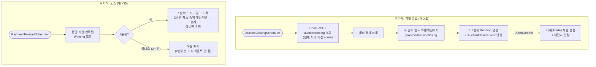
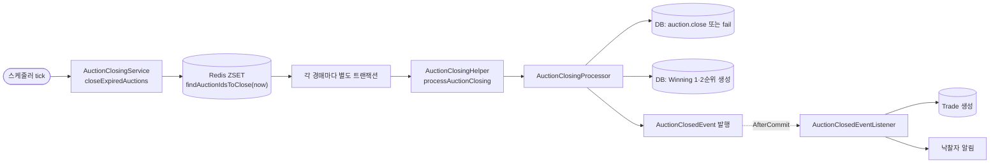
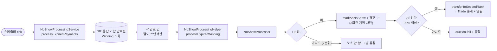
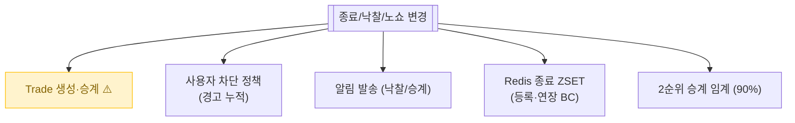

# 경매 종료 / 낙찰 / 노쇼 / 2순위 승계

> 종료 시각이 된 경매를 찾아서 종료 처리 → 1·2순위 낙찰 후보 결정 → 응답 안 한 사람은 노쇼 처리 → 2순위가 자동 승계.
> **사용자가 부르는 API 없음. 모두 스케줄러가 주도.**

📁 코드 위치: `backend/.../winning/` · 👥 주체: 시스템 (스케줄러) · 🔐 인증: 없음

---

## 1. 한눈에

**스토리**: 두 스케줄러가 시스템을 굴림 — **종료 스케줄러**(시간 도래 경매 닫음)와 **노쇼 스케줄러**(응답 안 한 낙찰자 처리). 모두 사용자 API 없음.

---

## 2. 왜 이게 있나

!!! abstract "비즈니스 의도"
    - **자동 종료** — 판매자/구매자가 신경 안 써도 시간 되면 자동 마무리
    - **2순위 승계 정책** — 1순위가 잠수 → 2순위 입찰가가 1순위의 90% 이상이면 자동 승계, 아니면 유찰
    - **노쇼 페널티** — 1순위가 응답 안 하면 경고 1회. 3회 누적 시 [계정 차단](oauth-login.md)
    - **2순위는 페널티 없음** — 승계받았다 해도 응답 안 해도 OK (대신 그 경매는 유찰)
    - **이벤트 발행으로 거래 자동 생성** — 낙찰 즉시 [Trade](거래-기본.md) 만들어서 다음 단계로

---

## 3. 시나리오

### 3-1. 경매 종료 — `AuctionClosingScheduler` (주기 호출)

> **상황**: 어떤 경매의 `scheduledEndTime`이 지났음. 스케줄러가 다음 주기에 발견.

-   :material-numeric-1-circle: **Redis ZSET에서 종료 대상 찾기**

    `auction:closing`은 `auctionId → 종료시각(epoch ms)` 매핑.
    `score <= now`인 항목 모두 가져옴. **DB 폴링 안 함** = 빠르고 가벼움.

    > 입찰 연장으로 시간이 바뀌어도 ZSET만 갱신되어 있어서 스케줄러가 항상 정확한 시각으로 처리.

-   :material-numeric-2-circle: **각 경매를 별도 트랜잭션에서 처리**

    `AuctionClosingHelper.processAuctionClosing` (`@Transactional REQUIRES_NEW`).
    **한 경매 실패해도 다른 경매는 계속**. 부분 실패 격리.

-   :material-numeric-3-circle: **입찰 있으면 종료(`close`), 없으면 유찰(`fail`)**

    `auction.hasBids()` 체크.
    `close`는 1순위 winnerId 지정, `fail`은 winnerId 없이 종료.

-   :material-numeric-4-circle: **1·2순위 Winning 생성**

    Redis에 들고 있던 `topBidderId`/`secondBidderId`로 각각 Winning 객체.
    1순위는 `PENDING_RESPONSE` (응답 기한 24h),
    2순위는 `STANDBY` (대기 — 1순위 노쇼 시 깨어남).

-   :material-numeric-5-circle: **AuctionClosedEvent 발행**

    이벤트 리스너가 `AfterCommit`으로 [Trade](거래-기본.md) 생성 + 낙찰자 알림.

---

### 3-2. 노쇼 처리 — `PaymentTimeoutScheduler` (주기 호출)

> **상황**: 1순위 낙찰자가 24시간 안에 [거래 방식 선택](거래-기본.md) 안 함. 스케줄러가 발견.

-   :material-numeric-1-circle: **응답 기한 만료자 일괄 조회**

    `findExpiredPendingResponses` — `responseDeadline < now`인 PENDING_RESPONSE 모두.
    각자 별도 트랜잭션(REQUIRES_NEW)에서 처리.

-   :material-numeric-2-circle: **1순위 노쇼 처리**

    `winning.markAsNoShow()` + 사용자 경고 카운트 +1.
    경고 3회 누적 시 [`User.isBlocked()`](oauth-login.md)가 true가 되어 다음 로그인부터 차단.

-   :material-numeric-3-circle: **2순위 자동 승계 판정**

    `winning2.isEligibleForAutoTransfer(firstBidAmount)` — **2순위 입찰가 ≥ 1순위 × 0.9**면 승계.

    > 90% 미만이면: 너무 큰 가격 차이로 승계 강요는 부적절. 유찰 처리.

-   :material-numeric-4-circle: **승계 시 Trade도 갱신**

    승계되면 [Trade.transferToSecondRank](거래-기본.md)로 같은 Trade 객체 재활용 — `buyerId`/`finalPrice`/응답기한 갈아끼움.
    2순위에게 알림.

-   :material-numeric-5-circle: **2순위는 노쇼 페널티 없음**

    승계받은 2순위가 또 잠수해도 `markAsNoShow` 안 함 → 경고 누적 안 됨.
    "원해서 1순위 된 것 아니다" 정책. 그 경매는 유찰.

---

## 4. 진입점

| 종류 | 이름 | 트리거 |
|------|------|--------|
| Scheduler | [`AuctionClosingScheduler`](https://github.com/ahn-h-j/Fairbid/blob/main/backend/src/main/java/com/cos/fairbid/winning/adapter/in/scheduler/AuctionClosingScheduler.java) | `@Scheduled` 주기 호출 |
| Scheduler | [`PaymentTimeoutScheduler`](https://github.com/ahn-h-j/Fairbid/blob/main/backend/src/main/java/com/cos/fairbid/winning/adapter/in/scheduler/PaymentTimeoutScheduler.java) | `@Scheduled` 주기 호출 |
| EventListener | [`AuctionClosedEventListener`](https://github.com/ahn-h-j/Fairbid/blob/main/backend/src/main/java/com/cos/fairbid/winning/application/event/AuctionClosedEventListener.java) | `AuctionClosedEvent` 수신 |

> 사용자 호출 가능한 REST 엔드포인트는 없음. ProcessNoShowUseCase는 테스트/관리자용 단건 처리 진입점.

---

## 5. 도메인 상태

??? note "WinningStatus"
    - `PENDING_RESPONSE` — 응답 기한 카운트 중 (1순위 또는 승계된 2순위)
    - `STANDBY` — 2순위 대기 (1순위 노쇼 시 깨어남)
    - `RESPONDED` — 응답 완료 (방식 선택했음)
    - `NO_SHOW` — 응답 기한 만료
    - `FAILED` — 유찰

??? note "AuctionStatus 종료 관련"
    - `BIDDING` → `ENDED` (입찰 있고 정상 종료)
    - `BIDDING` → `FAILED` (입찰 없거나 2순위 승계 실패)

---

## 6. 에러 케이스

| 상황 | 처리 |
|------|------|
| 한 경매 종료 처리 실패 | log 남기고 다음 경매로 (`try/catch`) |
| 한 노쇼 처리 실패 | log 남기고 다음으로 |
| 도메인 가드 위반 (`Auction.close`/`fail` 상태 안 맞음) | `IllegalStateException` (정상 흐름이면 안 남) |

---

## 7. 변경 시 영향

> Trade 생성/승계 로직 깨지면 낙찰돼도 거래 시작 못 함 = 가장 큰 사용자 영향. 이벤트 리스너 누락 절대 금지.

---

## 8. 설계 결정

!!! tip "왜 이렇게 했나"

    **종료 대상을 Redis ZSET로**
    DB 폴링(`SELECT WHERE end_time < now`) 안 함. ZSET range 조회로 빠르고 일정 시간. 입찰 연장으로 시간이 바뀌어도 ZSET만 갱신.

    **각 경매를 별도 트랜잭션으로**
    `REQUIRES_NEW`. 한 경매 처리 실패해도 다른 경매는 계속. 부분 실패 격리.

    **2순위 승계는 90% 룰**
    너무 큰 가격 차이는 강제 안 함. 정책 상수: `Winning.AUTO_TRANSFER_THRESHOLD = 0.9`.

    **2순위에 노쇼 페널티 없음**
    "내가 원해서 1순위 된 것 아니다". 1순위 잠수로 떠넘겨받은 책임을 페널티화하면 부당. 유찰만.

    **승계 시 같은 Trade 재활용**
    `Trade.transferToSecondRank` — `buyerId`/`finalPrice`/응답기한 갈아끼움. 새 Trade 만들지 않는 이유는 1:1 불변 (한 경매 = 한 Trade) + 이력 추적 단순화.

    **이벤트로 Trade 생성 분리**
    종료 트랜잭션 안에서 Trade까지 만들면 트랜잭션 길어짐. `AuctionClosedEvent` AfterCommit으로 분리.

---

## 9. 🔧 기술 메모

!!! info "트랜잭션"
    - `AuctionClosingService` / `NoShowProcessingService` — 클래스 기본은 `@Transactional(readOnly=true)`.
    - 실제 변경은 `AuctionClosingHelper` / `NoShowProcessingHelper`의 `@Transactional(REQUIRES_NEW)` 메서드.
    - **각 경매/낙찰 1건마다 새 트랜잭션** → 부분 실패 격리.

!!! info "이벤트 — Spring ApplicationEvent (인프로세스)"
    - `AuctionClosedEvent` — `AuctionClosedEventListener`가 받음.
    - `@TransactionalEventListener(AFTER_COMMIT)` — 종료 트랜잭션 커밋 후 실행 → Trade 생성 + 알림.
    - **메시지 브로커 아님**. 같은 JVM 한정.

!!! info "스케줄러 — `@Scheduled`"
    - 주기는 `application.yml`의 `fairbid.scheduler.*` (확인 필요).
    - 멀티 인스턴스 환경에서 **모든 인스턴스가 동시 실행하면 중복 처리**. ShedLock 같은 분산 락 적용 여부 확인.

!!! info "Redis ZSET"
    - 키: `auction:closing`. score = 종료 epoch ms, member = auctionId.
    - 종료 처리 후 ZREM으로 제거 (확인 필요).
    - 입찰 연장 시 ZADD로 score 갱신 ([입찰](입찰.md) 참고).

!!! info "캐시 / 락 — 안 씀"
    스케줄러가 단일 진입점. 락 안 걸어도 됨 (분산 락은 별개).

---

## 10. 운영

- `종료 대상 경매 N건 처리 시작/완료` (INFO)
- `경매 종료 처리 실패 - auctionId: ...` (ERROR) — 잦으면 점검
- `응답 기한 만료 건 N건 처리 시작` (INFO)
- `노쇼 처리 실패 - winningId: ...` (ERROR)

**관련 페이지**
- [경매 등록](경매-등록.md) — 종료 ZSET에 등록되는 시점
- [입찰](입찰.md) — 입찰 연장으로 종료 시각 갱신
- [거래 기본](거래-기본.md) — 종료 후 Trade 자동 생성
- [알림](알림.md) — 낙찰/승계 알림
