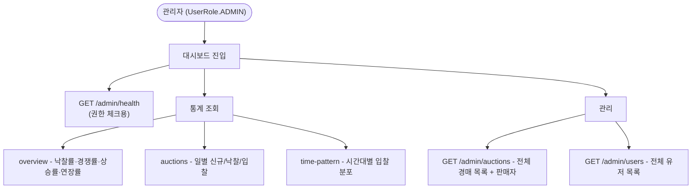
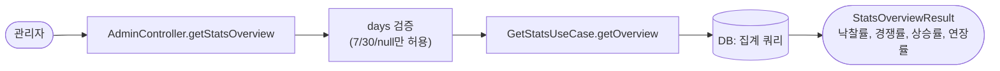
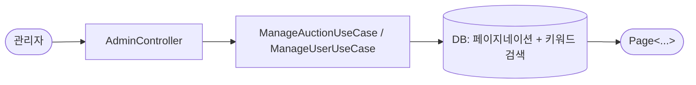
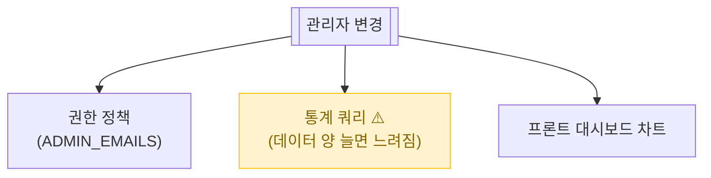

# 관리자 대시보드

> ADMIN 권한 사용자 전용. 사이트 통계 + 경매/유저 관리. 일반 사용자는 호출 자체 불가.

📁 코드 위치: `backend/.../admin/` · 👥 주체: 관리자 (`UserRole.ADMIN`) · 🔐 인증: JWT + `@PreAuthorize("hasRole('ADMIN')")`

---

## 1. 한눈에



**스토리**: ADMIN 사용자(이메일이 `ADMIN_EMAILS` 환경변수에 있는 사람) 전용. 사이트 운영 통계 + 경매/유저 검색.

---

## 2. 왜 이게 있나

!!! abstract "비즈니스 의도"
    - **운영 가시성** — 낙찰률, 경쟁률 같은 KPI를 한눈에
    - **경매 시간대 분석** — 사용자 행동 패턴 (피크 타임 등)
    - **신고/이상 거래 추적용** — 경매·유저 검색
    - **권한 분리** — 일반 사용자는 보면 안 되는 데이터

---

## 3. 기능 카테고리

<div class="grid cards" markdown>

-   :material-chart-line: **통계 (3종)**

    overview / 일별 경매 / 시간대 입찰. `days=7|30|null`로 기간 조절.

-   :material-gavel: **경매 관리**

    상태/키워드 필터 + 판매자 정보 포함한 경매 목록.

-   :material-account-cog: **유저 관리**

    닉네임/이메일 검색.

</div>

---

## 4. 시나리오

### 4-1. 통계 개요 — `GET /admin/stats/overview`

> **상황**: 관리자가 대시보드 메인에 들어옴. 전체 KPI 요약.



<div class="grid cards" markdown>

-   :material-numeric-1-circle: **`days` 파라미터 검증**

    7, 30, null만 허용. 그 외는 null로 처리 + WARN 로그.
    임의의 큰 값으로 풀스캔 막음.

-   :material-numeric-2-circle: **집계 쿼리 (RDB)**

    StatsPersistenceAdapter가 SUM/AVG/COUNT 쿼리.
    실시간 캐시 안 함 — 관리자만 호출하니 빈도 낮음.

</div>

---

### 4-2. 경매 / 유저 목록 — `GET /admin/auctions`, `/admin/users`



<div class="grid cards" markdown>

-   :material-numeric-1-circle: **표준 Pageable 페이징**

    `page=0&size=20&sort=createdAt,DESC` 형태.

-   :material-numeric-2-circle: **키워드 = LIKE**

    경매: 상품명. 유저: 닉네임 또는 이메일.

-   :material-numeric-3-circle: **판매자 정보 같이 조립**

    경매 목록은 `AdminAuctionResult`에 판매자 닉네임/이메일 포함 — JOIN 필요.

</div>

---

## 5. 진입점

| Method | Path | 핸들러 | 권한 |
|--------|------|--------|------|
| `🟢 GET` | `/api/v1/admin/health` | [`healthCheck`](https://github.com/ahn-h-j/Fairbid/blob/main/backend/src/main/java/com/cos/fairbid/admin/adapter/in/controller/AdminController.java#L62) | ADMIN |
| `🟢 GET` | `/api/v1/admin/stats/overview?days=` | [`getStatsOverview`](https://github.com/ahn-h-j/Fairbid/blob/main/backend/src/main/java/com/cos/fairbid/admin/adapter/in/controller/AdminController.java#L76) | ADMIN |
| `🟢 GET` | `/api/v1/admin/stats/auctions?days=` | [`getDailyAuctionStats`](https://github.com/ahn-h-j/Fairbid/blob/main/backend/src/main/java/com/cos/fairbid/admin/adapter/in/controller/AdminController.java#L91) | ADMIN |
| `🟢 GET` | `/api/v1/admin/stats/time-pattern?days=` | [`getTimePattern`](https://github.com/ahn-h-j/Fairbid/blob/main/backend/src/main/java/com/cos/fairbid/admin/adapter/in/controller/AdminController.java#L106) | ADMIN |
| `🟢 GET` | `/api/v1/admin/auctions?status=&keyword=&page=&size=` | [`getAuctionList`](https://github.com/ahn-h-j/Fairbid/blob/main/backend/src/main/java/com/cos/fairbid/admin/adapter/in/controller/AdminController.java#L126) | ADMIN |
| `🟢 GET` | `/api/v1/admin/users?keyword=&page=&size=` | [`getUserList`](https://github.com/ahn-h-j/Fairbid/blob/main/backend/src/main/java/com/cos/fairbid/admin/adapter/in/controller/AdminController.java#L146) | ADMIN |

---

## 6. 요청 / 응답

??? example "StatsOverviewResult"
    ```json
    {
      "totalAuctions": 1234, "winRate": 0.78,
      "averageCompetitionRate": 5.2, "averagePriceIncreaseRate": 1.45,
      "extensionRate": 0.12
    }
    ```

??? example "DailyAuctionStatsResult"
    날짜별 신규 경매 / 낙찰 완료 / 입찰 수 시계열.

??? example "TimePatternResult"
    0~23시 시간대별 입찰 수 + 피크 시간대.

??? example "AdminAuctionResult / AdminUserResult"
    경매/유저 기본 정보 + 운영 시 필요한 메타 (판매자 정보, 가입일 등).

---

## 7. 에러 케이스

| 상황 | 처리 |
|------|------|
| ADMIN 권한 없음 | `@PreAuthorize` → 403 |
| `days` 잘못된 값 | `null`로 처리 + WARN 로그 (전체 조회) |

---

## 8. 변경 시 영향



> 데이터 양 늘면 통계 쿼리 풀스캔 위험. 인덱스 점검 또는 사전 집계 테이블 도입.

---

## 9. 설계 결정

!!! tip "왜 이렇게 했나"

    **`@PreAuthorize` 메서드 보안**
    `SecurityConfig` URL 패턴 + `@PreAuthorize` 이중. URL 매칭 실수해도 메서드 단위에서 막힘.

    **`days` 화이트리스트 (7/30/null만)**
    임의 큰 값 막아서 풀스캔/타임아웃 방지. 그 외는 조용히 null로 처리하고 로그만.

    **ADMIN 부여를 환경변수로**
    `ADMIN_EMAILS` 콤마 나열. 코드 안 건드리고 환경별로 관리자 운용. [OAuth 로그인](oauth-login.md) 참고.

    **인앱 캐시 안 씀**
    관리자 호출 빈도 낮음. 캐시 도입은 트래픽 늘면.

---

## 10. 🔧 기술 메모

!!! info "트랜잭션"
    - `StatsService` / `AdminAuctionService` / `AdminUserService` — 클래스 레벨 `@Transactional(readOnly=true)` 추정.
    - 조회만이라 가벼움.

!!! info "쿼리 — 집계 풀스캔 가능성"
    - `days=null` (전체)일 때 `bid` / `auction` 테이블 풀스캔.
    - 데이터 양 늘면 인덱스 또는 사전 집계 검토.

!!! info "권한 — 메서드 + URL 이중 가드"
    - `@PreAuthorize("hasRole('ADMIN')")` 메서드 레벨.
    - SecurityConfig에서 URL 패턴도 ADMIN 필수.

!!! info "이벤트 / 캐시 / 락 / 비동기 — 안 씀"
    조회만. 동기.

---

## 11. 운영

별도 메트릭 없음. 로그는 `INFO`/`DEBUG` 수준.

**관련 페이지**
- [OAuth 로그인](oauth-login.md) — ADMIN 권한 부여
- [경매 등록](경매-등록.md) / [입찰](입찰.md) — 통계 데이터 출처
