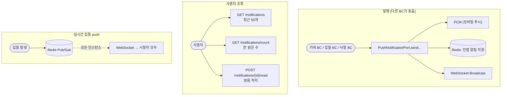
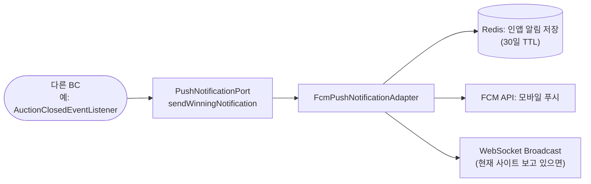
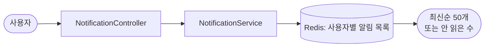
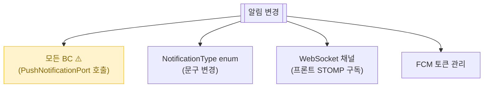

# 알림 (조회 / 발행 / 실시간 push)

> 사용자가 받는 모든 알림 (낙찰/거래/입금 등 16종) — **인앱(DB) + 푸시(FCM) + 실시간(WebSocket)** 3채널.

📁 코드 위치: `backend/.../notification/` · 👥 주체: 모든 사용자 · 🔐 인증: 본인 알림만 조회/읽음

---

## 1. 한눈에



**스토리**: 알림은 **다른 BC가 호출**하는 라이브러리에 가까움. `PushNotificationPort` 한 인터페이스로 FCM(푸시) + Redis(인앱) + WebSocket(실시간) 3채널 동시 전송.

---

## 2. 왜 이게 있나

!!! abstract "비즈니스 의도"
    - **사용자 인지 향상** — 거래·입찰·낙찰 변화가 즉시 닿게
    - **3채널 분리** — 모바일 백그라운드(FCM), 사이트 인앱 배지(Redis), 화면 보고 있을 때(WebSocket)
    - **16종 알림 타입** — 시나리오별 제목/본문 표준화 (전략 패턴, [`NotificationType` enum](https://github.com/ahn-h-j/Fairbid/blob/main/backend/src/main/java/com/cos/fairbid/notification/domain/NotificationType.java))
    - **실시간 입찰** — Redis Pub/Sub로 멀티 인스턴스 환경 broadcast

---

## 3. 알림 타입 (`NotificationType` 16종)

??? note "전체 목록"
    | 타입 | 트리거 | 받는 사람 |
    |------|--------|-----------|
    | `WINNING` | 1순위 낙찰 | 낙찰자 |
    | `TRANSFER` | 2순위 승계 | 2순위 |
    | `FAILED` | 유찰 | 판매자 |
    | `RESPONSE_REMINDER` | 응답 12시간 전 | 낙찰자 |
    | `SECOND_RANK_STANDBY` | 2순위 등록 | 2순위 |
    | `NO_SHOW_PENALTY` | 노쇼 처리됨 | 노쇼한 사람 |
    | `METHOD_SELECTED` | 거래 방식 선택 | 판매자 |
    | `ARRANGEMENT_PROPOSED` | 직거래 시간 제안 | 상대방 |
    | `ARRANGEMENT_COUNTER_PROPOSED` | 직거래 역제안 | 상대방 |
    | `ARRANGEMENT_ACCEPTED` | 직거래 수락 | 상대방 |
    | `DELIVERY_ADDRESS_SUBMITTED` | 택배 배송지 입력 | 판매자 |
    | `DELIVERY_SHIPPED` | 택배 발송 | 구매자 |
    | `TRADE_COMPLETED` | 거래 완료 | 양쪽 |
    | `PAYMENT_CONFIRMED` | 입금 신고 | 판매자 |
    | `PAYMENT_VERIFIED` | 입금 확인 | 구매자 |
    | `PAYMENT_REJECTED` | 입금 거절 | 구매자 |

> **전략 패턴**: enum 상수마다 `getTitle()` / `formatBody(auctionTitle, amount)` 오버라이드.
> 새 알림 추가 = enum에 한 줄.

---

## 4. 시나리오

### 4-1. 알림 발행 (다른 BC가 호출)

> **상황**: [경매 종료](경매-종료.md)에서 1순위 낙찰자 결정. 낙찰 알림 발송.



<div class="grid cards" markdown>

-   :material-numeric-1-circle: **`PushNotificationPort` 1개로 3채널 동시**

    호출자(거래/입찰/낙찰 BC)는 `sendWinningNotification(...)` 한 줄.
    내부에서 FCM + Redis + WebSocket 모두 발사.

-   :material-numeric-2-circle: **`NotificationType` enum이 제목/본문 책임**

    호출자는 type + 데이터(`auctionTitle`, `amount` 등)만 넘김.
    실제 문구는 enum의 `getTitle` / `formatBody`가 만듦. **문구 변경은 enum 한 곳만**.

-   :material-numeric-3-circle: **인앱 알림은 Redis 저장**

    DB가 아니라 Redis. 30일 TTL로 자동 만료. 마이페이지 알림 목록은 Redis에서 조회.

</div>

---

### 4-2. 사용자가 알림 조회



<div class="grid cards" markdown>

-   :material-numeric-1-circle: **목록 조회 (최대 50개, 최신순)**

    `GET /notifications` — 페이지네이션 없음, 그냥 최근 50개.
    더 오래된 알림은 자동 사라짐 (Redis TTL).

-   :material-numeric-2-circle: **안 읽은 수 (헤더 배지용)**

    `GET /notifications/count`. `{ unreadCount: 3 }` 같은 응답.

-   :material-numeric-3-circle: **읽음 처리**

    `POST /notifications/{id}/read`. 본인 알림만 가능 (userId 매칭).

</div>

---

### 4-3. 실시간 입찰 broadcast (WebSocket + Redis Pub/Sub)

> **상황**: 인기 경매에 새 입찰. 그 경매 보고 있는 모든 사용자 화면 갱신.

```mermaid
flowchart LR
    Bid(["입찰 발생"]) --> Pub["BidEventPublisherAdapter<br/>publishBidPlaced"]
    Pub --> RedisPS[("Redis Pub/Sub<br/>채널: auction:bid:{id}"))]
    RedisPS -.인스턴스 1.-> Sub1["RedisMessageSubscriber"]
    RedisPS -.인스턴스 2.-> Sub2["RedisMessageSubscriber"]
    RedisPS -.인스턴스 N.-> SubN["RedisMessageSubscriber"]
    Sub1 --> WS1["WebSocket: 그 인스턴스에 붙은 시청자"]
    Sub2 --> WS2["WebSocket: 그 인스턴스에 붙은 시청자"]
    SubN --> WSN["..."]
```

<div class="grid cards" markdown>

-   :material-numeric-1-circle: **Redis Pub/Sub로 인스턴스 간 broadcast**

    멀티 인스턴스 환경에서 사용자가 어느 서버에 붙어있을지 모름.
    한 인스턴스가 받은 입찰 → Redis Pub/Sub → 모든 인스턴스가 자기 WebSocket으로 push.

-   :material-numeric-2-circle: **WebSocket은 채널별**

    `auction:bid:{auctionId}` 토픽. 그 경매 보고 있는 사용자만 받음.

-   :material-numeric-3-circle: **Pub/Sub vs Stream**

    Pub/Sub는 **fire-and-forget** (구독자 없으면 메시지 사라짐).
    [입찰 RDB 동기화](입찰-비동기처리.md)와 다름 — 거기는 무손실 필요해서 Stream.
    실시간 push는 놓쳐도 OK (다음 입찰 때 또 옴).

</div>

---

## 5. 진입점

| Method | Path | 핸들러 | 권한 |
|--------|------|--------|------|
| `🟢 GET` | `/api/v1/notifications` | [`getMyNotifications`](https://github.com/ahn-h-j/Fairbid/blob/main/backend/src/main/java/com/cos/fairbid/notification/adapter/in/controller/NotificationController.java#L46) | 본인 |
| `🟢 GET` | `/api/v1/notifications/count` | [`getUnreadCount`](https://github.com/ahn-h-j/Fairbid/blob/main/backend/src/main/java/com/cos/fairbid/notification/adapter/in/controller/NotificationController.java#L63) | 본인 |
| `🟡 POST` | `/api/v1/notifications/{id}/read` | [`markAsRead`](https://github.com/ahn-h-j/Fairbid/blob/main/backend/src/main/java/com/cos/fairbid/notification/adapter/in/controller/NotificationController.java#L76) | 본인 |
| WebSocket | `/ws/auction/{id}` | `WebSocketBroadcastAdapter` | 모두 |

---

## 6. 변경 시 영향



> Port 시그니처 변경 시 호출하는 모든 BC 동시 수정 필요.

---

## 7. 설계 결정

!!! tip "왜 이렇게 했나"

    **Port 1개 + 3채널 동시 전송**
    호출자가 채널별 분기 안 함. 알림 BC가 책임. 신규 채널(이메일 등) 추가 시 Adapter만 추가.

    **`NotificationType` 전략 패턴**
    enum 상수마다 `getTitle` / `formatBody` 오버라이드. 새 알림 = enum 한 줄. 문구 일관성.

    **인앱 알림을 DB가 아니라 Redis**
    30일 TTL 자동 만료. 알림은 휘발성 데이터, RDB 부담 줄임.

    **Pub/Sub vs Stream**
    실시간 push는 놓쳐도 OK → Pub/Sub. RDB 동기화는 무손실 필요 → Stream.

    **인스턴스 간 broadcast = Pub/Sub 필수**
    WebSocket 세션은 한 인스턴스에 종속. 다른 인스턴스 사용자에게 알리려면 Pub/Sub로 전파.

---

## 8. 🔧 기술 메모

!!! info "트랜잭션"
    - `NotificationService` (조회용) — `@Transactional` 없음. Redis만 만짐.
    - 발행은 호출자 BC의 트랜잭션 안에서 동기 호출 (FCM 외부 호출 시간만큼 커넥션 잡음).

!!! info "Redis — 인앱 알림 저장"
    - 사용자별 List 또는 Sorted Set (구현 확인).
    - TTL 30일.

!!! info "Redis Pub/Sub — 실시간 입찰 broadcast"
    - 채널: `auction:bid:{id}`
    - `RedisPubSubBroadcastAdapter`가 발행, `RedisMessageSubscriber`가 구독.
    - **메시지 영속성 없음** (Stream과의 결정적 차이).

!!! info "WebSocket — STOMP"
    - `WebSocketConfig`로 endpoint 등록.
    - 토픽 기반 구독.
    - 세션 관리는 `WebSocketConnectionsEndpoint`로 모니터링 가능.

!!! info "FCM — Firebase 외부 호출"
    - `FcmClient` + `FirebaseConfig`. Firebase Admin SDK 사용.
    - **외부 장애 시 발행 측 트랜잭션이 길어짐**.

!!! info "이벤트 — Spring ApplicationEvent도 사용"
    - `BidEventListener` — `BidPlacedEvent` 수신해서 비동기 처리 가능.
    - 입찰 측은 인프로세스 이벤트, 인스턴스 간은 Pub/Sub. 두 채널 공존.

---

## 9. 운영

- WebSocket 활성 세션 수 — `WebSocketConnectionsEndpoint`
- FCM 발송 실패율은 별도 메트릭 없음 (필요 시 추가)
- Redis Pub/Sub은 메시지 손실 추적 불가 — 운영 정합성 보장 안 됨

**관련 페이지**
- [입찰](입찰.md) — WebSocket 실시간 가격 push
- [경매 종료](경매-종료.md) — 낙찰 알림 발행
- [거래 기본](거래-기본.md) / [직거래](직거래.md) / [택배](택배.md) — 단계별 알림
