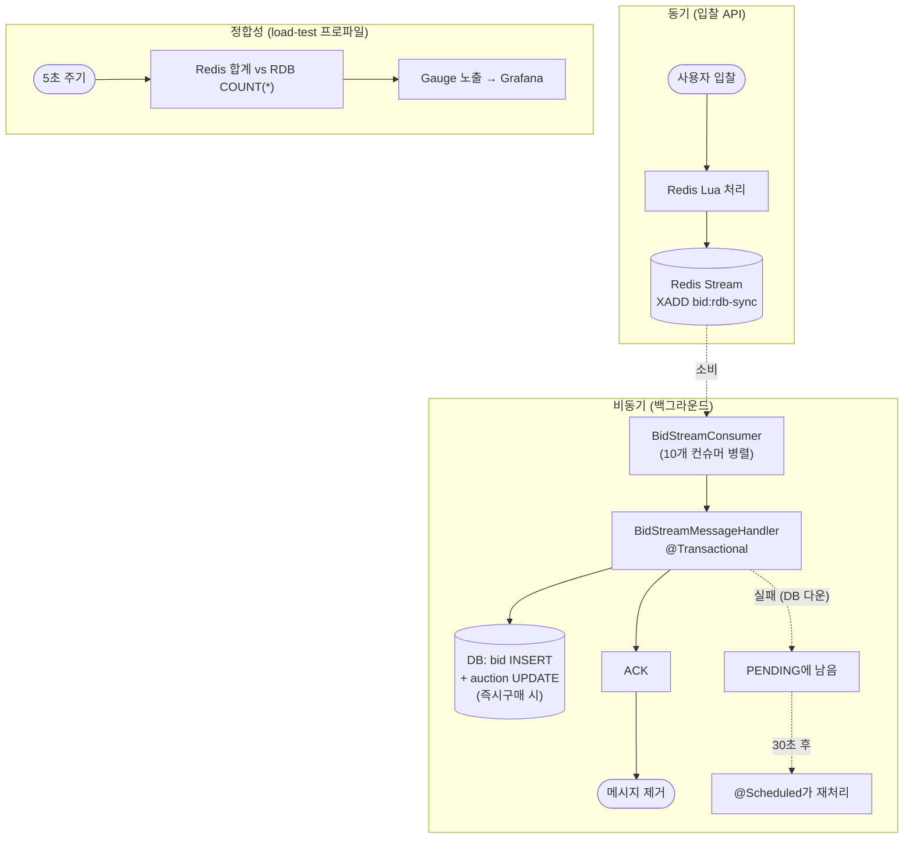
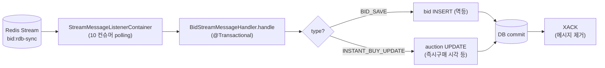
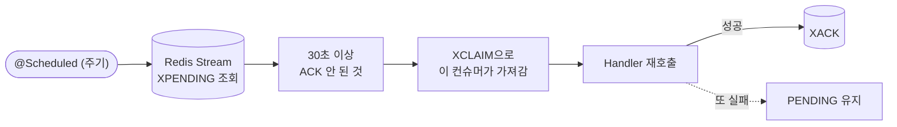
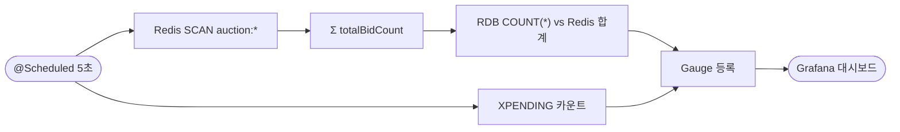
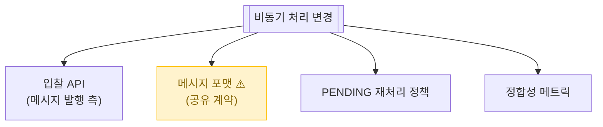

# 입찰 비동기 처리 (Stream Consumer + 정합성 체커)

> Redis Stream에 쌓인 입찰 메시지를 백그라운드 컨슈머가 꺼내서 RDB에 저장. 그리고 Redis-RDB 정합성을 주기적으로 체크.

📁 코드 위치: `backend/.../bid/adapter/in/stream/` + `monitoring/` · 👥 주체: 시스템 (Consumer + Scheduler) · 🔐 인증: 없음

---

## 1. 한눈에



**스토리**: 입찰 API는 Stream에 던지기만 하면 끝(O(1)). 컨슈머가 알아서 꺼내고, 실패해도 PENDING에 남아 재처리. **DB 장애 시에도 입찰은 살아있고, 복구 후 자동으로 따라잡음**.

---

## 2. 왜 이게 있나

!!! abstract "비즈니스 의도"
    - **입찰 API의 무손실** — DB 장애에도 사용자 입찰은 성공해야 함
    - **자동 복구** — DB 살아나면 PENDING 메시지 자동 재처리, 사람 개입 0
    - **장애 격리** — 입찰 응답은 DB 상태와 무관 (Redis만 OK면 OK)
    - **정합성 가시화** — Redis vs RDB 입찰 수 차이를 실시간 메트릭으로

---

## 3. 시나리오

### 3-1. 정상 흐름 — 메시지 소비 + RDB 저장



<div class="grid cards" markdown>

-   :material-numeric-1-circle: **Consumer Group + 10개 병렬 컨슈머**

    `bid-rdb-sync-group`. 메시지가 컨슈머들 사이에 분산되어 처리.
    **다중 인스턴스 환경에서 인스턴스마다 10개씩 — 총 N×10 컨슈머**.

-   :material-numeric-2-circle: **메시지 핸들러는 별도 빈 + `@Transactional`**

    `BidStreamMessageHandler`가 `BidStreamConsumer`와 분리된 이유:
    Spring 프록시 우회 방지. 콜백을 `this::onMessage`로 등록하면 `@Transactional` 안 먹음.

-   :material-numeric-3-circle: **메시지 타입 분기**

    `BID_SAVE` → bid 테이블 INSERT (recordId 기반 멱등 — 중복 처리 안 됨)
    `INSTANT_BUY_UPDATE` → auction 테이블 즉시구매 활성 시각 업데이트

-   :material-numeric-4-circle: **트랜잭션 커밋 후 ACK**

    DB 성공 → `XACK` 호출 → Stream에서 메시지 제거.
    **DB 실패 시 ACK 안 함** → 메시지가 PENDING에 남음.

</div>

---

### 3-2. 장애 대응 — PENDING 자동 재처리

> **상황**: DB가 잠깐 다운되어 메시지 100개가 PENDING에 쌓임. DB 복구 후 자동 따라잡기.



<div class="grid cards" markdown>

-   :material-numeric-1-circle: **`PENDING_TIMEOUT = 30초`**

    30초 이상 ACK 안 된 메시지 = 누가 처리하다 죽었음 또는 실패.
    스케줄러가 다른 컨슈머가 가져가도록 XCLAIM.

-   :material-numeric-2-circle: **재처리 = 멱등**

    `BID_SAVE`는 recordId 기반으로 중복 INSERT 안 함.
    같은 메시지를 두 번 처리해도 안전.

-   :material-numeric-3-circle: **DB 복구 시 자동 따라잡기**

    DB 살아나면 다음 폴링에서 PENDING 메시지 줄줄이 처리.
    **사람 개입 없음**.

</div>

---

### 3-3. 정합성 모니터링 (load-test 프로파일)

> **상황**: 부하 테스트 중 Redis와 RDB 입찰 수 차이를 실시간으로 보고 싶음.



<div class="grid cards" markdown>

-   :material-numeric-1-circle: **5초마다 둘 다 카운트**

    Redis: 모든 `auction:*` 해시의 `totalBidCount` 합산 (SCAN).
    RDB: `SELECT COUNT(*) FROM bid` 풀 스캔.

-   :material-numeric-2-circle: **load-test 프로파일에서만**

    `@Profile("load-test")`. **운영에서는 비활성** — 5초마다 COUNT(*) 풀 스캔은 부담.

-   :material-numeric-3-circle: **Gauge 4종**

    - `fairbid_bid_redis_count`
    - `fairbid_bid_rdb_count`
    - `fairbid_bid_inconsistency_count` (차이)
    - `fairbid_stream_pending_count` (PENDING 메시지 수)

</div>

---

## 4. 진입점

| 종류 | 이름 | 트리거 |
|------|------|--------|
| Stream Listener | [`BidStreamConsumer`](https://github.com/ahn-h-j/Fairbid/blob/main/backend/src/main/java/com/cos/fairbid/bid/adapter/in/stream/BidStreamConsumer.java) | Redis Stream 메시지 도착 |
| Handler | [`BidStreamMessageHandler`](https://github.com/ahn-h-j/Fairbid/blob/main/backend/src/main/java/com/cos/fairbid/bid/adapter/in/stream/BidStreamMessageHandler.java) | Consumer가 콜백 |
| Scheduler | `BidStreamConsumer@Scheduled` (PENDING 재처리) | 주기 호출 |
| Scheduler | [`BidConsistencyChecker`](https://github.com/ahn-h-j/Fairbid/blob/main/backend/src/main/java/com/cos/fairbid/bid/adapter/in/monitoring/BidConsistencyChecker.java) | 5초 주기 (load-test 프로파일) |

---

## 5. 메시지 포맷

??? example "BID_SAVE"
    ```
    type: BID_SAVE
    auctionId: 123
    bidderId: 456
    amount: 50000
    bidType: NORMAL
    createdAt: 2026-01-01T...
    ```
    Handler: `bid INSERT (멱등 — recordId 중복 체크)`

??? example "INSTANT_BUY_UPDATE"
    ```
    type: INSTANT_BUY_UPDATE
    auctionId: 123
    currentPrice: 100000
    totalBidCount: 50
    bidIncrement: 5000
    instantBuyerId: 456
    activatedAt: ...
    scheduledEndTimeMs: ...
    ```
    Handler: `auction UPDATE`

---

## 6. 에러 케이스

| 상황 | 처리 |
|------|------|
| DB 트랜잭션 실패 | ACK 안 보냄 → PENDING에 남음 → @Scheduled가 재처리 |
| 알 수 없는 메시지 타입 | `WARN` 로그 + 스킵 (handler 안에서) |
| 메시지 타입 누락 (`type` 필드 없음) | `WARN` 로그 + 스킵 |
| Stream/Redis 자체 다운 | Container 재연결 시도 |

---

## 7. 변경 시 영향



> 메시지 포맷이 발행 측과 소비 측의 공유 계약. 한쪽만 바꾸면 PENDING 누적 + 데이터 손실.

---

## 8. 설계 결정

!!! tip "왜 이렇게 했나"

    **`@Async` 대신 Redis Stream**
    `@Async`는 메모리 큐 기반 → 앱 종료 시 유실. 입찰은 무손실 요구. Stream은 디스크 영속 + Consumer Group 분산 + PENDING 자동 재처리.

    **Consumer 10개 병렬**
    단일 컨슈머는 처리량 한계. 10개 분산. **Consumer Group 메커니즘이 자동으로 메시지를 분배**해서 같은 메시지를 둘이 처리하지 않음.

    **Handler 별도 빈으로 분리**
    Spring AOP 프록시는 메서드 레퍼런스(`this::handle`)로 호출하면 우회됨 → `@Transactional` 안 먹음.
    별도 빈으로 분리해서 `messageHandler.handle(...)`처럼 호출해야 프록시 작동.

    **PENDING 30초 임계**
    너무 짧으면 정상 처리 중인 것까지 재처리. 너무 길면 장애 회복 지연. 30초가 그 사이.

    **정합성 체커는 load-test 전용**
    운영에서 5초마다 `COUNT(*)`는 부담. 부하 테스트할 때만 켜서 정합성 검증.

---

## 9. 🔧 기술 메모

!!! info "트랜잭션"
    - `BidStreamMessageHandler.handle`은 `@Transactional` (write).
    - **트랜잭션 커밋 후에 ACK** — 호출자(`BidStreamConsumer`)가 commit 확인 후 XACK.
    - DB 실패 시 자동 롤백 + ACK 누락 → PENDING.

!!! info "Redis Stream — 디스크 영속 + Consumer Group"
    - Stream key: `bid:rdb-sync`
    - Group: `bid-rdb-sync-group`
    - Consumer name: 인스턴스마다 UUID 기반 고유.
    - **Stream은 메시지 보존** — XLEN으로 누적 확인 가능. 운영 시 트리밍(MAXLEN) 정책 필요.

!!! info "스케줄러"
    - PENDING 재처리: `@Scheduled` 주기 (코드의 fixedDelay 확인).
    - 정합성 체커: 5초 (load-test 프로파일만).

!!! info "메트릭 — Gauge 4종"
    | Gauge | 의미 |
    |-------|------|
    | `fairbid_bid_redis_count` | Redis 입찰 합계 |
    | `fairbid_bid_rdb_count` | RDB 입찰 COUNT |
    | `fairbid_bid_inconsistency_count` | 차이 (RDB가 항상 ≤ Redis) |
    | `fairbid_stream_pending_count` | PENDING 메시지 수 |

!!! info "락 / 캐시 — 안 씀"
    Stream Consumer Group 자체가 메시지 분산 락 역할. 별도 락 불필요.

---

## 10. 운영

- **PENDING 카운트 추적** — 0이 정상. 누적되면 DB 또는 Handler 문제.
- **Redis-RDB 차이** — 일시적 차이는 정상 (비동기), 지속 누적이면 Stream/Consumer 점검.
- DB 장애 시 입찰은 동작, 복구 후 PENDING 자동 따라잡힘 (사람 개입 0).

**관련 페이지**
- [입찰](입찰.md) — 메시지 발행 측
- [경매 종료](경매-종료.md) — 동시성 처리 다른 패턴
