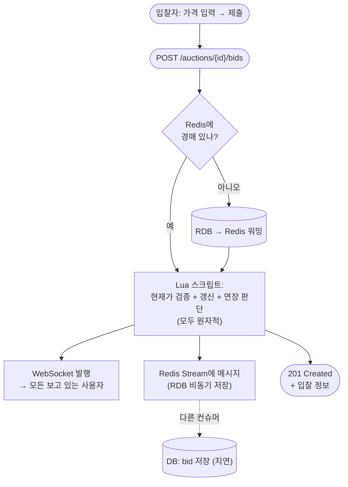
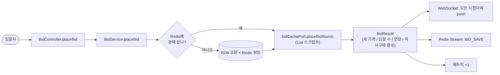
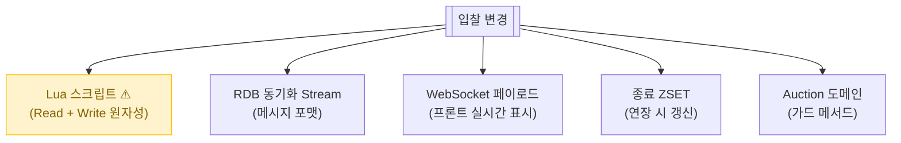

# 입찰

> 사용자가 경매에 가격을 부르는 핵심 동작. **Redis Lua 스크립트로 원자적 처리** — 동시 입찰자 100명이 와도 충돌 없음.

📁 코드 위치: `backend/.../bid/` · 👥 주체: 입찰자 (판매자 본인 제외) · 🔐 인증: 로그인 + 온보딩 완료

---

## 1. 한눈에



**스토리**: 입찰은 **빠르고, 정확하고, 안 깨져야** 함. Redis가 가격의 정답이고, 검증·갱신·연장 판단을 **Lua 스크립트 한 방**에 함 → 동시성 안전. RDB 저장은 별도 컨슈머가 비동기 ([입찰 비동기 처리](입찰-비동기처리.md)).

---

## 2. 왜 이게 있나

!!! abstract "비즈니스 의도"
    - **시스템에서 가장 동시성 높은 영역** — 인기 경매는 종료 직전 초당 수십 건
    - **Redis가 SoT** (Source of Truth) — RDB의 `current_price` 직접 UPDATE 절대 금지
    - **종료 5분 전 입찰 = 자동 5분 연장** + 3회마다 입찰 단위 50% 증가 (호가 조작 방지)
    - **즉시 구매** — 즉시구매가 입찰 시 1시간 카운트다운, 그 안에 더 높은 입찰 없으면 즉시 종료
    - **본인 경매 입찰 금지** — 판매자가 가격 띄우는 사기 방지

---

## 3. 입찰 종류 (`BidType`)

<div class="grid cards" markdown>

-   :material-gavel: **NORMAL — 일반 입찰**

    가장 흔함. 사용자가 가격 직접 입력.
    검증: 현재가 + 입찰단위 이상.

-   :material-cash-fast: **INSTANT_BUY — 즉시구매**

    즉시구매가로 일괄. 1시간 카운트 시작.
    조건: 현재가 < 즉시구매가 × 90% (그 이상이면 즉시구매 비활성).

</div>

---

## 4. 시나리오

### 4-1. 일반 입찰 — `POST /auctions/{id}/bids`

> **상황**: 사용자가 현재가 50,000원 + 입찰단위 1,000원인 경매에서 51,000원 제출.



<div class="grid cards" markdown>

-   :material-shield-alert: **0. `@RequireOnboarding` 가드**

    온보딩 미완료자는 차단. 본인 경매 검증은 Lua 안에서.

-   :material-numeric-1-circle: **Redis 캐시 확인 / 워밍**

    `bidCachePort.existsInCache`. 없으면 RDB → Redis 적재 후 입찰.
    인기 경매는 첫 입찰부터 캐시 hit.

-   :material-numeric-2-circle: **Lua 스크립트로 원자적 처리** ⭐

    한 번의 Redis 호출에서:
    - 경매 존재/종료 여부 확인
    - 본인 경매 입찰 차단
    - 최소 금액 검증 (현재가 + 입찰단위)
    - 현재가 / 1순위 / 2순위 갱신
    - 종료 5분 전이면 5분 연장 + 입찰 단위 할증 판단
    - 즉시구매면 1시간 카운트 활성화

    > **왜 Lua냐**: Read + Write가 한 트랜잭션. 다른 입찰자가 끼어들 틈 없음. 멀티 인스턴스 환경에서도 Redis 자체가 단일 스레드라 안전.

-   :material-numeric-3-circle: **WebSocket 발행 (실시간 알림)**

    `BidEventPublisherPort.publishBidPlaced` — 그 경매를 보고 있는 모든 클라이언트에 새 가격 push.
    [알림](알림.md)의 WebSocket 채널.

-   :material-numeric-4-circle: **Redis Stream으로 RDB 동기화 메시지 발행**

    `XADD bid:rdb-sync stream` — `BID_SAVE` 타입 메시지.
    **여기까지가 동기**. RDB 저장은 [별도 컨슈머가 비동기](입찰-비동기처리.md).

    > Stream 발행 실패해도 사용자에겐 입찰 성공. RDB 동기화만 누락 (정합성 체커가 잡음).

-   :material-numeric-5-circle: **즉시구매 활성화 시 추가 메시지**

    `INSTANT_BUY_UPDATE` 별도 메시지 → 컨슈머가 RDB의 `instant_buy_activated_time` 등 갱신.

-   :material-numeric-6-circle: **메트릭 누적**

    `fairbid_bid_total{result=success|fail}` + `fairbid_auction_extension_total`. Prometheus/Grafana 대시보드 ([운영](#10) 참고).

</div>

---

## 5. 진입점

| Method | Path | 핸들러 | 권한 |
|--------|------|--------|------|
| `🟡 POST` | `/api/v1/auctions/{auctionId}/bids` | [`placeBid`](https://github.com/ahn-h-j/Fairbid/blob/main/backend/src/main/java/com/cos/fairbid/bid/adapter/in/controller/BidController.java#L42) | 로그인 + 온보딩 |

---

## 6. 요청 / 응답

??? example "PlaceBidRequest"
    ```json
    { "amount": 51000, "bidType": "NORMAL" }
    ```
    `bidType`이 `INSTANT_BUY`면 `amount` 무시 (즉시구매가로 일괄).

??? example "BidResponse (201)"
    ```json
    { "id": ..., "auctionId": ..., "bidderId": ..., "amount": 51000, "bidType": "NORMAL", "createdAt": "..." }
    ```

---

## 7. 에러 케이스

| 예외 | 발생 조건 | HTTP |
|------|-----------|------|
| [`AuctionNotFoundException`](https://github.com/ahn-h-j/Fairbid/blob/main/backend/src/main/java/com/cos/fairbid/auction/domain/exception/AuctionNotFoundException.java) | auctionId 없음 | 404 |
| [`AuctionEndedException.forBid`](https://github.com/ahn-h-j/Fairbid/blob/main/backend/src/main/java/com/cos/fairbid/bid/domain/exception/AuctionEndedException.java) | 이미 종료된 경매 | 409 |
| [`SelfBidNotAllowedException`](https://github.com/ahn-h-j/Fairbid/blob/main/backend/src/main/java/com/cos/fairbid/bid/domain/exception/SelfBidNotAllowedException.java) | 판매자 본인이 입찰 시도 | 403 |
| [`BidTooLowException.belowMinimum`](https://github.com/ahn-h-j/Fairbid/blob/main/backend/src/main/java/com/cos/fairbid/bid/domain/exception/BidTooLowException.java) | 금액이 (현재가 + 입찰단위) 미만 | 400 |
| [`InvalidBidException.bidderIdRequired`](https://github.com/ahn-h-j/Fairbid/blob/main/backend/src/main/java/com/cos/fairbid/bid/domain/exception/InvalidBidException.java) | bidderId null | 400 |
| [`InstantBuyException`](https://github.com/ahn-h-j/Fairbid/blob/main/backend/src/main/java/com/cos/fairbid/bid/domain/exception/InstantBuyException.java) | 즉시구매 비활성 (현재가 ≥ 즉시구매가 90%) | 409 |

---

## 8. 변경 시 영향



> Lua 스크립트가 입찰 동시성의 핵심. 분기 추가 시 원자성·검증 순서 매우 신중하게.

---

## 9. 설계 결정

!!! tip "왜 이렇게 했나"

    **`@Transactional` 제거**
    클래스 레벨 트랜잭션이 있으면 `placeBid` 진입 즉시 DB 커넥션 획득 → DB 장애 시 Redis 작업까지 블로킹. **DB와 Redis 장애 격리**를 위해 트랜잭션 빼고 RDB 저장은 Stream으로 분리.

    **Redis Lua 스크립트로 원자성**
    "현재가 읽고 → 검증 → 갱신" 사이에 다른 입찰자 못 끼어들게. Redis가 단일 스레드 모델이라 Lua 실행 동안 다른 명령 블록. 분산 락 필요 없음.

    **WebSocket → 동기, RDB → 비동기**
    실시간 화면 갱신은 즉시 필요. 통계/이력 저장은 0~수 초 늦어도 OK. **사용자가 보는 건 항상 Redis가 SoT**.

    **`@Async` 대신 Redis Stream**
    `@Async`는 메모리 큐 → 앱 재시작 시 유실. Stream은 디스크 영속 + Consumer Group 분산 + PENDING 자동 재처리. 입찰 같은 무손실 요구에 적합.

    **본인 경매 입찰 금지를 Lua 안에서**
    Service 진입 전 검증보다 Lua 안에서 한 번 더. Auction 객체 캐시 시점과 입찰 시점 사이의 변경(예: 누가 sellerId 바꿈)에도 안전.

---

## 10. 🔧 기술 메모

!!! info "트랜잭션 — `@Transactional` 명시적 제거"
    - `BidService` 클래스에 `@Transactional` 없음. **의도적**.
    - DB 작업은 모두 Stream Consumer로 위임 → 입찰 API는 Redis만 만짐.
    - **DB 장애 시에도 입찰 가능** (RDB 동기화만 지연 또는 누락).

!!! info "Redis Lua 스크립트 — 원자적 입찰"
    - `bidCachePort.placeBidAtomic` → Lua 스크립트 호출.
    - 검증 + 갱신 + 연장 + 즉시구매를 한 번에. Redis 단일 스레드 보장.
    - **분산 락 안 씀** — Lua 자체가 락 역할.

!!! info "Redis Stream — 비동기 RDB 동기화"
    - `XADD bid:rdb-sync ...` (O(1)).
    - 메시지 타입: `BID_SAVE`, `INSTANT_BUY_UPDATE`.
    - 컨슈머는 [입찰 비동기 처리](입찰-비동기처리.md) 페이지 참고.

!!! info "WebSocket — 실시간 가격 push"
    - `BidEventPublisherPort` → Redis Pub/Sub or 직접 STOMP broadcast (어댑터 확인).
    - **모든 시청자에 동시 push**. WebSocket 세션 관리는 [알림](알림.md) BC.

!!! info "캐시 미스 시 워밍"
    - RDB → Redis 적재 (`loadAuctionToRedis`).
    - **첫 입찰자가 비용 부담**. 인기 경매는 [경매 등록](경매-등록.md) 시 미리 워밍됨.

!!! info "메트릭"
    - `fairbid_bid_total{result=success|fail}` — 성공/실패 카운터
    - `fairbid_auction_extension_total` — 연장 발생 횟수

---

## 11. 운영

- 입찰 성공/실패 비율 — Grafana
- Stream 발행 실패 시 `WARN` 로그 + 정합성 체커가 사후 보정
- DB 장애 시에도 입찰 자체는 동작 (Stream에 메시지 쌓임 → 복구 후 재처리)

**관련 페이지**
- [입찰 비동기 처리](입찰-비동기처리.md) — Stream Consumer + 정합성 체커
- [경매 조회](경매-목록-상세.md) — 현재가 출처가 같은 Redis
- [경매 종료](경매-종료.md) — Redis ZSET이 입찰 연장 시 갱신
- [알림](알림.md) — WebSocket / 1순위 변경 알림
