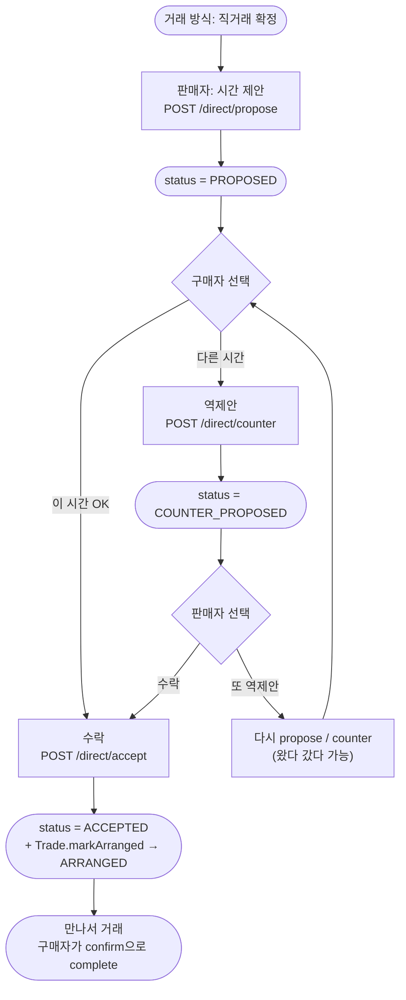
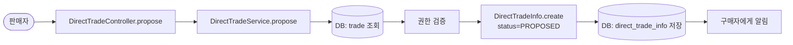
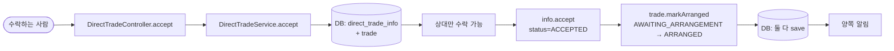
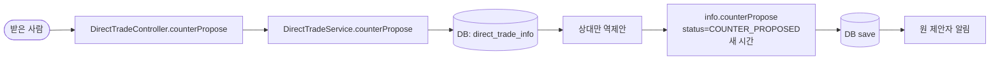
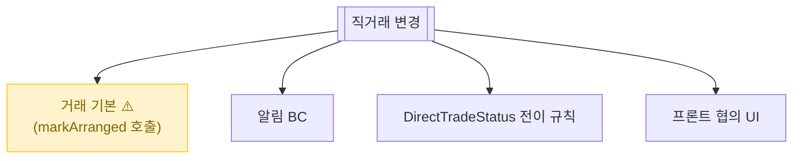

# 직거래 (시간 제안 / 수락 / 역제안)

> 만나서 거래할 약속 잡기. 판매자가 시간을 제안하고, 구매자가 수락 또는 다른 시간 역제안.

📁 코드 위치: `backend/.../trade/` · 👥 주체: 판매자 (제안), 구매자 (수락/역제안) · 🔐 인증: 로그인

---

## 1. 한눈에



**스토리**: 판매자가 첫 시간 제안 → 구매자가 수락하면 끝, 역제안하면 판매자 차례 → 왔다 갔다 가능. 양쪽 중 누군가 `accept` 누르면 [Trade가 ARRANGED](거래-기본.md)로 넘어가고 진짜 약속 확정.

---

## 2. 왜 이게 있나

!!! abstract "비즈니스 의도"
    - **만남이 필요** — 사이트 안에서 시간 협의 끝, 외부 메신저 안 거치고 거래
    - **양방향 협의** — 일방 통보 아니라 역제안 가능
    - **수락 = 약속 확정** — 그 시점에 [Trade.markArranged](거래-기본.md)로 자동 전이
    - **만남 자체는 외부** — 시스템은 시간 잡기까지. 실제 만남 후 구매자가 "수령 확인" → 거래 완료

---

## 3. 직거래 상태 (`DirectTradeStatus`)

<div class="grid cards" markdown>

-   :material-clock-outline: **PROPOSED**

    누군가 시간 제안한 상태. **상대 차례**.

-   :material-swap-horizontal: **COUNTER_PROPOSED**

    상대가 다른 시간 역제안. **다시 처음 제안자 차례**.

-   :material-check-outline: **ACCEPTED**

    수락됨. 약속 확정. [Trade도 ARRANGED](거래-기본.md)로 동시 전이.

</div>

> 거래 위치는 [경매 등록](경매-등록.md) 시 정한 `directTradeLocation`으로 고정. 시간만 협의.

---

## 4. 시나리오

### 4-1. 시간 제안 — `POST /trades/{id}/direct/propose`

> **상황**: 거래 방식이 직거래로 확정됨. 판매자가 처음 시간 제안.



<div class="grid cards" markdown>

-   :material-numeric-1-circle: **첫 제안은 판매자**

    판매자가 자기 가능 시간을 제시. `meetingDate` + `meetingTime` 따로.

-   :material-numeric-2-circle: **알림 → 구매자**

    "판매자가 약속 시간을 제안했어요". 구매자가 거래 화면에서 확인.

</div>

---

### 4-2. 수락 — `POST /trades/{id}/direct/accept`

> **상황**: 받은 제안이 마음에 들어 그대로 수락.



<div class="grid cards" markdown>

-   :material-shield-check: **자기 제안 자체수락 금지**

    A 제안 → A 수락은 막힘. **항상 상대만**.

-   :material-numeric-1-circle: **두 도메인 동시 변경**

    `DirectTradeInfo.accept()` + `Trade.markArranged()`. **같은 트랜잭션**.

-   :material-numeric-2-circle: **거래 단계도 자동 전이**

    Trade `AWAITING_ARRANGEMENT` → `ARRANGED`. 다음은 만남 후 [수령 확인 → COMPLETED](거래-기본.md).

</div>

---

### 4-3. 역제안 — `POST /trades/{id}/direct/counter`

> **상황**: 받은 제안이 안 맞아 다른 시간 제시.



<div class="grid cards" markdown>

-   :material-numeric-1-circle: **횟수 제한 없음**

    A→B→A→B... 무한. 단, [Trade `responseDeadline`](거래-기본.md)까지 결론 안 나면 노쇼.

-   :material-numeric-2-circle: **도메인이 자기 갱신**

    `DirectTradeInfo`가 자기 상태/시간 갱신 책임.

</div>

---

## 5. 진입점

| Method | Path | 핸들러 | 권한 |
|--------|------|--------|------|
| `🟡 POST` | `/api/v1/trades/{id}/direct/propose` | [`propose`](https://github.com/ahn-h-j/Fairbid/blob/main/backend/src/main/java/com/cos/fairbid/trade/adapter/in/controller/DirectTradeController.java#L39) | 거래 참여자 (첫 제안 판매자) |
| `🟡 POST` | `/api/v1/trades/{id}/direct/accept` | [`accept`](https://github.com/ahn-h-j/Fairbid/blob/main/backend/src/main/java/com/cos/fairbid/trade/adapter/in/controller/DirectTradeController.java#L57) | 받은 제안의 **상대만** |
| `🟡 POST` | `/api/v1/trades/{id}/direct/counter` | [`counterPropose`](https://github.com/ahn-h-j/Fairbid/blob/main/backend/src/main/java/com/cos/fairbid/trade/adapter/in/controller/DirectTradeController.java#L69) | 받은 제안의 **상대만** |

---

## 6. 요청 / 응답

??? example "DirectTradeProposalRequest"
    ```json
    { "meetingDate": "2026-04-30", "meetingTime": "14:00" }
    ```

??? example "DirectTradeInfoResponse"
    ```json
    {
      "id": ..., "tradeId": ...,
      "status": "PROPOSED" | "COUNTER_PROPOSED" | "ACCEPTED",
      "meetingDate": "...", "meetingTime": "...",
      "lastProposerId": ...,
      "createdAt": "...", "updatedAt": "..."
    }
    ```

---

## 7. 에러 케이스

| 예외 | 발생 조건 | HTTP |
|------|-----------|------|
| `NotTradeParticipantException` | 거래 참여자 아님 | 403 |
| `IllegalStateException` (도메인) | 자체수락 / 잘못된 상태 전이 | 409 |
| `TradeNotFoundException` | tradeId 없음 | 404 |

---

## 8. 변경 시 영향



> 수락 시 [Trade.markArranged](거래-기본.md) 호출 누락하면 거래가 영원히 ARRANGED로 못 넘어감.

---

## 9. 설계 결정

!!! tip "왜 이렇게 했나"

    **위치 고정, 시간만 협의**
    위치까지 자유면 합의 어려움. 판매자가 [등록](경매-등록.md) 시 정한 위치만.

    **수락은 상대만**
    A 제안 → A 자체수락은 위조 가능. 항상 카운터 파트가.

    **역제안 무제한**
    유연성 우선. 무한 핑퐁 문제는 [responseDeadline](거래-기본.md)이 강제 종결.

    **수락 시 두 도메인 같은 트랜잭션**
    DirectTradeInfo + Trade 동시 변경. 한쪽만 변경되면 일관성 깨짐.

---

## 10. 🔧 기술 메모

!!! info "트랜잭션"
    - `DirectTradeService` 메서드 단위 `@Transactional` (write).
    - `accept`는 두 엔티티 변경 + 알림이 한 트랜잭션.

!!! info "알림 — 동기 호출"
    - `PushNotificationPort` 직접 호출. 트랜잭션 안.
    - FCM 시간만큼 DB 커넥션 잡음. 비동기 분리는 [알림](알림.md).

!!! info "이벤트 / 캐시 / 락 / Stream — 안 씀"
    동기 + RDB. 빈도 낮아 동시성 이슈 없음.

---

## 11. 운영

별도 메트릭 없음.

**관련 페이지**
- [거래 기본](거래-기본.md)
- [택배](택배.md)
- [알림](알림.md)
