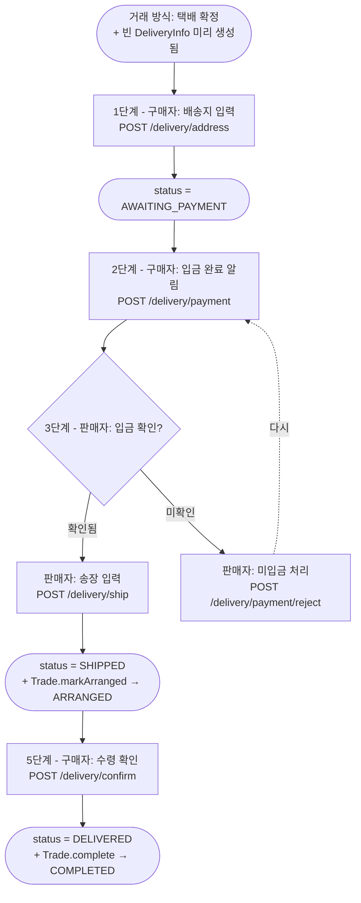
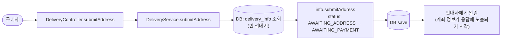
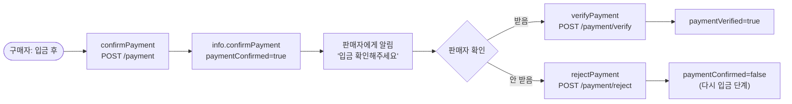
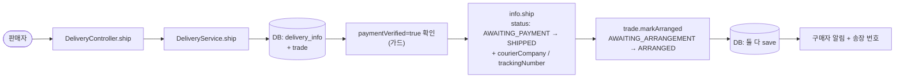
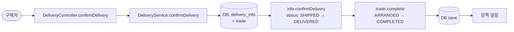
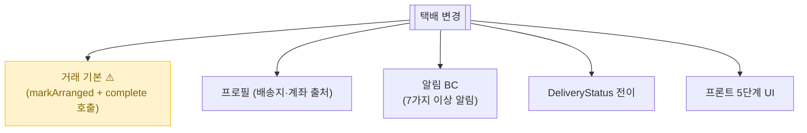

# 택배 거래 (배송지 → 입금 → 발송 → 수령)

> 만나지 않고 택배로 거래. **5단계** — 배송지 입력 → 구매자 입금 → 판매자 입금 확인 → 송장 입력 → 수령 확인.

📁 코드 위치: `backend/.../trade/` · 👥 주체: 구매자 + 판매자 · 🔐 인증: 로그인

---

## 1. 한눈에



**스토리**: 5단계 순차 진행. 각 단계에서 정해진 사람만 다음 액션 가능. **3단계(입금 확인)에서 판매자가 거절하면 다시 입금 단계로 되돌리기 가능**. 만남 없는 거래라 입금 검증 단계가 핵심.

---

## 2. 왜 이게 있나

!!! abstract "비즈니스 의도"
    - **만남 없는 거래** — 원격지 거래 가능
    - **입금 검증 사이클** — 결제 시스템 안 쓰고 **계좌 송금 + 양측 확인** 방식. 사기 방지 핵심
    - **순차 5단계** — 각 단계 미수행 시 노쇼 카운트
    - **수령 확인 = 거래 완료** — 자동으로 [Trade.complete](거래-기본.md) 호출

---

## 3. 택배 상태 (`DeliveryStatus`)

<div class="grid cards" markdown>

-   :material-numeric-1-circle: **AWAITING_ADDRESS**

    배송지 입력 대기. **구매자 차례**.
    [거래 기본](거래-기본.md)의 방식 선택 시 자동 생성된 빈 껍데기.

-   :material-numeric-2-circle: **AWAITING_PAYMENT**

    배송지 입력 완료. **구매자가 판매자 계좌로 송금**.
    이 단계에서만 [판매자 계좌가 응답에 노출](거래-기본.md).

-   :material-numeric-3-circle: **SHIPPED**

    판매자가 입금 확인 + 송장 입력 완료. 운송장 번호로 추적 가능.
    이 시점에 [Trade도 ARRANGED](거래-기본.md)로 전이.

-   :material-numeric-4-circle: **DELIVERED**

    구매자 수령 확인. 거래 종료.
    이 시점에 [Trade.complete → COMPLETED](거래-기본.md).

</div>

> 입금/입금확인 단계는 status 자체가 아니라 `paymentConfirmed` / `paymentVerified` **플래그로 관리**.

---

## 4. 시나리오

### 4-1. 배송지 입력 (구매자) — `POST /delivery/address`



<div class="grid cards" markdown>

-   :material-numeric-1-circle: **구매자만 호출 가능**

    판매자는 배송지 모르므로 입력 권한 없음.

-   :material-numeric-2-circle: **상태 전이로 계좌 노출 시작**

    `AWAITING_PAYMENT` 진입 시점부터 [TradeDetailResponse에 sellerBankAccount](거래-기본.md) 포함됨.
    구매자에게만 노출 (판매자 본인 정보).

</div>

---

### 4-2. 입금 / 입금 확인 / 미입금 거절



<div class="grid cards" markdown>

-   :material-numeric-1-circle: **2단계 — 구매자 입금 신고 (`payment`)**

    구매자가 송금 후 "입금했어요" 누름. `paymentConfirmed` 플래그 ON.
    **실제 송금은 외부 (시스템은 모름)**.

-   :material-numeric-2-circle: **3단계 — 판매자 입금 확인 (`payment/verify`)**

    판매자가 통장 보고 "받았어요" 누름. `paymentVerified` ON.
    이게 안 되면 다음 단계(`ship`) 진행 불가 (도메인 가드).

-   :material-numeric-3-circle: **3단계 분기 — 판매자 거절 (`payment/reject`)**

    "안 받았어요" 누르면 `paymentConfirmed=false`로 되돌림 → **다시 구매자 입금 단계**.
    구매자가 잘못 누른 케이스 등.

</div>

---

### 4-3. 송장 입력 (판매자) — `POST /delivery/ship`



<div class="grid cards" markdown>

-   :material-shield-check: **paymentVerified 가드**

    입금 확인 안 된 상태에서 송장 입력 시도하면 도메인이 거부.
    **판매자가 입금 받기 전 발송하는 위험 차단**.

-   :material-numeric-1-circle: **택배사 + 송장 번호 입력**

    `courierCompany` (CJ대한통운, 한진택배 등), `trackingNumber`. 외부 추적 가능.

-   :material-numeric-2-circle: **Trade도 ARRANGED 전이**

    [DirectTradeService.accept](직거래.md)와 같은 패턴. 두 도메인 동시 변경 같은 트랜잭션.

</div>

---

### 4-4. 수령 확인 (구매자) — `POST /delivery/confirm`



<div class="grid cards" markdown>

-   :material-numeric-1-circle: **구매자가 받았다고 누름**

    DeliveryInfo 마지막 상태. + Trade도 동시 완료.

-   :material-numeric-2-circle: **자동 거래 완료**

    [거래 기본 `complete`](거래-기본.md) 엔드포인트를 따로 안 쳐도 여기서 같이 처리됨.

</div>

---

## 5. 진입점

| Method | Path | 핸들러 | 권한 |
|--------|------|--------|------|
| `🟡 POST` | `/api/v1/trades/{id}/delivery/address` | [`submitAddress`](https://github.com/ahn-h-j/Fairbid/blob/main/backend/src/main/java/com/cos/fairbid/trade/adapter/in/controller/DeliveryController.java#L43) | 구매자 |
| `🟡 POST` | `/api/v1/trades/{id}/delivery/payment` | [`confirmPayment`](https://github.com/ahn-h-j/Fairbid/blob/main/backend/src/main/java/com/cos/fairbid/trade/adapter/in/controller/DeliveryController.java#L65) | 구매자 |
| `🟡 POST` | `/api/v1/trades/{id}/delivery/payment/verify` | [`verifyPayment`](https://github.com/ahn-h-j/Fairbid/blob/main/backend/src/main/java/com/cos/fairbid/trade/adapter/in/controller/DeliveryController.java#L78) | 판매자 |
| `🟡 POST` | `/api/v1/trades/{id}/delivery/payment/reject` | [`rejectPayment`](https://github.com/ahn-h-j/Fairbid/blob/main/backend/src/main/java/com/cos/fairbid/trade/adapter/in/controller/DeliveryController.java#L91) | 판매자 |
| `🟡 POST` | `/api/v1/trades/{id}/delivery/ship` | [`ship`](https://github.com/ahn-h-j/Fairbid/blob/main/backend/src/main/java/com/cos/fairbid/trade/adapter/in/controller/DeliveryController.java#L103) | 판매자 |
| `🟡 POST` | `/api/v1/trades/{id}/delivery/confirm` | [`confirmDelivery`](https://github.com/ahn-h-j/Fairbid/blob/main/backend/src/main/java/com/cos/fairbid/trade/adapter/in/controller/DeliveryController.java#L121) | 구매자 |

---

## 6. 요청 / 응답

??? example "AddressRequest"
    ```json
    {
      "recipientName": "...", "recipientPhone": "...",
      "postalCode": "...", "address": "...", "addressDetail": "..."
    }
    ```

??? example "ShippingRequest"
    ```json
    { "courierCompany": "CJ대한통운", "trackingNumber": "..." }
    ```

??? example "DeliveryInfoResponse"
    ```json
    {
      "id": ..., "tradeId": ...,
      "status": "AWAITING_ADDRESS" | "AWAITING_PAYMENT" | "SHIPPED" | "DELIVERED",
      "address": {...},
      "paymentConfirmed": true|false,
      "paymentVerified": true|false,
      "courierCompany": "...", "trackingNumber": "...",
      "shippedAt": "...", "deliveredAt": "..."
    }
    ```

---

## 7. 에러 케이스

| 예외 | 발생 조건 | HTTP |
|------|-----------|------|
| `NotTradeParticipantException` | 거래 참여자 아님 | 403 |
| `NotTradeParticipantException.notBuyer` / `notSeller` | 단계별 권한 위반 | 403 |
| `IllegalStateException` (도메인) | 잘못된 단계에서 호출 (예: paymentVerified 안 된 상태에서 ship) | 409 |
| `TradeNotFoundException` | tradeId 없음 | 404 |

---

## 8. 변경 시 영향



> ship/confirm 시 Trade 동기화 누락하면 거래 자체가 진행 안 됨.

---

## 9. 설계 결정

!!! tip "왜 이렇게 했나"

    **결제 시스템 없이 계좌 송금 + 양측 확인**
    PG 연동 비용/복잡도 회피. 단점은 사기 가능성 → 양측 확인 사이클로 보완.

    **paymentVerified 가드**
    돈 못 받은 판매자가 발송하는 위험 차단. 도메인 메서드(`ship`)가 자기 검증.

    **이중 상태 (status + 플래그)**
    `status`는 큰 단계 (배송지/입금대기/발송/수령), 입금은 부속 플래그(`paymentConfirmed`/`paymentVerified`).
    상태를 더 잘게 쪼개지 않은 이유는 **DeliveryStatus enum의 단순성 유지** + 입금 단계는 양측 핑퐁이 잦음.

    **계좌 노출은 입금 대기 단계에서만**
    [거래 기본](거래-기본.md)의 `sellerBankAccount` 조건. 완료 후엔 가림.

    **수령 확인 = Trade.complete 자동 호출**
    구매자가 따로 [거래 완료 엔드포인트](거래-기본.md)를 호출 안 해도 됨.

---

## 10. 🔧 기술 메모

!!! info "트랜잭션"
    - `DeliveryService` 메서드 단위 `@Transactional` (write).
    - `ship` / `confirmDelivery`는 DeliveryInfo + Trade 두 엔티티 + 알림이 한 트랜잭션.

!!! info "알림 — 동기 호출"
    - 6개 엔드포인트마다 알림 (배송지 입력 / 입금 신고 / 입금 확인 / 미입금 거절 / 송장 입력 / 수령 확인).
    - 모두 트랜잭션 안 동기 호출. FCM 시간만큼 커넥션 잡음.

!!! info "이벤트 / 캐시 / 락 / Stream — 안 씀"
    동기 + RDB. 한 거래의 단계 진행은 동시성 이슈 거의 없음.

!!! info "외부 추적 안 함"
    `trackingNumber` 저장만. CJ/한진 추적 API 연동 없음. 프론트가 외부 추적 페이지 링크만 제공.

---

## 11. 운영

별도 메트릭 없음. 단계별 분포는 `delivery_status` 그룹 카운트.

**관련 페이지**
- [거래 기본](거래-기본.md)
- [직거래](직거래.md)
- [프로필](user-profile.md) — 배송지/계좌 입력
- [알림](알림.md) — 6단계 알림 발송
